# Milestone Project 4: The Elysium Archive

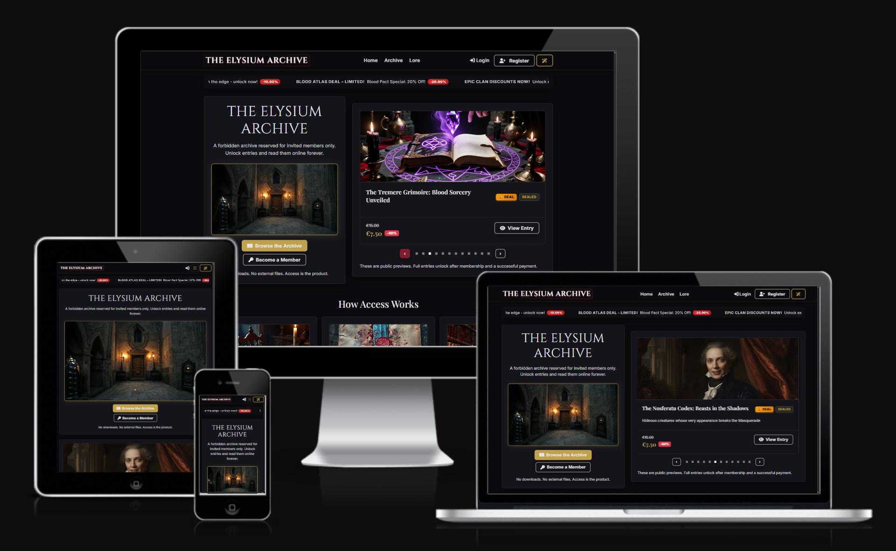

The Elysium Archive is a story-driven, dark fantasy ecommerce site where each purchase unlocks a private archive page inside the website.

## Quick Links

- [Live Site](https://the-elysium-archive-a51393fa9431.herokuapp.com/)
- [GitHub Project Board](https://github.com/users/Drake-Designer/projects/5)
- [Testing Documentation](TESTING.md)

## Contents

- [Project Overview](#project-overview)
- [How The Elysium Archive Works](#how-the-elysium-archive-works)
- [Feature Summary](#feature-summary)
- [Features](#features)
- [Pages Overview](#pages-overview)
- [Website Pages Showcase](#website-pages-showcase)
- [User Experience Design](#user-experience-design)
- [Technical Overview](#technical-overview)
- [Frontend Structure and Static Assets](#frontend-structure-and-static-assets)
- [Technologies Used](#technologies-used)
- [Security and Error Handling](#security-and-error-handling)
- [Stripe Payments](#stripe-payments)
- [Admin Power Tools](#admin-power-tools)
- [Database Design](#database-design)
- [AI-Assisted Development (Testing and Complex Features)](#ai-assisted-development-testing-and-complex-features)
- [Testing and Bug Fixes](#testing-and-bug-fixes)
- [Bug Fix Log](#bug-fix-log)
- [Running the Project Locally](#running-the-project-locally)
- [Heroku Deployment](#heroku-deployment)
- [Deal Banner Bar](#deal-banner-bar)
- [Alt Text Safety](#alt-text-safety)
- [Future Improvements](#future-improvements)
- [Credits and Acknowledgements](#credits-and-acknowledgements)

## Project Overview

**The Elysium Archive** is a dark fantasy, story-driven ecommerce project where you do not buy a file. You buy access.

No downloads. No attachments. No folders sitting on your desktop.
When you purchase an entry, it becomes part of your personal archive inside the site.

Each product is a piece of forbidden lore. A text that exists only within a private library. After a successful Stripe Checkout, the entry unlocks and can be read directly inside your account.

I built this project as my Code Institute Milestone Project 4 using Django and PostgreSQL. I wanted to explore the idea of selling access instead of files, and I wrapped that technical concept inside a world inspired by gothic vampire mythology, secret orders, and hidden libraries.

The Elysium Archive is meant to feel like a place, not just a shop.
An old archive that has existed for centuries, quietly collecting dangerous knowledge, accessible only to those who have been granted entry.

### The Story Behind The Elysium Archive

The project is inspired by the idea that a hidden society exists alongside the normal world. A society that records truths most people were never meant to read.

The platform presents itself as a private archive of forbidden texts, available only to verified members who have earned access.

This narrative gives meaning to the core features of the platform:

- Each user owns a personal archive
- Access is granted through verified purchases
- Content unlocks instantly after payment

In short, the story is not decoration. It exists to support and justify how the platform actually works.

### What You Get

- A themed product catalog (digital content)
- Secure account system (register, login, logout)
- Stripe checkout and order confirmation
- A private "My Archive" area with unlocked entries
- Account dashboard tabs for Profile, My Archive, My Orders, My Reviews, and Delete Account
- Track orders and reviews from the dashboard
- Protected archive reading pages
- Verified buyer reviews
- Profile management and full account deletion

### Who It Is For

- Visitors who enjoy dark fantasy themes and want to browse teasers
- Members who want a buy once, access forever experience
- Developers who want to explore a complete and structured Django project

Refunds are not supported by design. Archive entries unlock immediately after purchase.

## How The Elysium Archive Works

1. Visitors browse the catalog without an account.
2. Users register or log in to purchase content.
3. Checkout is handled via Stripe.
4. After payment, content unlocks and appears in "My Archive".
5. Users can manage their profile or delete their account.

## Feature Summary

### Homepage and User Interface

- Featured archive carousel with a single entry per slide
- Automatic carousel rotation with manual navigation controls
- Fully responsive layout across desktop, tablet, and mobile
- Global reduced-effects toggle available on all pages
- Consistent button styling and iconography across the site
- Optimised image loading and scaling via Cloudinary

### Catalog and Purchases

- Archive catalog supports search (`q`), category filter (`cat`), and deals-only filter (`deals=true`).
- Product detail pages with a clear purchase flow
- Stripe checkout and confirmation

### Archive Access Control

- Private "My Archive" area with protected reading pages
- Direct URL access blocked for non-entitled users
- Unpublished products remain accessible to buyers who already own them

### Reviews (Verified Buyers Only)

- Reviews visible to everyone on product pages
- Only verified buyers can submit reviews
- One review per user per product enforced server-side
- Simple validation for clean feedback

### Profiles

- Edit account details
- Manage email and password
- Delete account permanently

## User Experience Design

To keep this section simple and easy to scan, it is organised in the following order:

1. [User Stories](#user-stories)
2. [Site Structure](#site-structure)
3. [Wireframes](#wireframes)
4. [Color Palette and Typography](#color-palette-and-typography)

### User Stories

User stories are planned and tracked using GitHub Projects.

[GitHub Project board](https://github.com/users/Drake-Designer/projects/5)

### Site Structure

The site structure was designed to support a clear journey from public browsing to protected content access.

#### Public areas

- Homepage
- Product catalog
- Product detail pages
- Registration and login pages

#### Restricted areas

- Shopping cart
- Checkout
- Order confirmation
- My Archive area
- Protected archive pages
- User profile

Restricted areas require authentication and a verified email address.

### Wireframes

Wireframes define layout and user flow before development.
They focus on structure and usability rather than visual design.

All wireframes were created using Balsamiq.

#### Desktop Wireframes

Designed for a 27 inch QHD display (2560x1440).


#### Mobile Wireframes

Optimised for common mobile and tablet devices.


### Color Palette and Typography

The visual identity supports the dark fantasy theme while remaining readable and accessible.

#### Color Palette

- **Void Black (`#0b0b0f`)**
  Main background color.

- **Obsidian Grey (`#14141b`)**
  Secondary background color for sections and cards.

- **Ash White (`#e6e6eb`)**
  Primary text color.

- **Blood Crimson (`#8b1e2d`)**
  Accent color for call-to-action elements.

- **Relic Gold (`#c2a14d`)**
  Premium accent color for archive highlights.

All color combinations were tested for WCAG contrast compliance.


#### Typography

The project uses the following Google Fonts:

- **Playfair Display**
  Used for headings and section titles.

- **Inter**
  Used for body text and UI elements.

- **Cinzel**
  Considered as an alternative decorative heading font.

Typography rules:

- Serif fonts are used only for headings.
- Sans-serif fonts are used for body text and UI.
- No more than two font families are used at the same time.
- Readability is always prioritised.


### Design and UX Decisions

The homepage carousel displays a single archive entry per slide to prioritise readability and focus. The reduced-effects toggle respects motion-sensitive users while preserving atmosphere, and the state persists via local storage.

Consistency between the homepage, catalog, and archive views keeps the experience cohesive through shared button styling, iconography, and spacing.

## Features

This section documents implemented features organised by category.

### User Authentication

- **Registration** - Create account with username, email, and password validation
- **Unique Email Enforcement** - Signup enforces unique emails case-insensitively (no duplicate accounts with different casing)
- **Email Verification** - Mandatory email verification (see Email Templates section for backend behavior)
- **Login** - Secure authentication with username or email
- **Login Warnings** - Shows one warning at a time, distinguishes wrong password vs wrong username/email, and only shows the case-sensitive reminder when relevant
- **Password Reset** - Complete password reset flow with email link
- **Password Change** - Users can change password when logged in
- **Email Management** - Add and manage multiple email addresses
- **Account Deletion** - Permanent account deletion with proper cleanup
- **Custom Styling** - All auth pages styled to match the site
- **Allauth Integration** - Custom allauth templates and email flow

### User Profiles

- **Profile Page** - View account username and manage display name
- **Edit Display Name** - Optional custom display name with validation (max 20 characters)
- **Profile Picture** - Upload, replace, or remove a profile picture via Cloudinary
- **Delete Account** - Permanent account deletion with confirmation page

### Verified Email Access Control

- **Verified Email Gate** - All member-only areas (profile, dashboard, cart, checkout, archive) require a verified email address
- **Smart Redirects** - Unverified users are directed to email management with a clear, user-friendly message
- **Consistent Messaging** - Verification messages use Django messages framework styling
- **Superuser Protection** - Superuser accounts cannot be deleted via the UI; deletion attempts show a system message

### Public Pages

- **Homepage**: Hero section, featured entries carousel, membership information
- **Archive Catalog**: Browse all available archive entries
- **Lore Page**: Background story and world-building content
- **Footer Pages**: Privacy, Terms, and Contact form

### User Feedback

- **Django Messages**: Clear success and error notifications
- **Form Validation**: Inline error feedback on registration and login forms
- **Accessible Alerts**: Bootstrap-styled alerts with proper ARIA roles

### Verified Reviews

- **Eligibility** - Verified email and a purchased product are required to submit; reviews are public on product pages
- **One Review Per Product** - Database constraint prevents duplicate reviews from the same user
- **Star Rating** - Reviews include a 1-5 star rating
- **Optional Title** - Review title is optional. If left blank, the UI displays 'Untitled Review'.
- **Review Body** - Review body uses a 1000-character client-side input limit.
- **Edit and Delete** - Users can edit or delete their own reviews while the related product is not removed.
- **Admin Moderation** - Reviews are registered in Django admin with filters for rating, product, and date

### My Archive – Permanent Access Management

- **Unified Access Source** - AccessEntitlement model is the single source of truth for purchased products
- **Dashboard Tab** - My Archive is a dashboard tab; `/accounts/my-archive/` redirects to it
- **Purchase Date Display** - Each unlocked product shows the unlock date on archive cards
- **Consistent Card Layout** - Archive cards display product image, title, and unlock date.
- **Direct Reading Access** - Each card includes a "Read" button that opens the dedicated reading page
- **Empty State** - When no products are purchased, a friendly empty-state message is shown.
- **Permanent Retention** - Once purchased, products remain in My Archive indefinitely; no expiration or revocation

### My Orders

- **Dashboard Tab** - Order history is available from the account dashboard
- **Order Summary** - Displays order number, created date/time, status, and total
- **Line Items** - Lists purchased items with quantity, line total, and product links when available
- **Empty State** - Shows a message when no orders exist

### My Reviews

- **Dashboard Tab** - Lists the user's reviews in the account dashboard
- **Review Details** - Displays product, rating, optional title, date/time, and body
- **Edit and Delete** - Includes edit/delete actions with server-side ownership enforcement
- **Empty State** - Shows a message when no reviews exist

### Product Preview Pages

- **Public Browsing** - Product detail previews are public only for active, non-removed products. Inactive products are visible only to staff/superusers and entitled users.
- **Purchase Flow** - Non-owners see pricing, add-to-cart button, and purchase call-to-action
- **Access Indicator** - Owners see a "Read Full Archive" button instead of purchase options
- **Content Separation** - Preview pages show teaser fields; full content is on the read page after entitlement
- **Review Display** - Reviews are visible to everyone; submission follows the verified purchase rule

### Archive Reading Pages

- **Dedicated Reading Experience** - Separate page (`/archive/<slug>/read/`) for immersive content consumption
- **Access Control** - Requires authentication. Non-superusers must have a verified email and product entitlement. Superusers bypass these checks.
- **Immersive Layout** - Clean, distraction-free design focused on reading the complete archive entry
- **Full Content Display** - Complete archive text displayed with elegant formatting and generous spacing
- **Content Editor** - Product content uses CKEditor5 for rich text formatting with custom styling support
- **Navigation** - Clear links back to My Archive and product preview page
- **Purchase Elements** - Reading page has no purchase CTA, but includes archive metadata such as price information.
- **Permission Denied** - Users without access receive 403 error; anonymous users redirected to login

### Product Visibility and Access Control

- **is_active**: Controls whether a product appears in the public archive catalog. When `False`, the product is hidden from listings.
- **is_removed**: is_removed hides product preview pages from non-staff users. Entitled users keep access through `/archive/<slug>/read/`. Staff and superusers retain preview access.
- **Admin Delete Behavior**: Deleting a product from Django Admin converts the delete into an unpublish (sets `is_active=False`) to preserve user access to already-purchased content.
- **Admin Action**: Admin includes a "Delete permanently (keep access for buyers)" action:
  - Products with entitlements are soft-removed (`is_removed=True`).
  - Products with no entitlements are hard-deleted.

## Pages Overview

| Page | URL | Access | Description |
| ---- | --- | ------ | ----------- |
| Home | `/` | Public | Landing page with hero, carousel, and membership info |
| Archive | `/archive/` | Public | Browse all archive entries |
| Lore | `/lore/` | Public | World-building and story content |
| Privacy of the Covenant | `/privacy-of-the-covenant/` | Public | Privacy policy and site data practices |
| Terms of the Archiver | `/terms-of-the-archiver/` | Public | Terms and conditions for site use |
| Contact the Lore | `/contact-the-lore/` | Public | Public contact form to reach site maintainers |
| Register | `/accounts/signup/` | Public | Create a new account |
| Login | `/accounts/login/` | Public | Sign in to existing account |
| Logout | `/accounts/logout/` | Authenticated | Sign out (POST only) |
| Dashboard | `/accounts/dashboard/` | Authenticated + verified email | Account hub with profile, archive, orders, reviews, and delete tabs |
| Profile | `/accounts/profile/` | Authenticated + verified email | Redirects to dashboard profile tab |
| My Archive | `/accounts/my-archive/` | Authenticated + verified email | Redirects to dashboard archive tab |
| My Orders | `/accounts/my-orders/` | Authenticated + verified email | Redirects to dashboard orders tab |
| My Reviews | `/accounts/my-reviews/` | Authenticated + verified email | Redirects to dashboard reviews tab |
| Delete Account | `/accounts/delete/` | Authenticated + verified email | Permanently delete account |
| Product Preview | `/archive/<slug>/` | Public for active, non-removed products; staff/superusers and entitled users can also access inactive previews | Preview page with purchase flow |
| Archive Reading | `/archive/<slug>/read/` | Authenticated; non-superusers require verified email + entitlement | Dedicated reading page for purchased content |
| Submit Review | `/archive/<slug>/review/` | Verified buyers | Submit review for purchased product (POST only) |
| Edit Review | `/archive/<slug>/review/<id>/edit/` | Review owner + verified email | Edit your own review |
| Delete Review | `/archive/<slug>/review/<id>/delete/` | Review owner + verified email | Delete your own review (POST only) |
| Admin | `/admin/` | Staff only | Django admin panel |

## Website Pages Showcase

The Elysium Archive offers a complete user experience from public browsing to secure archive access. Here's a visual tour of the key pages:

### Public Area

These pages are accessible to all visitors without authentication.

**Homepage** - Hero section with featured entries, deal banner bar, and membership information:

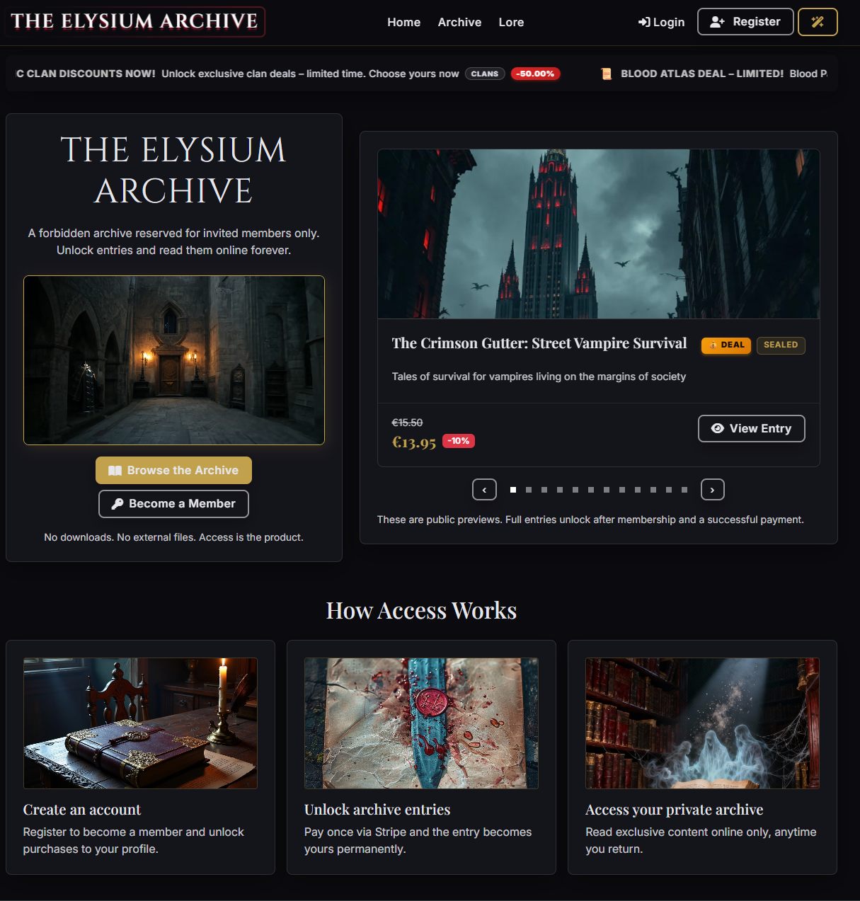

**Archive Catalog** - Browse all available archive entries with search, category filter, and deals filter:


**Lore** - Dark fantasy world-building and story content:


**Privacy Policy** - Data practices and privacy information:

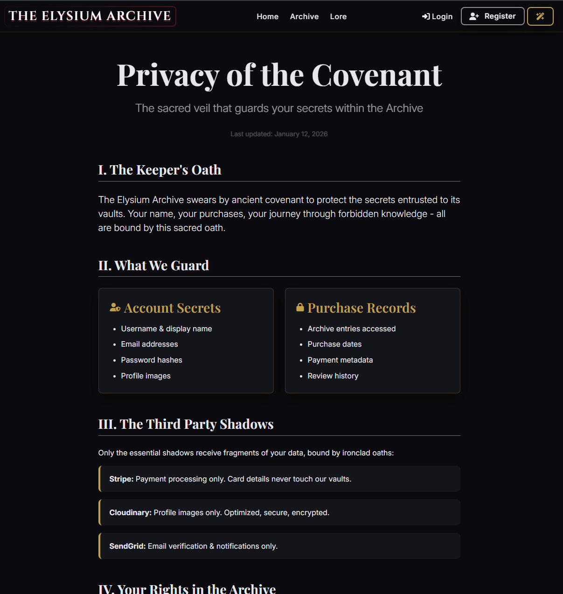

**Terms of Service** - Usage terms and conditions:

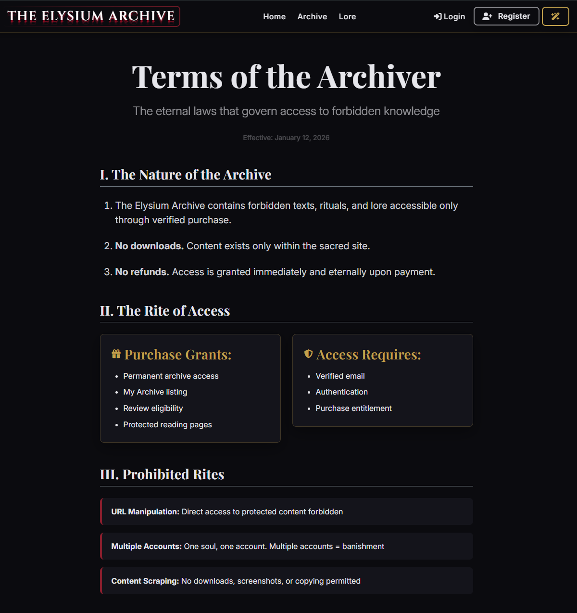

**Contact Form** - Reach out to site maintainers:

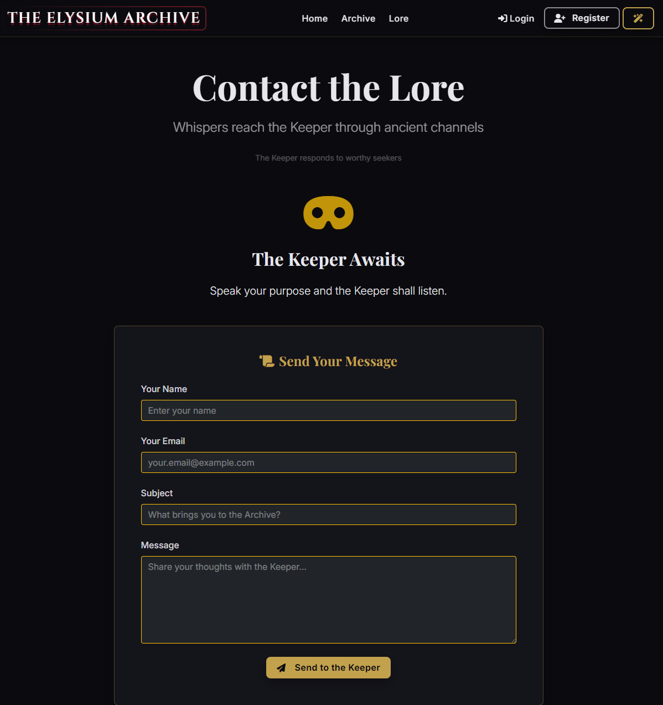

### Authentication Pages

**Registration** - Create a new account:

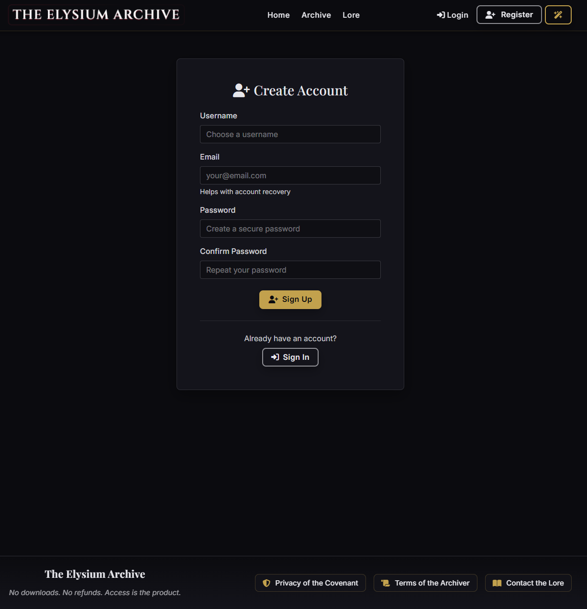

**Login** - Sign in to your account:

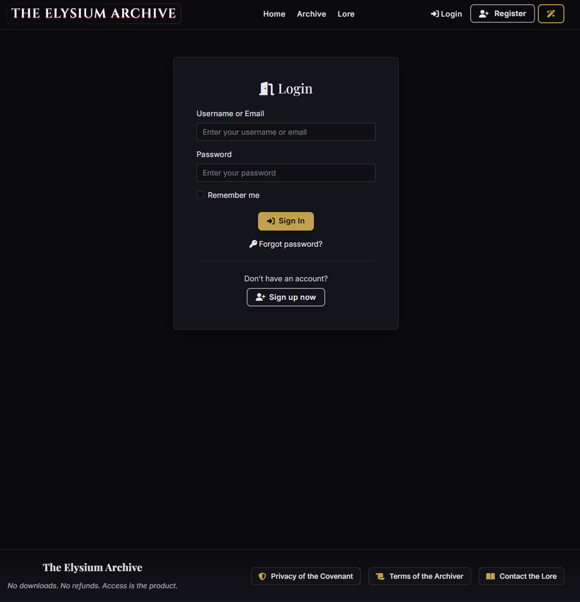

### Shopping & Checkout

**Shopping Cart** - Review items before purchase:

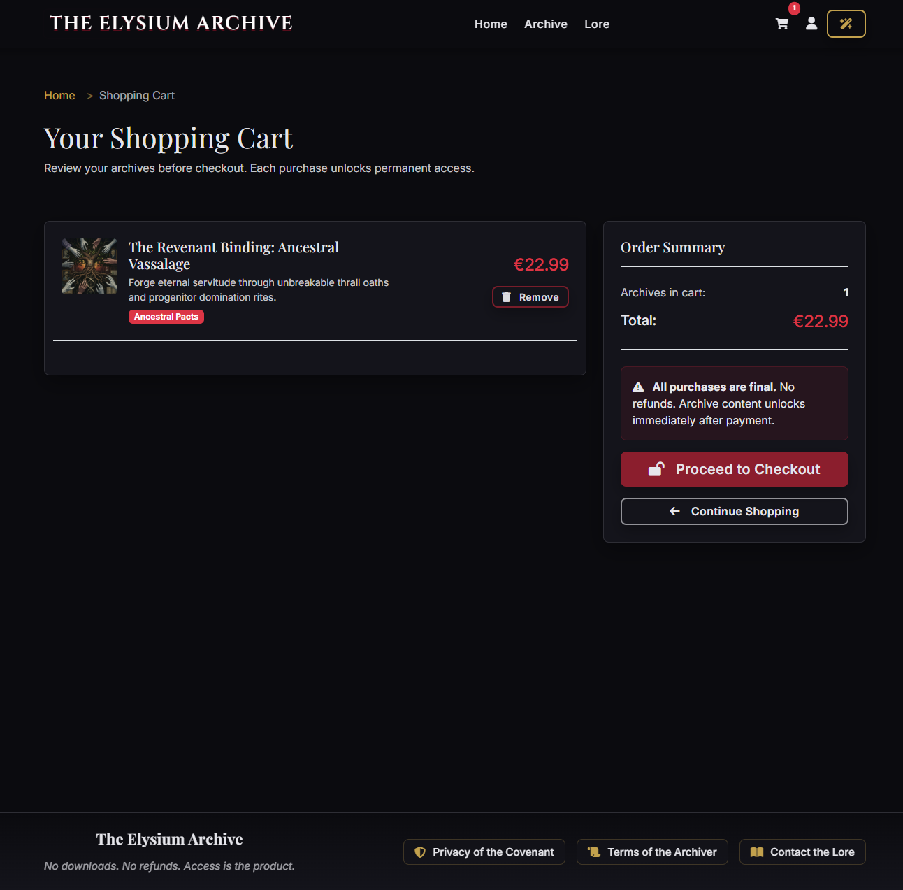

**Stripe Payment** - Secure checkout via Stripe:

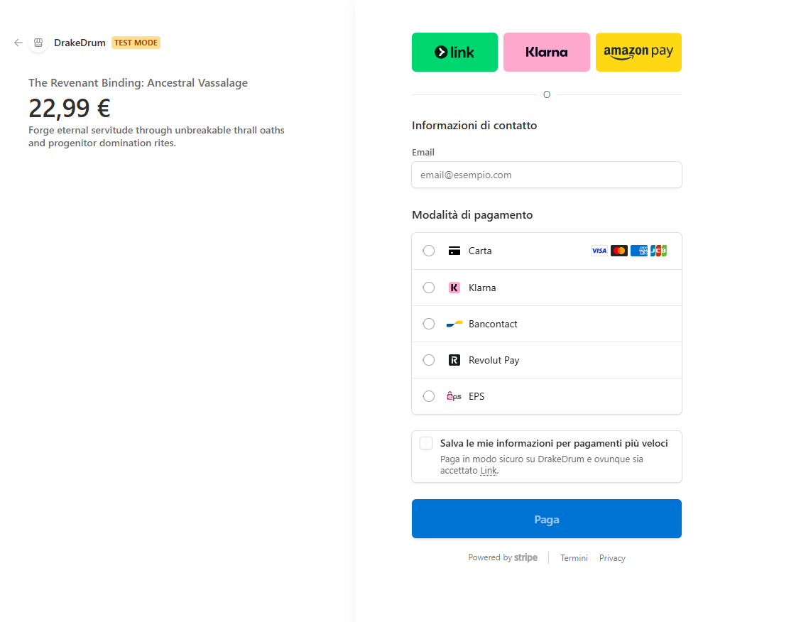

### User Dashboard

**Profile Overview** - Manage account details, view archive, orders, and reviews:

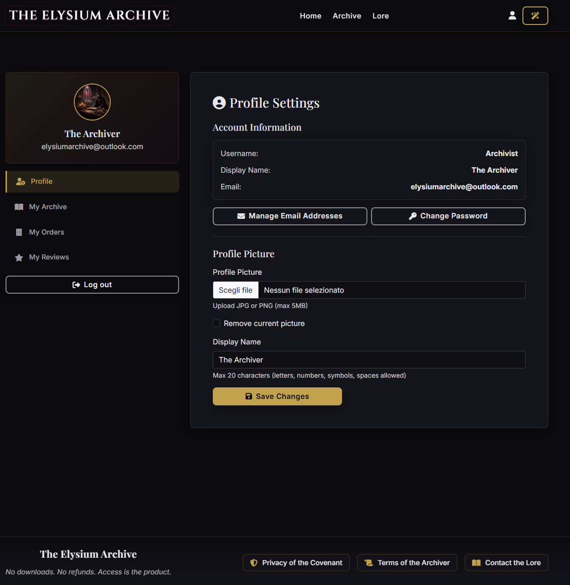

## Technical Overview

### Access Control & Entitlements Architecture

The project uses an **AccessEntitlement** model as the single source of truth for product ownership and access:

- **Unique User/Product Link**: Each entitlement ties a user to a product via `unique_entitlement_per_user_product`
- **Centralised Helper**: `user_has_access(user, product)` in `elysium_archive/helpers.py` provides a shared access check
- **Consistent Usage**: Views and review logic verify entitlements before granting access or review submission
- **No Manual URL Manipulation**: Protected content cannot be accessed via guessed URLs; server-side checks are mandatory

### Review System & Eligibility

Reviews use the same AccessEntitlement model to verify purchase eligibility:

- **Eligibility Check**: Review creation confirms verified email and AccessEntitlement for the product
- **Idempotent Prevention**: Unique constraint prevents users from submitting multiple reviews for the same product
- **Edit/Delete**: Users can edit or delete their own reviews while the related product is not removed; ownership is enforced in views
- **Display Logic**: Reviews are visible to all visitors on product pages

### Architecture Decision: Switching to Django-Allauth

During mid-project development, the authentication system was refactored to use **django-allauth** instead of custom authentication logic.

**Why the switch?**

Production requirements for professional email management, password resets, and secure authentication workflows made django-allauth the better choice.

**What changed:**

- Replaced custom login/register views with allauth's built-in views
- Integrated account email delivery with environment-based backend selection (see Email Templates section)
- Added email verification, password reset, and account management flows
- Implemented allauth email templates with project styling

**How the accounts app evolved:**

Rather than removing the `accounts` app, it was preserved and enhanced to complement allauth with domain-specific functionality:

- **UserProfile model** - Extended user profiles with display names and metadata
- **Dashboard and archive views** - Centralised account management and purchased content access
- **Account deletion** - Safe account deletion with proper cleanup
- **Custom forms** - ElysiumSignupForm and ElysiumLoginForm styled with Bootstrap
- **Improved login warnings** - Fixed compatibility issues and implemented unified warning messages that distinguish wrong password vs wrong username/email, show case-sensitive reminders only when relevant, and display one warning at a time

This hybrid approach keeps authentication professional while maintaining custom business logic within the accounts app.

### Signal Handlers and Automated Logic

Django signals are used to maintain data consistency and automate business logic:

**Accounts Signals** (`accounts/signals.py`):

- **post_save (User)** - Creates a UserProfile when a new user registers, ensuring every user has an associated profile
- **post_save (User)** - Updates UserProfile on every user save to ensure profile persistence

**Cart Signals** (`cart/signals.py`):

- **user_logged_in** - Restores a user's persistent cart to the session on login, but only if the session cart is empty, preventing accidental loss of items added before login
- **Cart filtering** - Only active products (not removed) are restored from persistent storage

**Product Signals** (`products/models.py`):

- **Product.save() logic** - Syncs deal status when a product category, active flag, or removed flag changes, and keeps featured status synchronized
- **post_save (DealBanner)** - Recalculates deals for previous and current banner targets when banners are created or updated
- **post_delete (DealBanner)** - Recalculates deals for affected targets when banners are deleted (CASCADE behavior)

These signals ensure that:

- User profiles are always created on registration
- Shopping carts persist across sessions
- Deal statuses remain synchronized with active banners
- No manual admin work is required to keep related data consistent

### Django Apps Structure

- `home` - Public-facing pages and layout
- `accounts` - User profiles, archive access, and account management
- `products` - Product catalog and protected archive content
- `cart` - Shopping cart logic
- `checkout` - Stripe checkout handling
- `orders` - Order storage and history
- `reviews` - Verified buyer reviews

## Frontend Structure and Static Assets

This section documents the frontend architecture and static asset management implemented during development.

### Base Template Architecture

The project uses Django template inheritance to ensure consistency across all pages.

- A global `base.html` template defines the HTML structure, metadata blocks, navigation, footer, and global message handling
- All pages extend `base.html` and override content blocks only where needed

### Navigation and Layout

- The navigation bar is fully responsive using Bootstrap
- Desktop and mobile layouts follow the wireframes
- Accessibility considerations include skip to content, semantic HTML structure, and clear focus states

### Design System and Styling

A custom design system is implemented using CSS variables for colour, spacing, and typography. Styles are centralised and no inline styles are used in site templates.

### CSS Architecture and Organization

The project uses a modular CSS architecture to keep styles scoped and maintainable.

#### Frontend CSS Structure

**Base Styles:**

- `static/css/base.css` - Global styles, CSS variables, typography, navigation, forms, alerts

**Component Styles:**

- `static/css/components/dashboard.css` - Dashboard tabs and layout
- `static/css/components/deal-banner.css` - Deal banner marquee
- `static/css/components/products.css` - Product cards and layouts

**Page-Specific Styles:**

- `static/css/pages/home.css` - Homepage layout (hero, carousel, membership cards)
- `static/css/pages/lore.css` - Lore page styling
- `static/css/pages/footer-pages.css` - Footer and static pages

**Admin Styles:**

- `static/css/admin/admin.css` - Admin entry point (imports modules)
- `static/css/admin/*` - Admin UI components and overrides

**Loading Strategy:**

- `base.css` is loaded globally in `base.html` (applies to all pages)
- Page-specific CSS is loaded conditionally using `` in individual templates

**Example (homepage template):**

```django

<link rel="stylesheet" href="">

```

#### Exception inline style: Email Templates

Email templates (`templates/account/email/*.html`) use inline CSS only. This is necessary because:

- Most email clients do not support external style sheets
- Document-level `<style>` tags are stripped by many providers
- Inline styles are the most reliable way to ensure correct email rendering

### Static Assets Structure

Static assets are organised to support both development and production environments.

```text
static/
├── css/
│   ├── base.css                          → Global styles
│   ├── components/                       → Dashboard, deal banner, products
│   ├── pages/                            → Home, lore, footer pages
│   └── admin/                            → Admin UI modules (variables, components, overrides)
├── js/
│   ├── dashboard.js, effects-toggle.js, messages.js, checkout-status.js, review-form.js
│   └── admin/image-alt-counter.js
├── img/
│   ├── favicon/, home/, lore/
└── video/
    └── elysium-intro-video.mp4
```

All static files are collected using Django's `collectstatic` command and are compatible with Heroku deployment.

### Email Templates and Notifications

In DEBUG, emails use Django console backend.
In production (`DEBUG=False`), emails use SMTP (Resend by default).
Account emails use custom HTML templates styled to match the project:

- **Email Verification** - Sent when users register (mandatory verification)
- **Password Reset** - Password Reset email with reset link; successful reset is confirmed on-site via a completion page.
- **Email Change Notification** - Sent when users update their email address

Templates live in `templates/account/` and `templates/account/email/`.

Each template:

#### ⚠️ Important: Resend SMTP Configuration and Domain Verification

Resend is used to send account emails (verification, password reset, and contact form delivery).

Resend **requires domain verification** to send emails. Sending from unverified domains is not possible.

For this project, using a personal verified domain was the only viable way to use Resend correctly. The project uses `drakedrumstudio.ie`, and all emails are sent from `noreply@drakedrumstudio.ie`.

**Example verification email:**

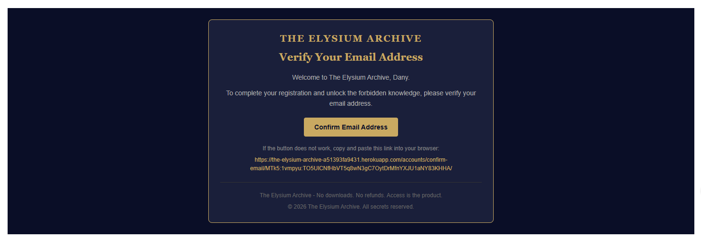

**For your own deployment:**

- Verify your own domain with Resend and use it as your sender address
- Or switch to another SMTP provider (Gmail, SendGrid, etc.)
- Or use Django's console email backend for local development

### Favicon Support

A full favicon set is implemented to support all major platforms.

Included formats:

- Browser favicon (`.ico`)
- PNG icons for multiple resolutions
- Apple touch icon
- Android icons
- Web manifest file

### Media Handling, Image Optimisation, and Visual Assets

Media assets are stored and delivered using **Cloudinary**, a cloud-based media management platform.

Images are served responsively based on device size and resolution. Cloudinary automatically generates optimised formats such as **WebP** and **AVIF** where supported, reducing file sizes without visible quality loss.

Image scaling is handled server-side to ensure the correct dimensions for each breakpoint. Featured images keep their intended composition across device sizes.

All atmospheric images used throughout the project are sourced from [Stockcake](https://stockcake.com/), a platform providing free AI-generated stock images. All images are used for educational purposes only as part of a Code Institute student project.

## Technologies Used

### Core Framework and Language

- **Django 6.0**
- **Python 3.14**
- **PostgreSQL**
- **SQLite3**

### Authentication and User Management

- **django-allauth 65.13.1**
  - User registration, login, logout
  - Email verification via configured Django email backend
  - Password reset and change functionality
  - Email address management
  - Social authentication is not currently configured.

### Frontend and Styling

- **HTML5, CSS3, JavaScript (Vanilla)**
- **Bootstrap 5.3**
- **Font Awesome 6.7**
- **Google Fonts**

### Backend Services and Integrations

- **Stripe 14.1.0**
- **Cloudinary 1.44.1**
- **Resend SMTP** (email delivery via `EMAIL_HOST` / `RESEND_API_KEY`)
- **CKEditor5 0.2.19** (Rich text editing for product content)

### Operations and Development

- **django-jazzmin 3.0.1**
- **whitenoise 6.11.0**
- **gunicorn 23.0.0**
- **dj-database-url 3.0.1**

### Development and Testing Tools

- Tools available via `dev-requirements.txt`:
  - **pytest 9.0.2**, **pytest-django 4.11.1**, **pytest-cov 7.0.0**
  - **black 25.12.0**, **isort 7.0.0**, **flake8 7.3.0**, **pylint 4.0.4**, **djlint 1.36.4**
  - **bandit 1.9.2**
  - **django-stubs 5.2.8** (type checking support)

### Deployment

- **Heroku**
- **Heroku PostgreSQL**
- **Git**

## Security and Error Handling

### Security Configuration

The Elysium Archive implements industry-standard security headers and Django best practices.

**Production Security Headers (when `DEBUG=False`):**

- `X_FRAME_OPTIONS = "DENY"` - Prevents clickjacking attacks
- `SECURE_HSTS_SECONDS = 31536000` - HTTP Strict Transport Security (1 year)
- `SECURE_HSTS_INCLUDE_SUBDOMAINS = True` - HSTS for all subdomains
- `SECURE_HSTS_PRELOAD = True` - HSTS preload list eligibility
- `SECURE_CONTENT_TYPE_NOSNIFF = True` - Prevents MIME type sniffing
- `SECURE_SSL_REDIRECT = True` - Force HTTPS in production
- `SESSION_COOKIE_SECURE = True` - Secure session cookies
- `CSRF_COOKIE_SECURE = True` - Secure CSRF cookies

`X_FRAME_OPTIONS` and `SECURE_CONTENT_TYPE_NOSNIFF` are always set; the remaining security settings apply when `DEBUG=False`.

**Environment Variable Protection:**

- All secrets stored in environment variables
- `env.py` excluded from version control
- Heroku Config Vars used for production
- Settings use safe placeholders for local defaults; production secrets are not committed

**Access Control:**

- Server-side authentication checks on all protected views
- Email verification required for sensitive operations
- Ownership verification for user-specific resources
- AccessEntitlement model as single source of truth for content access

**Code Security Audit:**

The codebase is regularly audited for security vulnerabilities using Bandit, a Python security linter:

- **Bandit Configuration**: Custom `bandit.yaml` excludes test code and third-party dependencies
- **XSS Prevention**: `format_html()` used for HTML generation with variable interpolation; `mark_safe()` only for static content
- **Password Security**: All test passwords generated at runtime using `django.utils.crypto.get_random_string()`
- **Secret Management**: No hardcoded secrets; `SECRET_KEY` uses environment variable with `get_random_secret_key()` fallback
- **Exception Handling**: All exceptions logged with context; no silent failures
- **Latest Audit**: 0 security issues (5,146 lines scanned, 02/02/2026)

Run security audit:

```bash
bandit -c bandit.yaml -r accounts cart checkout home orders products reviews elysium_archive manage.py
```

See [TESTING.md](TESTING.md) for detailed security audit results and methodology.

### Custom Error Pages

Error pages follow the site's styling and provide clear navigation:

- **400 - Bad Request** - Invalid request format handling
- **403 - Forbidden** - Access denied with login/purchase prompts
- **404 - Page Not Found** - Missing resources with helpful navigation
- **500 - Server Error** - Internal errors with self-contained styling

All custom error templates (400, 403, 404, 500) extend `base.html`.

Custom error templates are present; staff-only test routes (`/_test/errors/`) are used to validate them.
When `DEBUG=True`, Django shows its debug pages; to verify the themed error templates, test with `DEBUG=False` in a production-like local run.

## Stripe Payments

### Overview

The Elysium Archive uses Stripe Checkout (hosted) for secure payment processing.

The payment flow follows this sequence:

1. **Cart** - User adds archive entries to the shopping cart
2. **Checkout** - User reviews the order and confirms purchase intent
3. **Stripe Hosted Page** - User is redirected to Stripe's secure payment form
4. **Success or Cancel** - User returns to the site with confirmation or cancellation

Stripe Checkout sessions are created server-side using `stripe.checkout.Session.create`.
Payment method restrictions are not explicitly set in code.

### Webhook Confirmation and Fallback

Orders are finalized by verified webhooks and by a success-page fallback that rechecks Stripe session payment status.
Stripe webhook is available at `/checkout/webhook/` with alias `/checkout/wh/`.

The checkout success page includes a fallback verification step if webhook delivery is delayed: it re-checks the Stripe session and, when `payment_status == "paid"`, finalises the order (mark paid, store the payment intent ID, create entitlements, and clear the cart).

**Stripe Session Metadata and Fallback Logic:**

When a Stripe checkout session is created, the following metadata is included:

```python
metadata={
    "order_id": str(order.id),           # Primary key for quick DB lookup
    "order_number": order.order_number,  # Human-readable order identifier
}
```

The `order_id` metadata is primarily used by webhook handlers for direct order lookup.

**Idempotent and Atomic Processing:**

- The checkout flow is protected against duplicate submissions by reusing a recent pending order when a double POST happens in quick succession
- Entitlement creation is idempotent (DB unique constraint + `get_or_create`), so webhook replays and success-page refreshes do not create duplicates
- Order finalisation is atomic and uses transactions/row locking to prevent race conditions (double-submit safe)

### Stripe Mode

Stripe mode depends on configured API keys. Local defaults are test placeholders.

### How to Test a Payment

Follow these steps to test the checkout flow:

1. **Register an account** - Create a new account or log in to an existing one
2. **Verify your email** - Check your email inbox and verify your account (required for checkout)
3. **Browse the archive** - Go to the Archive page and select a product
4. **Add to cart** - Click "Add to Cart" on a product detail page
5. **View cart** - Review your cart at `/cart/`
6. **Proceed to checkout** - Click "Proceed to Checkout"
7. **Complete purchase** - Click "Complete Purchase" to redirect to Stripe
8. **Enter test card details** - Use the test card number below
9. **Submit payment** - Complete the Stripe form and submit
10. **View confirmation** - You will be redirected back to the success page

### Webhook Testing (optional)

- Install Stripe CLI and run `stripe login`
- Start a listener with `stripe listen --forward-to http://127.0.0.1:8000/checkout/webhook/`
- Complete a test checkout to let `checkout.session.completed` post back
- Ensure `STRIPE_WH_SECRET` matches the webhook signing secret printed by Stripe CLI

### Test Card Details

Use the following test card details on the Stripe checkout page:

- **Card Number:** `4242 4242 4242 4242`
- **Expiry Date:** Any future date (e.g., `12/34`)
- **CVC:** Any 3-digit number (e.g., `123`)
- **ZIP/Postal Code:** Any valid format (e.g., `12345`)

This is Stripe's official test card for successful payments. Other test cards for error scenarios can be found in [Stripe's testing documentation](https://docs.stripe.com/testing).

### Stripe Link Note

During checkout, you may see a "Pay with Link" button or a checkbox for "Save my information for faster checkout" on the Stripe hosted page.

This is part of Stripe's UI for accelerated checkout and autofill features. Available payment options are determined by Stripe for the session and account configuration.

### Developer Note

This project uses my personal Stripe account, which is also connected to my professional website [drakedrumstudio.ie](https://drakedrumstudio.ie).

The Elysium Archive served as a learning project for integrating Stripe Checkout into a Django application. The knowledge and implementation patterns developed here will be applied to my personal site in the future, where Stripe payments are planned but not yet active.

All Stripe keys and configuration are stored in environment variables and are never committed to version control.

## Admin Power Tools

The admin area uses Django admin with Jazzmin and project-specific enhancements.
It is designed for quick scanning, clear status visibility, and safer staff actions.
Most day-to-day checks can be done directly from list views without opening every record.

### Access for Staff

- Admin URL: `/admin/`
- Staff users can sign in to manage products, users, orders, reviews, categories, and entitlements.
- Local superuser command: `python manage.py createsuperuser`
- Configuration is environment-based (`env.py` locally, Config Vars in production).

### Visual Controls and Safety

Key admin UX improvements:
- Colored badges and status chips for active, featured, deal, verified, and order status
- Strong list filters and search fields for fast review and moderation
- Read-only fields where values are system-managed (for example, derived deal status)
- Safer flows in product management (delete action converted to unpublish, protected bulk actions)
- Extra guardrails in forms, including limits and helper UI for image alt text

### Jazzmin Showcase

#### Home Dashboard
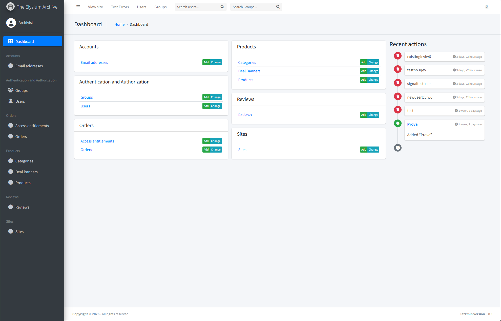
The home dashboard gives staff a clean entry point to the most important models.
It reduces navigation time across users, products, orders, reviews, and banners.

#### Users
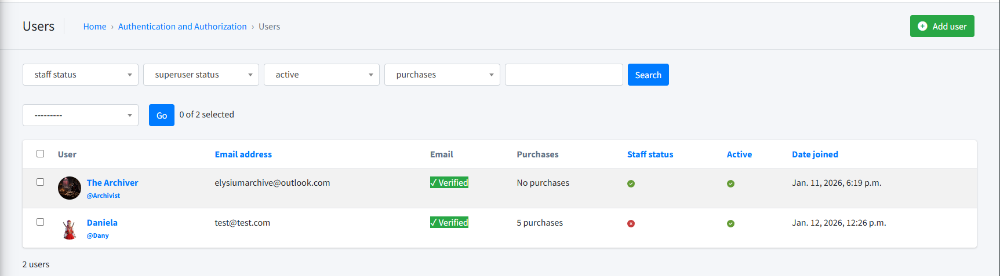
User rows expose verification and purchase context quickly.
This helps staff confirm account state and ownership history faster.

#### Products
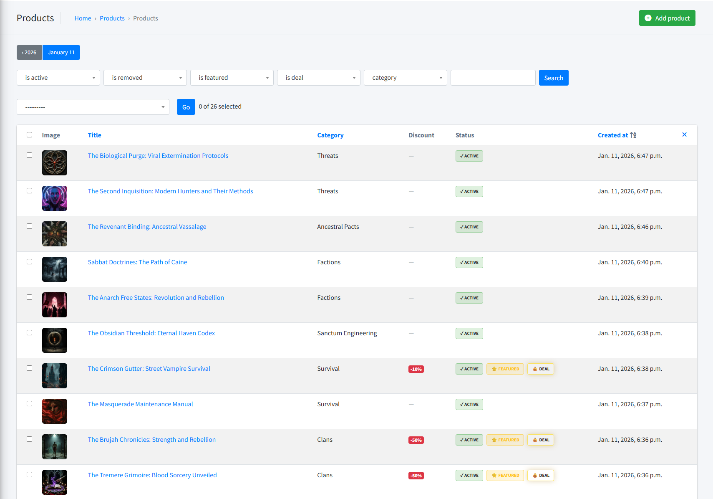
Product list views highlight active, featured, removed, and deal states with badges.
Staff can filter and update visibility with fewer mistakes.

#### Categories
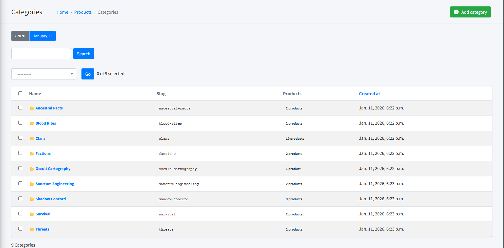
Category views show structure and product counts for quick scanning.
This improves catalog organization and cleanup decisions.

#### Deal Banners
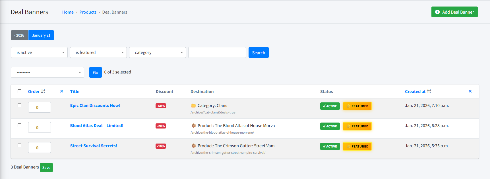
Banners can be reviewed with clear status cues and destination previews.
Staff can quickly control promotion visibility and ordering.

#### Orders
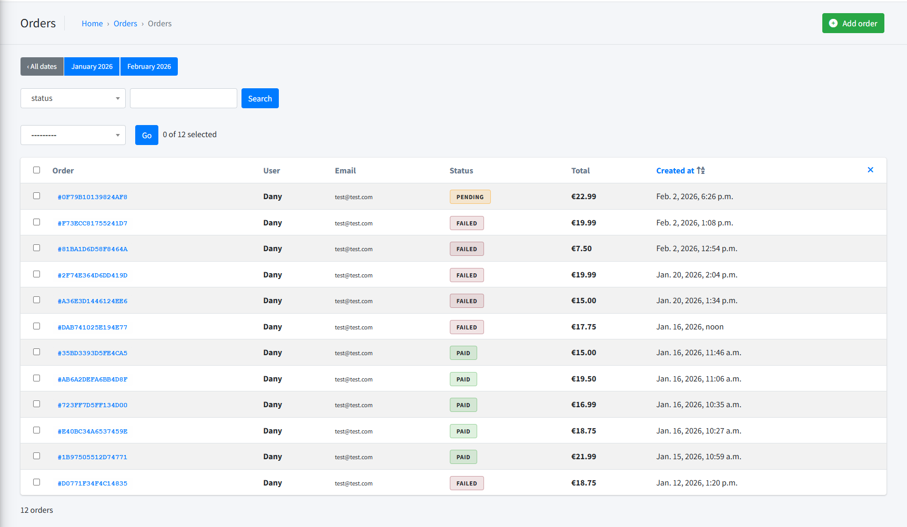
Orders show status badges and key account details in one row.
This supports faster support checks and payment follow-up.

#### Access Entitlements
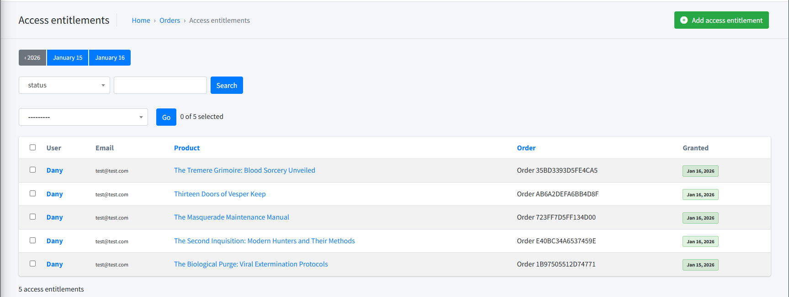
Entitlements provide the ownership source of truth for protected content access.
Staff can verify who owns what without jumping across multiple pages.

#### Reviews
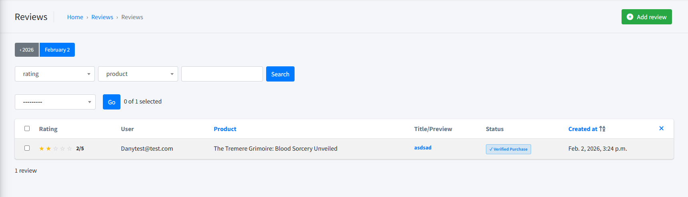
Reviews include rating display, verification cues, and moderation filters.
Staff can spot and process feedback issues more efficiently.

### Test Errors Dashboard (Staff Only)

Staff can open a dedicated error testing dashboard at `/_test/errors/`.
The page is linked from the admin top bar as **Test Errors** and is protected with staff-only access.
It is used to safely test the custom `400`, `403`, `404`, and `500` templates.

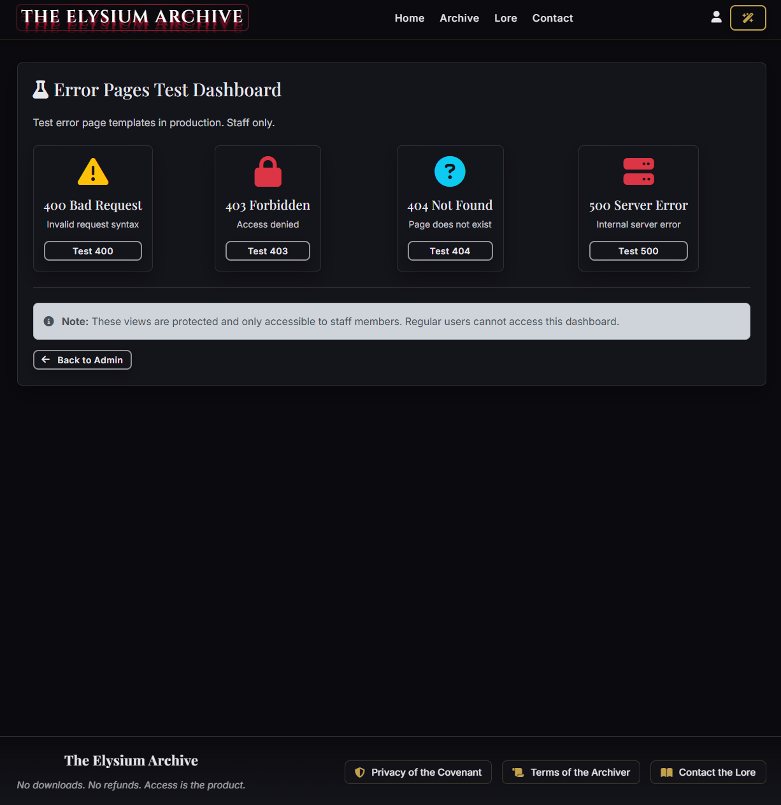

## Database Design

This project uses a relational database designed to support secure access control, verified purchases, and protected premium content.

### Business Rules

- Users can register and authenticate.
- Users can purchase products via Stripe checkout.
- A successful payment unlocks access to premium on-site content.
- Content is accessed on-site only (no downloads).
- Access is granted per product and linked to the purchasing user.
- Only verified buyers can leave a review for a product.

### Core Entities

- **User**
  Django built-in authentication user.

- **UserProfile**
  One-to-one extension of the User model for profile-related data.

- **Product**
  Represents a premium archive entry available for purchase.

- **Category**
  Organises products for browsing and deal banners.

- **DealBanner**
  Promotional banners that drive deal logic and front-end messaging.

- **Cart**
  Persistent cart container linked to a user.

- **CartItem**
  Items inside a user cart (one product per line).

- **Order**
  Stores checkout and payment-related information.

- **OrderLineItem**
  Links products to an order and records purchased items.

- **AccessEntitlement**
  Represents granted access to a product for a specific user after payment.

- **Review**
  Product review linked to a verified purchase.

Each entity and relationship is designed to be Django-friendly and simple to reason about.

### Data Model Overview

The database uses Django ORM with PostgreSQL in production and SQLite locally. Core models include cart persistence and deal banner logic, while keeping access control simple and auditable.

### Current Relationships

The current relationships are represented in the ERD below and summarised in the Core Relationships section.

### ERD (Entity Relationship Diagram)

The ERD below matches the current Django models in `accounts`, `cart`, `products`, `orders`, and `reviews`.

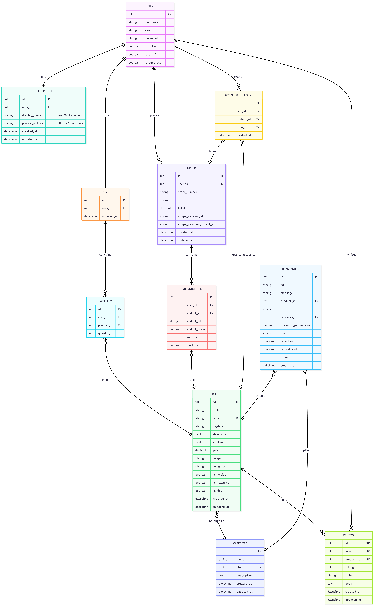

Main relationship summary:
- User ↔ UserProfile: one-to-one
- User ↔ Order: one-to-many (`Order.user` can be null for guest-style records)
- Order ↔ OrderLineItem: one-to-many
- User ↔ Product ownership: many-to-many through `AccessEntitlement`
- Product ↔ Category: many-to-one (`Product.category` is optional)
- Product ↔ Review: one-to-many, with each review linked to one user and one product
- DealBanner: optional links to a single product and/or a single category
- User ↔ Cart: one-to-one, with Cart ↔ CartItem as one-to-many

Each model uses Django's default primary key. Relationships are defined using foreign keys and one-to-one fields where appropriate.

**Key design choices:**

- Users are managed using Django's built-in authentication system.
- Profile data is stored separately using a one-to-one UserProfile model.
- Access to premium content is controlled via an explicit AccessEntitlement model.
- Reviews are restricted to verified buyers only.

### Core Relationships

- **User to UserProfile**: One-to-one relationship for profile data.
- **User to Cart**: One-to-one relationship for persistent cart storage.
- **Cart to CartItem**: One-to-many relationship for cart contents.
- **CartItem to Product**: Many-to-one relationship for cart items.
- **User to Order**: One-to-many relationship to track purchase history.
- **Order to OrderLineItem**: One-to-many relationship for purchased items.
- **User to Product**: Many-to-many relationship implemented via AccessEntitlement.
- **AccessEntitlement**: Grants access to a specific product for a specific user after payment.
- **Product to Review**: One-to-many relationship for verified buyer reviews.
- **Product to Category**: Many-to-one relationship for archive categorisation.
- **DealBanner to Product/Category**: Optional links that drive deal messaging and discount badges.

## AI-Assisted Development (Testing and Complex Features)

Testing is the area where I struggle the most and find the hardest to understand properly, so I used AI tools (ChatGPT and GitHub Copilot) to help with test design and complex flows such as authentication, email verification, access control, Stripe integration, webhooks, and admin safeguards.

I reviewed the suggested code carefully, understood it, and adapted it to match my project architecture. Mentor support and senior developer guidance were also essential in completing a project of this scope.

Automated tests are provided; run `pytest` locally and see [TESTING.md](TESTING.md) for details.

## Testing and Bug Fixes

For detailed testing documentation, coverage reports, manual testing procedures, and validation results, see [TESTING.md](TESTING.md).

### Testing Summary

**Automated Tests:** 120 tests, all passing.

Run the test suite:

```bash
pytest
```

Verbose output:

```bash
pytest -v
```

**Code Quality Checks** (available in `dev-requirements.txt`):

```bash
python -m black --check .
python -m isort --check-only .
flake8
pylint accounts cart checkout home orders products reviews elysium_archive manage.py
bandit -c bandit.yaml -r accounts cart checkout home orders products reviews elysium_archive manage.py
djlint --check .
```

**Security Audit:** Bandit scan reports 0 issues (5,146 lines scanned)

**Django Deployment Checks:**

```bash
python manage.py check --deploy
```

These are selected real bugs found and fixed during development. Fixes were validated with manual tests and deployment verification.

## Bug Fix Log

### Checkout access delay after payment

**Symptoms:** Purchases did not appear in My Archive; carts not cleared when webhooks arrived late.

**Root Cause:** Checkout relied on webhook-only reconciliation with only `order_number` in session metadata.

**Fix:** Added `order_id` to Stripe session metadata for direct webhook order lookup, while keeping success-page payment-status verification as fallback.

**How it was tested:** End-to-end checkout with test cards, simulated delayed webhooks, verified entitlement creation and cart clearing.

### Checkout: atomic paid + entitlements (idempotent) + fallback success confirmation

**Symptoms:** Delayed webhooks or refreshes could leave orders unpaid or risk duplicate entitlements.

**Root Cause:** Payment confirmation relied on webhook timing without a guarded fallback.

**Fix:** Success page now re-checks Stripe session `payment_status` and finalises orders atomically; entitlements created idempotently.

**How it was tested:** Stripe CLI forwarding, delayed webhook + refresh, replayed events to verify no duplicates.

### Static assets missing on Heroku

**Symptoms:** Deployed site served no CSS, JavaScript, or images.

**Root Cause:** Release phase ran migrations but not `collectstatic`.

**Fix:** Run `collectstatic` automatically in release phase:

```text
release: python manage.py migrate --noinput && python manage.py collectstatic --noinput
web: gunicorn elysium_archive.wsgi:application
```

**How it was tested:** Verified on Heroku staging; confirmed assets load correctly.

### Stripe webhook signature error not handled

**Symptoms:** Webhooks failed with import or attribute errors.

**Root Cause:** Code imported `SignatureVerificationError` from wrong path.

**Fix:** Corrected import from `stripe` and handled invalid signatures gracefully.

**How it was tested:** Replayed payloads locally; tested invalid and valid signatures; verified order updates and entitlement creation.

### ALT text length overflow (became a feature)

**Symptoms:** Admins could enter very long `image_alt` values risking deployment failures.

**Root Cause:** No server-side validation or admin guardrails for `Product.image_alt`.

**Fix:** Added `MaxLengthValidator(150)`, enforced `maxlength="150"` on admin input, added live character counter.

**How it was tested:** Manual admin tests; saves >150 chars failed server-side; verified counter updates while typing.

**Feature outcome:** Bug became a proactive admin UX safeguard with live counter and hard limit.

### Allauth login form AttributeError after customization

**Symptoms:** `'ElysiumLoginForm' object has no attribute '_login'`; `'str' object has no attribute 'redirect_url'`.

**Root Cause:** Customising allauth login form broke internal assumptions about form processing and redirect objects.

**Fix:** Restored expected form methods; ensured redirect handling returns correct types; updated login view logic for unified warning messages.

**How it was tested:** Manual login tests for wrong username/password scenarios; confirmed no AttributeError; ran unit tests.

## Running the Project Locally

### Quick Start

```bash
# Clone the repository
git clone https://github.com/Drake-Designer/the-elysium-archive.git
cd the-elysium-archive

# Create a virtual environment
python -m venv .venv

# Activate the virtual environment
# On macOS/Linux:
source .venv/bin/activate
# On Windows:
.venv\Scripts\Activate.ps1

# Install dependencies
pip install -r requirements.txt

# Install development dependencies (optional but recommended)
pip install -r dev-requirements.txt

# Create env.py with your configuration (see below)

# Run migrations
python manage.py migrate

# Create a superuser (optional, for admin access)
python manage.py createsuperuser

# Run the development server
python manage.py runserver
```

The project will be available at `http://127.0.0.1:8000/`

### Environment Configuration

This project uses environment variables to keep secrets out of version control. Local development uses a file called `env.py` in the project root, which is loaded automatically by Django settings.

**Important:** The `env.py` file must never be committed.

**Static Files in Development:**

Django serves static files automatically when `DEBUG=True`. The `collectstatic` command is primarily needed for deployment.

### Example `env.py`

Create a file named `env.py` in the project root (same level as `manage.py`):

```python
import os

os.environ.setdefault("DEBUG", "True")
os.environ.setdefault("SECRET_KEY", "local-dev-secret-key-change-me")
os.environ.setdefault("ALLOWED_HOSTS", "127.0.0.1,localhost")
```

### Example `env.py` (full local setup)

For a fuller local setup, include the common service keys as placeholders (no real values):

```python
import os

# Core
os.environ.setdefault("DEBUG", "True")
os.environ.setdefault("SECRET_KEY", "local-dev-secret-key-change-me")

# Media
os.environ.setdefault("CLOUDINARY_URL", "your-cloudinary-url")

# Stripe (test placeholders)
os.environ.setdefault("STRIPE_PUBLIC_KEY", "pk_test_xxx")
os.environ.setdefault("STRIPE_SECRET_KEY", "sk_test_xxx")
os.environ.setdefault("STRIPE_WH_SECRET", "whsec_xxx")

# Contact / Email
os.environ.setdefault("CONTACT_RECIPIENT_EMAIL", "your-contact@example.com")
os.environ.setdefault("DEFAULT_FROM_EMAIL", "no-reply@example.com")

# SMTP (Resend default)
os.environ.setdefault("EMAIL_HOST", "smtp.resend.com")
os.environ.setdefault("EMAIL_PORT", "587")
os.environ.setdefault("EMAIL_USE_TLS", "True")
os.environ.setdefault("EMAIL_HOST_USER", "resend")
os.environ.setdefault("RESEND_API_KEY", "re_xxx")
# Optional fallback if you are not using RESEND_API_KEY
os.environ.setdefault("EMAIL_HOST_PASSWORD", "your-smtp-password")
```

Never commit `env.py` to version control.
If sensitive keys are exposed, rotate them immediately and update your config vars.

### Email Configuration Guide

The project supports multiple SMTP providers. By default, it uses Resend.

**Resend (Recommended):**

```python
os.environ.setdefault("EMAIL_HOST", "smtp.resend.com")
os.environ.setdefault("RESEND_API_KEY", "re_xxx")
os.environ.setdefault("DEFAULT_FROM_EMAIL", "noreply@yourdomain.com")
```

**Alternatives:** Gmail (with app password), SendGrid, or any SMTP provider. Set `EMAIL_HOST`, `EMAIL_HOST_USER`, `EMAIL_HOST_PASSWORD`, and `DEFAULT_FROM_EMAIL` accordingly.

**Local Development:** In local DEBUG mode, Django already uses console email backend by default.

### DEBUG auto-switch

DEBUG is controlled by an environment variable:

- If `DEBUG` is not set, the project defaults to DEBUG True in local development.
- On Heroku, DEBUG is set to False using a config var.

## Heroku Deployment

The project is deployed on Heroku.

Production configuration uses Heroku Config Vars, which become environment variables at runtime. The production environment does not use `env.py`.

### Recommended production config vars (some have defaults/fallbacks).

The following environment variables are expected on Heroku:

#### Core

- `DEBUG` (set to `False` in production)
- `SECRET_KEY`
- `ALLOWED_HOSTS`
- `CSRF_TRUSTED_ORIGINS`
- `DATABASE_URL`

#### Media

- `CLOUDINARY_URL` - Required for Cloudinary media storage

#### Email / SMTP

- `EMAIL_HOST`
- `EMAIL_PORT`
- `EMAIL_USE_TLS`
- `EMAIL_HOST_USER`
- `RESEND_API_KEY` (preferred when using Resend SMTP)
- `EMAIL_HOST_PASSWORD` (fallback; required when `DEBUG=False` if `RESEND_API_KEY` is not set)
- `DEFAULT_FROM_EMAIL`
- `CONTACT_RECIPIENT_EMAIL`

#### Stripe

- `STRIPE_PUBLIC_KEY`
- `STRIPE_SECRET_KEY`
- `STRIPE_WH_SECRET`

### DEBUG auto-switch in production

Set `DEBUG=False` on Heroku. If `DEBUG` is not set locally, the project defaults to `True`.

## Deal Banner Bar

The homepage displays a scrolling **Deal Banner Bar** that shows promotional messages to visitors. Staff can create and manage these banners entirely from the Django Admin panel without code changes.

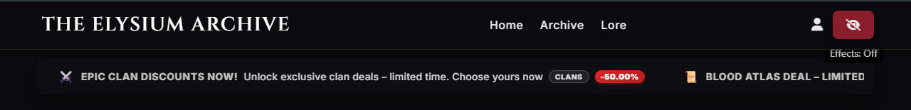

### What It Does

The Deal Banner Bar is a horizontal scrolling marquee that displays promotional messages at the top of the homepage. Each banner can include:

- A custom emoji icon
- A promotional message
- A clickable link to a product, category, or custom URL

Banners scroll continuously on the homepage only and are fully managed through Django Admin.

### How It Works (For Staff)

**Creating a Banner:**

1. Go to Django Admin → Deal Banners
2. Add a new banner with:

    - **Title**: Visible banner label shown to visitors (for example DEAL, HOT, NEW)
    - **Message**: The promotional text displayed on the homepage
    - **Emoji**: Optional icon (e.g., 🔥, ⚡, 🎉)
    - **Display Order**: Lower numbers appear first
    - **Active**: Toggle to show/hide the banner

**Managing from Admin List:**

- `is_active` is editable directly in the Deal Banner changelist
- Bulk actions are available for **Mark selected deal banners as active** and **Mark selected deal banners as inactive**
- Multiple banners can remain active at the same time
- Destination labels in admin reflect the same effective priority used by live banner URLs

**Linking Banners:**

Each banner can link to one of these destinations (effective priority order):

1. **Specific Product** → Used only when linked product is active and not removed
2. **Custom URL** → Used when product destination is not available
3. **Category** → Links to the archive filtered by that category + deals
4. **No Link** → Links to the archive with deals filter enabled

Simply select a product or category from the dropdown, or leave both empty to create a general deals banner.

### Automatic Deal Management

The banner system automatically manages the "Deal" status on products:

- A product is a deal only when it is active, not removed, and targeted by an active banner
- Category banners affect only active, non-removed products in that category
- When you disable or delete a banner, affected products are recalculated
- When you reassign a banner target, both previous and new targets are recalculated

This means you don't need to manually mark products as deals—the banner system handles it for you.

**Implementation Details:**

Deal status synchronization is handled via model save logic and Django signals in the `products/models.py` module:

- **Product save logic** - Recalculates deal status when category, active flag, or removed flag changes
- **DealBanner post_save signal** - Recalculates deal status for both previous and current product/category targets
- **DealBanner post_delete signal** - Recalculates deal status for associated targets after deletion

This ensures the `is_deal` field is always synchronized with the current state of banners without requiring manual admin intervention.

### Technical Details

For developers interested in the implementation:

- Banner visibility rules: `home/views.py`
- Deal status sync logic: `products/models.py`
- Admin configuration: `products/admin.py`
- Frontend marquee: `home/templates/home/index.html`
- Styling: `static/css/components/deal-banner.css`
- Automated tests: `TESTS/home/test_home.py`, `TESTS/products/test_deal_banners.py`

## Alt Text Safety

### Context

During testing, I intentionally entered very long image ALT texts to stress-test the system. I discovered that overly long values can fail during deployment when the database enforces max-length constraints (notably on Heroku/Postgres). To prevent accidental admin content from causing deploy or migration failures, small guardrails were added to the admin workflow.

### What Was Changed

1. **Server-side validation:**
    - The `Product.image_alt` field is constrained at the Django validation level to a safe maximum of **150 characters**
    - This prevents saving overly long values via the admin, API, or ORM and keeps the database schema unchanged

2. **Admin input hard limit:**
    - The Django Admin form enforces `maxlength="150"` on the `image_alt` input so staff cannot type past the limit in the browser

3. **Admin UX improvement (character counter):**
    - A small live character counter appears under the `image_alt` input (for example `0/150`) and updates while typing
    - When the limit is reached the counter highlights to indicate the maximum has been hit
    - The counter is implemented purely for UX; the security and canonical enforcement are provided by server-side validation

### Files Implementing This

- `products/models.py` - `image_alt` max length + Django validation
- `products/admin.py` - admin ModelForm and Media inclusion
- `static/js/admin/image-alt-counter.js` - live character counter (admin UX)
- `static/css/admin/admin-product-image-alt.css` - counter styling (no inline styles)

### Practical Benefit

- Prevents accidental invalid admin input that could break deployments or migrations
- Reduces the risk of runtime errors caused by data exceeding database constraints
- Encourages concise, meaningful ALT text which improves accessibility and content quality

## Future Improvements

- Send order confirmation emails automatically after purchase
- Show average rating summary on product cards
- Improve dashboard empty states with clearer guidance
- Add simple rate limiting or spam protection on login and contact form

These improvements focus on usability, feedback, and small quality-of-life enhancements without changing the core architecture.

## Credits and Acknowledgements
