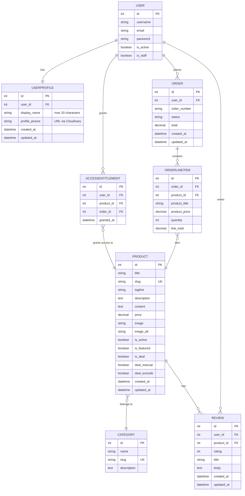

# Milestone Project 4: The Elysium Archive


**Live Site:** [The Elysium Archive](https://the-elysium-archive-a51393fa9431.herokuapp.com/)

The Elysium Archive is a story-driven, dark fantasy ecommerce site where each purchase unlocks a private archive page inside the website.

## Contents

- [Project Overview](#project-overview)
- [How The Elysium Archive Works](#how-the-elysium-archive-works)
- [Feature Summary](#feature-summary)
- [User Experience Design](#user-experience-design)
- [Features](#features)
- [Pages Overview](#pages-overview)
- [Technical Overview](#technical-overview)
- [Frontend Structure and Static Assets](#frontend-structure-and-static-assets)
- [Technologies Used](#technologies-used)
- [Security and Error Handling](#security-and-error-handling)
- [Stripe Payments](#stripe-payments)
- [Admin Panel Setup](#admin-panel-setup)
- [Database Design](#database-design)
- [AI-Assisted Development (Testing and Complex Features)](#ai-assisted-development-testing-and-complex-features)
- [Testing and Bug Fixes](#testing-and-bug-fixes)
- [Running the Project Locally](#running-the-project-locally)
- [Heroku Deployment](#heroku-deployment)
- [Admin Power Tools](#admin-power-tools)
- [Deal Banner Bar](#deal-banner-bar)
- [Alt Text Safety](#alt-text-safety)
- [Future Improvements](#future-improvements)
- [Credits and Acknowledgements](#credits-and-acknowledgements)

## Project Overview

**The Elysium Archive** is a story-driven, dark fantasy ecommerce project where you do not buy a file, you buy access. No downloads. No loose files. Just secrets.

Each product represents an archive entry, a forbidden text stored inside a private, vampire-only archive. Stripe Checkout runs in test mode, and a successful payment unlocks the entry inside your personal archive.

I built this project as my Code Institute Milestone Project 4 using Django and PostgreSQL. Inspired by gothic vampire lore and secret societies, The Elysium Archive is designed to feel like a real place: an ancient library reserved for invited members only.

### The Story Behind The Elysium Archive

The project draws on gothic vampire lore and the idea of a hidden society that exists alongside the ordinary world. The platform is framed as a private collection of forbidden texts, accessible only to verified members.

The dark fantasy theme supports the core logic of the platform by providing a narrative reason for:

- User accounts tied to a personal archive
- Access permissions based on verified purchases
- Immediate content unlocking after payment

### What You Get

- A themed product catalog (digital content)
- Secure account system (register, login, logout)
- Stripe checkout and order confirmation
- A private "My Archive" area with unlocked entries
- Account dashboard tabs for Profile, My Archive, My Orders, My Reviews, and Delete Account
- Track orders and reviews from the dashboard
- Protected archive reading pages
- Verified buyer reviews
- Profile management and full account deletion

### Who It Is For

- Visitors who enjoy dark fantasy themes and want to browse teasers
- Members who want a buy once, access forever experience
- Developers exploring a complete and structured Django project

Refunds are not supported by design. Archive entries unlock immediately after purchase.

## How The Elysium Archive Works

1. Visitors browse the catalog without an account.
2. Users register or log in to purchase content.
3. Checkout is handled via Stripe.
4. After payment, the product unlocks for the user.
5. The entry appears in "My Archive".
6. Users can manage their profile or delete their account.

## Feature Summary

### Homepage and User Interface

- Featured archive carousel with a single entry per slide
- Automatic carousel rotation with manual navigation controls
- Fully responsive layout across desktop, tablet, and mobile
- Global reduced-effects toggle available on all pages
- Consistent button styling and iconography across the site
- Optimised image loading and scaling via Cloudinary

### Catalog and Purchases

- Browse products with title, price, and description
- Product detail pages with a clear purchase flow
- Stripe checkout and confirmation

### Archive Access Control

- Private "My Archive" area
- Individual protected archive pages
- Direct URL access is blocked
- Unpublished products are hidden from the public archive list but remain reachable by entitled buyers (and superusers) via direct link; non-entitled users cannot access them

### Reviews (Verified Buyers Only)

- Reviews visible to everyone on product pages
- Only verified buyers can submit reviews
- One review per user per product enforced server-side
- Simple validation for clean feedback

### Profiles

- Edit account details
- Manage email and password
- Delete account permanently

## User Experience Design

To keep this section simple and easy to scan, it is organised in the following order:

1. [User Stories](#user-stories)
2. [Site Structure](#site-structure)
3. [Wireframes](#wireframes)
4. [Color Palette and Typography](#color-palette-and-typography)

### User Stories

User stories are planned and tracked using GitHub Projects.

[GitHub Project board](https://github.com/users/Drake-Designer/projects/5)

### Site Structure

The site structure was designed to support a clear journey from public browsing to protected content access.

#### Public areas

- Homepage
- Product catalog
- Product detail pages
- Registration and login pages

#### Restricted areas

- Shopping cart
- Checkout
- Order confirmation
- My Archive area
- Protected archive pages
- User profile

Restricted areas require authentication and a verified email address. Archive content also requires a completed purchase.

### Wireframes

Wireframes define layout and user flow before development.
They focus on structure and usability rather than visual design.

All wireframes were created using Balsamiq.

#### Desktop Wireframes

Designed for a 27 inch QHD display (2560x1440).


#### Mobile Wireframes

Optimised for common mobile and tablet devices.


### Color Palette and Typography

The visual identity supports the dark fantasy theme while remaining readable and accessible.

#### Color Palette

- **Void Black (`#0b0b0f`)**
  Main background color.

- **Obsidian Grey (`#14141b`)**
  Secondary background color for sections and cards.

- **Ash White (`#e6e6eb`)**
  Primary text color.

- **Blood Crimson (`#8b1e2d`)**
  Accent color for call-to-action elements.

- **Relic Gold (`#c2a14d`)**
  Premium accent color for archive highlights.

All color combinations were tested for WCAG contrast compliance.


#### Typography

The project uses the following Google Fonts:

- **Playfair Display**
  Used for headings and section titles.

- **Inter**
  Used for body text and UI elements.

- **Cinzel**
  Considered as an alternative decorative heading font.

Typography rules:

- Serif fonts are used only for headings.
- Sans-serif fonts are used for body text and UI.
- No more than two font families are used at the same time.
- Readability is always prioritised.


### Design and UX Decisions

The homepage carousel displays a single archive entry per slide to prioritise readability and focus. The reduced-effects toggle respects motion-sensitive users while preserving atmosphere, and the state persists via local storage.

Consistency between the homepage, catalog, and archive views keeps the experience cohesive through shared button styling, iconography, and spacing.

## Features

This section documents implemented features organised by category.

### User Authentication

- **Registration** - Create account with username, email, and password validation
- **Unique Email Enforcement** - Signup enforces unique emails case-insensitively (no duplicate accounts with different casing)
- **Email Verification** - Mandatory email verification via SendGrid
- **Login** - Secure authentication with username or email
- **Login Warnings** - Shows one warning at a time, distinguishes wrong password vs wrong username/email, and only shows the case-sensitive reminder when relevant
- **Password Reset** - Complete password reset flow with email link
- **Password Change** - Users can change password when logged in
- **Email Management** - Add and manage multiple email addresses
- **Account Deletion** - Permanent account deletion with proper cleanup
- **Custom Styling** - All auth pages styled to match the site
- **Allauth Integration** - Custom allauth templates and email flow

### User Profiles

- **Profile Page** - View account username and manage display name
- **Edit Display Name** - Optional custom display name with validation (max 20 characters)
- **Profile Picture** - Upload, replace, or remove a profile picture via Cloudinary
- **Delete Account** - Permanent account deletion with confirmation page

### Verified Email Access Control

- **Verified Email Gate** - All member-only areas (profile, dashboard, cart, checkout, archive) require a verified email address
- **Smart Redirects** - Unverified users are directed to email management with a clear, user-friendly message
- **Consistent Messaging** - Verification messages use Django messages framework styling
- **Superuser Protection** - Superuser accounts cannot be deleted via the UI; deletion attempts show a system message

### Public Pages

- **Homepage**: Hero section, featured entries carousel, membership information
- **Archive Catalog**: Browse all available archive entries
- **Lore Page**: Background story and world-building content

### User Feedback

- **Django Messages**: Clear success and error notifications
- **Form Validation**: Inline error feedback on registration and login forms
- **Accessible Alerts**: Bootstrap-styled alerts with proper ARIA roles

### Verified Reviews

- **Eligibility** - Verified email and a purchased product are required to submit; reviews are public on product pages
- **One Review Per Product** - Database constraint prevents duplicate reviews from the same user
- **Star Rating** - Reviews include a 1-5 star rating
- **Optional Title** - Review title is optional; defaults to "Untitled Review"
- **Review Body** - Text field for detailed feedback (no character limit)
- **Edit and Delete** - Users can edit or delete their own reviews at any time; ownership is enforced
- **Admin Moderation** - Reviews are registered in Django admin with filters for rating, product, and date

### My Archive – Permanent Access Management

- **Unified Access Source** - AccessEntitlement model is the single source of truth for purchased products
- **Dashboard Tab** - My Archive is a dashboard tab; `/accounts/my-archive/` redirects to it
- **Purchase Date Display** - Each unlocked product shows the unlock date on archive cards
- **Consistent Card Layout** - Archive cards display product image, title, description, and unlock date
- **Direct Reading Access** - Each card includes a "Read" button that opens the dedicated reading page
- **Empty State** - When no products are purchased, displays a friendly message and link to the archive catalog
- **Permanent Retention** - Once purchased, products remain in My Archive indefinitely; no expiration or revocation

### My Orders

- **Dashboard Tab** - Order history is available from the account dashboard
- **Order Summary** - Displays order number, created date/time, status, and total
- **Line Items** - Lists purchased items with quantity, line total, and product links when available
- **Empty State** - Shows a message when no orders exist

### My Reviews

- **Dashboard Tab** - Lists the user's reviews in the account dashboard
- **Review Details** - Displays product, rating, optional title, date/time, and body
- **Edit and Delete** - Includes edit/delete actions with server-side ownership enforcement
- **Empty State** - Shows a message when no reviews exist

### Product Preview Pages

- **Public Browsing** - Product detail pages serve as previews for all visitors
- **Purchase Flow** - Non-owners see pricing, add-to-cart button, and purchase call-to-action
- **Access Indicator** - Owners see a "Read Full Archive" button instead of purchase options
- **Content Separation** - Preview pages show teaser fields; full content is on the read page after entitlement
- **Review Display** - Reviews are visible to everyone; submission follows the verified purchase rule

### Archive Reading Pages

- **Dedicated Reading Experience** - Separate page (`/archive/<slug>/read/`) for immersive content consumption
- **Access Control** - Requires authentication, verified email, and AccessEntitlement for the specific product
- **Immersive Layout** - Clean, distraction-free design focused on reading the complete archive entry
- **Full Content Display** - Complete archive text displayed with elegant formatting and generous spacing
- **Navigation** - Clear links back to My Archive and product preview page
- **No Purchase Elements** - Reading page contains no cart, pricing, or purchase CTAs
- **Permission Denied** - Users without access receive 403 error; anonymous users redirected to login

## Pages Overview

| Page | URL | Access | Description |
| ------ | ----- | -------- | ------------- |
| Home | `/` | Public | Landing page with hero, carousel, and membership info |
| Archive | `/archive/` | Public | Browse all archive entries |
| Lore | `/lore/` | Public | World-building and story content |
| Privacy of the Covenant | `/privacy-of-the-covenant/` | Public | Privacy policy and site data practices |
| Terms of the Archiver | `/terms-of-the-archiver/` | Public | Terms and conditions for site use |
| Contact the Lore | `/contact-the-lore/` | Public | Public contact form to reach site maintainers |
| Register | `/accounts/signup/` | Anonymous only | Create a new account |
| Login | `/accounts/login/` | Anonymous only | Sign in to existing account |
| Logout | `/accounts/logout/` | Authenticated | Sign out (POST only) |
| Dashboard | `/accounts/dashboard/` | Authenticated | Account hub with profile, archive, orders, reviews, and delete tabs |
| Profile | `/accounts/profile/` | Authenticated | Redirects to dashboard profile tab |
| My Archive | `/accounts/my-archive/` | Authenticated | Redirects to dashboard archive tab |
| Delete Account | `/accounts/delete/` | Authenticated | Permanently delete account |
| Product Preview | `/archive/<slug>/` | Public | Preview page with purchase flow |
| Archive Reading | `/archive/<slug>/read/` | Owners only | Dedicated reading page for purchased content |
| Submit Review | `/archive/<slug>/review/` | Authenticated (POST) | Submit review for purchased product |
| Edit Review | `/archive/<slug>/review/<id>/edit/` | Review owner | Edit your own review |
| Delete Review | `/archive/<slug>/review/<id>/delete/` | Review owner (POST) | Delete your own review |
| Admin | `/admin/` | Staff only | Django admin panel |

## Technical Overview

### Access Control & Entitlements Architecture

The project uses an **AccessEntitlement** model as the single source of truth for product ownership and access:

- **Unique User/Product Link**: Each entitlement ties a user to a product via `unique_entitlement_per_user_product`
- **Centralised Helper**: `user_has_access(user, product)` in `elysium_archive/helpers.py` provides a shared access check
- **Consistent Usage**: Views and review logic verify entitlements before granting access or review submission
- **No Manual URL Manipulation**: Protected content cannot be accessed via guessed URLs; server-side checks are mandatory

### Review System & Eligibility

Reviews use the same AccessEntitlement model to verify purchase eligibility:

- **Eligibility Check**: Review creation confirms verified email and AccessEntitlement for the product
- **Idempotent Prevention**: Unique constraint prevents users from submitting multiple reviews for the same product
- **Edit/Delete**: Users can edit or delete their own reviews; ownership is enforced in views
- **Display Logic**: Reviews are visible to all visitors on product pages

### Architecture Decision: Switching to Django-Allauth

During mid-project development, the authentication system was refactored to use **django-allauth** instead of custom authentication logic.

**Why the switch?**

Production requirements for professional email management, password resets, and secure authentication workflows made django-allauth the better choice.

**What changed:**

- Replaced custom login/register views with allauth's built-in views
- Integrated SendGrid for professional email delivery
- Added email verification, password reset, and account management flows
- Implemented allauth email templates with project styling

**How the accounts app evolved:**

Rather than removing the `accounts` app, it was preserved and enhanced to complement allauth with domain-specific functionality:

- **UserProfile model** - Extended user profiles with display names and metadata
- **Dashboard and archive views** - Centralised account management and purchased content access
- **Account deletion** - Safe account deletion with proper cleanup
- **Custom forms** - ElysiumSignupForm and ElysiumLoginForm styled with Bootstrap
- Fixed login compatibility issues caused by custom allauth login form overrides
- Final behaviour supports the unified login warning messages described above

This hybrid approach keeps authentication professional while maintaining custom business logic within the accounts app.

### Django Apps Structure

- `home` - Public-facing pages and layout
- `accounts` - User profiles, archive access, and account management
- `products` - Product catalog and protected archive content
- `cart` - Shopping cart logic
- `checkout` - Stripe checkout handling
- `orders` - Order storage and history
- `reviews` - Verified buyer reviews

## Frontend Structure and Static Assets

This section documents the frontend architecture and static asset management implemented during development.

### Base Template Architecture

The project uses Django template inheritance to ensure consistency across all pages.

- A global `base.html` template defines the HTML structure, metadata blocks, navigation, footer, and global message handling
- All pages extend `base.html` and override content blocks only where needed

### Navigation and Layout

- The navigation bar is fully responsive using Bootstrap
- Desktop and mobile layouts follow the wireframes
- Accessibility considerations include skip to content, semantic HTML structure, and clear focus states

### Design System and Styling

A custom design system is implemented using CSS variables for colour, spacing, and typography. Styles are centralised and no inline styles are used in site templates.

### CSS Architecture and Organization

The project uses a modular CSS architecture to keep styles scoped and maintainable.

#### Frontend CSS Structure

**Base Styles:**

- `static/css/base.css` - Global styles, CSS variables, typography, navigation, forms, alerts

**Component Styles:**

- `static/css/components/dashboard.css` - Dashboard tabs and layout
- `static/css/components/deal-banner.css` - Deal banner marquee
- `static/css/components/products.css` - Product cards and layouts

**Page-Specific Styles:**

- `static/css/pages/home.css` - Homepage layout (hero, carousel, membership cards)
- `static/css/pages/lore.css` - Lore page styling
- `static/css/pages/footer-pages.css` - Footer and static pages

**Admin Styles:**

- `static/css/admin/admin.css` - Admin entry point (imports modules)
- `static/css/admin/*` - Admin UI components and overrides

**Loading Strategy:**

- `base.css` is loaded globally in `base.html` (applies to all pages)
- Page-specific CSS is loaded conditionally using `` in individual templates

**Example (homepage template):**

```django

<link rel="stylesheet" href="">

```

#### Exception inline style: Email Templates

Email templates (`templates/account/email/*.html`) use inline CSS only. This is necessary because:

- Most email clients do not support external style sheets
- Document-level `<style>` tags are stripped by many providers
- Inline styles are the most reliable way to ensure correct email rendering

### Static Assets Structure

Static assets are organised to support both development and production environments.

```text
static/
├── css/
│   ├── base.css                          → Global styles (navigation, forms, typography)
│   ├── components/
│   │   ├── dashboard.css                 → Dashboard UI components
│   │   ├── deal-banner.css               → Deal banner marquee
│   │   └── products.css                  → Product cards and layouts
│   ├── pages/
│   │   ├── home.css                      → Homepage-specific styles
│   │   ├── lore.css                      → Lore page styles
│   │   └── footer-pages.css              → Footer page styles
│   └── admin/
│       ├── admin.css                     → Admin entry point (imports all modules)
│       ├── admin-variables.css           → Admin CSS variables
│       ├── admin-components.css          → Admin UI components
│       ├── admin-jazzmin-overrides.css   → Jazzmin theme customisations
│       ├── admin-categories.css          → Category admin styling
│       ├── admin-products.css            → Product admin styling
│       ├── admin-orders.css              → Order admin styling
│       ├── admin-reviews.css             → Review admin styling
│       ├── admin-accounts.css            → Account admin styling
│       ├── admin-deal-banners.css        → Deal banner admin styling
│       └── admin-product-image-alt.css   → ALT text counter
│
├── js/
│   ├── dashboard.js                      → Dashboard tab switching
│   ├── deal-banner-carousel.js           → Deal banner auto-scroll
│   ├── effects-toggle.js                 → Reduced effects toggle
│   ├── messages.js                       → Django messages auto-dismiss
│   └── admin/
│       └── image-alt-counter.js          → Admin ALT text character counter
│
├── img/
│   ├── favicon/                          → Favicon files (all formats)
│   ├── home/
│   │   ├── how/                          → "How it works" section images
│   │   └── membership/                   → Membership section images
│   └── lore/                             → Lore page images
│
└── video/
    └── elysium-intro-video.mp4           → Homepage hero video
```

All static files are collected using Django's `collectstatic` command and are compatible with Heroku deployment.

### Email Templates and Notifications

All emails sent via SendGrid use custom HTML templates styled to match the project:

- **Email Verification** - Sent when users register (mandatory verification)
- **Password Reset** - Sent when users request password reset
- **Password Reset Complete** - Confirmation after successful reset
- **Email Change Notification** - Sent when users update their email address

Each template:

- Uses the site colour palette and typography
- Is responsive on mobile and desktop
- Has a plaintext fallback for clients that do not support HTML

Notes:

- The "Contact the Lore" form sends an email to the address set in `CONTACT_RECIPIENT_EMAIL`.
- Local development uses Django console email backend; production uses SMTP via `EMAIL_*` settings.

### Favicon Support

A full favicon set is implemented to support all major platforms.

Included formats:

- Browser favicon (`.ico`)
- PNG icons for multiple resolutions
- Apple touch icon
- Android icons
- Web manifest file

### Media Handling, Image Optimisation, and Visual Assets

Media assets are stored and delivered using **Cloudinary**, a cloud-based media management platform.

Images are served responsively based on device size and resolution. Cloudinary automatically generates optimised formats such as **WebP** and **AVIF** where supported, reducing file sizes without visible quality loss.

Image scaling is handled server-side to ensure the correct dimensions for each breakpoint. Featured images keep their intended composition across device sizes.

All atmospheric images used throughout the project are sourced from [Stockcake](https://stockcake.com/), a platform providing free AI-generated stock images. All images are used for educational purposes only as part of a Code Institute student project.

## Technologies Used

### Core Framework and Language

- **Django 6.0**
- **Python 3.14**
- **PostgreSQL**
- **SQLite3**

### Authentication and User Management

- **django-allauth 65.13.1**
  - User registration, login, logout
  - Email verification via SendGrid
  - Password reset and change functionality
  - Email address management
  - Social authentication ready

### Frontend and Styling

- **HTML5, CSS3, JavaScript (Vanilla)**
- **Bootstrap 5.3**
- **Font Awesome 6.5**
- **Google Fonts**

### Backend Services and Integrations

- **Stripe 14.1.0**
- **Cloudinary 1.44.1**
- **SendGrid (via django-allauth)**

### Admin and Development

- **django-jazzmin 3.0.1**
- **whitenoise 6.11.0**
- **gunicorn 23.0.0**
- **dj-database-url 3.0.1**

### Development and Testing Tools

- **pytest 9.0.2**
- **pytest-django 4.11.1**
- **black 25.12.0**
- **flake8 7.3.0**
- **bandit 1.9.2**

### Deployment

- **Heroku**
- **Heroku PostgreSQL**
- **Git**

## Security and Error Handling

### Security Configuration

The Elysium Archive implements industry-standard security headers and Django best practices.

**Production Security Headers (when `DEBUG=False`):**

- `X_FRAME_OPTIONS = "DENY"` - Prevents clickjacking attacks
- `SECURE_HSTS_SECONDS = 31536000` - HTTP Strict Transport Security (1 year)
- `SECURE_HSTS_INCLUDE_SUBDOMAINS = True` - HSTS for all subdomains
- `SECURE_HSTS_PRELOAD = True` - HSTS preload list eligibility
- `SECURE_CONTENT_TYPE_NOSNIFF = True` - Prevents MIME type sniffing
- `SECURE_SSL_REDIRECT = True` - Force HTTPS in production
- `SESSION_COOKIE_SECURE = True` - Secure session cookies
- `CSRF_COOKIE_SECURE = True` - Secure CSRF cookies

`X_FRAME_OPTIONS` and `SECURE_CONTENT_TYPE_NOSNIFF` are always set; the remaining security settings apply when `DEBUG=False`.

**Environment Variable Protection:**

- All secrets stored in environment variables
- `env.py` excluded from version control
- Heroku Config Vars used for production
- No hardcoded API keys, tokens, or passwords

**Access Control:**

- Server-side authentication checks on all protected views
- Email verification required for sensitive operations
- Ownership verification for user-specific resources
- AccessEntitlement model as single source of truth for content access

### Custom Error Pages

Error pages follow the site's styling and provide clear navigation:

- **400 - Bad Request** - Invalid request format handling
- **403 - Forbidden** - Access denied with login/purchase prompts
- **404 - Page Not Found** - Missing resources with helpful navigation
- **500 - Server Error** - Internal errors with self-contained styling

All error templates extend `base.html` (except 500, which uses inline critical CSS for reliability).

Error handlers are configured in `elysium_archive/urls.py` and work in both development and production.
When `DEBUG=True`, Django shows its debug pages; to verify the themed error templates, test with `DEBUG=False` in a production-like local run.

## Stripe Payments

### Overview

The Elysium Archive uses Stripe Checkout (hosted) for secure payment processing.

The payment flow follows this sequence:

1. **Cart** - User adds archive entries to the shopping cart
2. **Checkout** - User reviews the order and confirms purchase intent
3. **Stripe Hosted Page** - User is redirected to Stripe's secure payment form
4. **Success or Cancel** - User returns to the site with confirmation or cancellation

Stripe sessions are created server-side using `stripe.checkout.Session.create`. The integration is configured to accept card payments only via `payment_method_types=["card"]`.

### Webhook Confirmation

Payments are confirmed server-side via Stripe webhooks at `/checkout/webhook/`. Orders are marked paid and access entitlements are granted only after Stripe signature verification succeeds.

The checkout success page includes a fallback verification step if webhook delivery is delayed: it re-checks the Stripe session and, when `payment_status == "paid"`, finalises the order (mark paid, store the payment intent ID, create entitlements, and clear the cart).

The checkout flow is protected against duplicate submissions by reusing a recent pending order when a double POST happens in quick succession. Confirmation is robust through webhooks plus the success-page fallback, and entitlement creation is idempotent so refreshes or webhook replays do not create duplicates.

Entitlements are created idempotently to prevent duplicate access grants if webhook events are replayed or users refresh the success page.

- Entitlement creation is idempotent (DB unique constraint + `get_or_create`), so webhook replays and success-page refreshes do not create duplicates.
- Order finalisation is atomic and uses transactions/row locking to prevent race conditions (double-submit safe).

### Test Mode

All Stripe operations in this project run in test mode. This means:

- No real credit cards are charged
- No actual money moves
- Test card numbers are used for checkout
- Webhooks and payment confirmation can be simulated

### How to Test a Payment

Follow these steps to test the checkout flow:

1. **Register an account** - Create a new account or log in to an existing one
2. **Verify your email** - Check your email inbox and verify your account (required for checkout)
3. **Browse the archive** - Go to the Archive page and select a product
4. **Add to cart** - Click "Add to Cart" on a product detail page
5. **View cart** - Review your cart at `/cart/`
6. **Proceed to checkout** - Click "Proceed to Checkout"
7. **Complete purchase** - Click "Complete Purchase" to redirect to Stripe
8. **Enter test card details** - Use the test card number below
9. **Submit payment** - Complete the Stripe form and submit
10. **View confirmation** - You will be redirected back to the success page

### Webhook Testing (optional)

- Install Stripe CLI and run `stripe login`
- Start a listener with `stripe listen --forward-to http://127.0.0.1:8000/checkout/webhook/`
- Complete a test checkout to let `checkout.session.completed` post back
- Ensure `STRIPE_WH_SECRET` matches the webhook signing secret printed by Stripe CLI

### Test Card Details

Use the following test card details on the Stripe checkout page:

- **Card Number:** `4242 4242 4242 4242`
- **Expiry Date:** Any future date (e.g., `12/34`)
- **CVC:** Any 3-digit number (e.g., `123`)
- **ZIP/Postal Code:** Any valid format (e.g., `12345`)

This is Stripe's official test card for successful payments. Other test cards for error scenarios can be found in [Stripe's testing documentation](https://docs.stripe.com/testing).

### Stripe Link Note

During checkout, you may see a "Pay with Link" button or a checkbox for "Save my information for faster checkout" on the Stripe hosted page.

This is part of Stripe's UI for accelerated checkout and autofill features. The payment session is explicitly configured to accept card payments only via `payment_method_types=["card"]`.

### Developer Note

This project uses my personal Stripe account, which is also connected to my professional website [drakedrumstudio.ie](https://drakedrumstudio.ie).

The Elysium Archive served as a learning project for integrating Stripe Checkout into a Django application. The knowledge and implementation patterns developed here will be applied to my personal site in the future, where Stripe payments are planned but not yet active.

All Stripe keys and configuration are stored in environment variables and are never committed to version control.

## Admin Panel Setup

### Django Admin

- The project uses Django's built-in admin panel.
- The admin interface is available at `/admin`.
- It is used during development to manage users, products, orders, and reviews.

### Jazzmin Admin Theme

- `django-jazzmin` enhances the Django admin UI.
- Jazzmin is configured in `settings.py`.
- It improves layout and usability without changing admin logic.
- The top menu includes a staff-only quick link to `/_test/errors/` for the error testing dashboard.

### Superuser Creation

- Create a superuser locally to access the admin panel.
- Run the command: `python manage.py createsuperuser`.
- The superuser account is required for admin access.

### Environment Variables and Security

- Local development uses an `env.py` file for configuration.
- `env.py` is never committed to version control.
- Production uses Heroku Config Vars.
- Configuration is always read from `os.environ`.

### DEBUG Auto-Switch

- `DEBUG` defaults to `True` locally.
- `DEBUG` is set to `False` on Heroku.
- No manual code changes are required between environments.

## Database Design

This project uses a relational database designed to support secure access control, verified purchases, and protected premium content.

### Business Rules

- Users can register and authenticate.
- Users can purchase products via Stripe checkout.
- A successful payment unlocks access to premium on-site content.
- Content is accessed on-site only (no downloads).
- Access is granted per product and linked to the purchasing user.
- Only verified buyers can leave a review for a product.

### Core Entities

- **User**
  Django built-in authentication user.

- **UserProfile**
  One-to-one extension of the User model for profile-related data.

- **Product**
  Represents a premium archive entry available for purchase.

- **Category**
  Organises products for browsing and deal banners.

- **Order**
  Stores checkout and payment-related information.

- **OrderLineItem**
  Links products to an order and records purchased items.

- **AccessEntitlement**
  Represents granted access to a product for a specific user after payment.

- **Review**
  Product review linked to a verified purchase.

Each entity and relationship is designed to be Django-friendly and simple to reason about.

### Data Model Overview

The database uses Django ORM with PostgreSQL in production and SQLite locally. Core models are listed above and designed to keep access control simple and auditable.

### Current Relationships

The current relationships are represented in the ERD below and summarised in the Core Relationships section.

### ERD (Entity Relationship Diagram)

The Entity Relationship Diagram (ERD) below illustrates the current database structure.

The ERD was created using **[Mermaid Live](https://mermaid.live/)**, a diagramming tool that allows database relationships to be defined using clear, readable syntax and exported as an image.



Each model uses Django's default primary key. Relationships are defined using foreign keys and one-to-one fields where appropriate.

**Key design choices:**

- Users are managed using Django's built-in authentication system.
- Profile data is stored separately using a one-to-one UserProfile model.
- Access to premium content is controlled via an explicit AccessEntitlement model.
- Reviews are restricted to verified buyers only.

### Core Relationships

- **User to UserProfile**: One-to-one relationship for profile data.
- **User to Order**: One-to-many relationship to track purchase history.
- **Order to OrderLineItem**: One-to-many relationship for purchased items.
- **User to Product**: Many-to-many relationship implemented via AccessEntitlement.
- **AccessEntitlement**: Grants access to a specific product for a specific user after payment.
- **Product to Review**: One-to-many relationship for verified buyer reviews.
- **Product to Category**: Many-to-one relationship for archive categorisation.

## AI-Assisted Development (Testing and Complex Features)

Testing is the area where I struggle the most and find the hardest to understand properly, so I used AI tools (ChatGPT and GitHub Copilot) to help with test design and complex flows such as authentication, email verification, access control, Stripe integration, webhooks, and admin safeguards.

I reviewed the suggested code carefully, understood it, and adapted it to match my project architecture. Mentor support and senior developer guidance were also essential in completing a project of this scope.

All automated tests pass locally (see [TESTING.md](TESTING.md) and pytest output).

## Testing and Bug Fixes

For detailed testing, see [TESTING.md](TESTING.md).

These are selected real bugs found and fixed during development. Fixes were validated with manual tests and deployment verification.

## Bug Fix Log

### Checkout access delay after payment

- Symptoms:
  - Users reached checkout success but purchases did not appear in My Archive; carts were not cleared when webhook processing arrived later.
- Root Cause:
  - Checkout relied on webhook-only reconciliation and used only `order_number` in session metadata; delayed webhooks left the success view without a reliable payment state.
- Fix:
  - Add `order_id` to Stripe session metadata, verify the Stripe session in `checkout_success` as a fallback, create `AccessEntitlement` records when payment is confirmed, and limit model saves to changed fields.

`checkout/views.py`

```python
session = stripe.checkout.Session.create(
    line_items=line_items,
    mode="payment",
    success_url=request.build_absolute_uri(
        reverse("checkout_success", kwargs={"order_number": order.order_number})
    ),
    cancel_url=request.build_absolute_uri(reverse("checkout_cancel")),
    client_reference_id=order.order_number,
    metadata={
        "order_id": str(order.id),
        "order_number": order.order_number,
    },
)
```

- How it was tested:
  - Manual end-to-end checkout with Stripe test cards.
  - Simulated delayed webhooks.
  - Verified `AccessEntitlement` creation.
  - Confirmed cart clearing after payment.
  - Ran unit tests to ensure no regressions.

### Checkout: atomic paid + entitlements (idempotent) + fallback success confirmation

- Symptoms:
  - Delayed webhooks or refreshes could leave orders unpaid and entitlements missing, or risk duplicate entitlements after event replay.
- Root Cause:
  - Payment confirmation relied on webhook timing without a guarded fallback and lacked explicit idempotent entitlement checks in the success flow.
- Fix:
  - Add success-page fallback that re-checks Stripe session `payment_status == "paid"` and finalises the order atomically; create entitlements idempotently to prevent duplicates.
- How it was tested:
  - Stripe CLI forwarding with test card `4242 4242 4242 4242`.
  - Delayed webhook scenario followed by success-page refresh.
  - Replayed duplicate webhook events and verified no duplicate entitlements.

### Static assets missing on Heroku

- Symptoms:
  - Deployed site served no CSS, JavaScript, or images.
- Root Cause:
  - The Heroku release phase executed database migrations but did not run `collectstatic`, so static files were missing from the deployed slug.
- Fix:
  - Run `collectstatic` automatically in the release phase after migrations.

`Procfile`

```text
release: python manage.py migrate --noinput && python manage.py collectstatic --noinput
web: gunicorn elysium_archive.wsgi:application
```

- How it was tested:
  - Verified on Heroku staging.
  - Ran `python manage.py collectstatic --noinput` locally.
  - Confirmed that CSS, JS, and images load correctly after deployment.

### Stripe webhook signature error not handled

- Symptoms:
  - Stripe webhooks failed with an import or attribute error and were not processed.
- Root Cause:
  - The code imported the signature verification exception from the wrong path for the installed Stripe client library.
- Fix:
  - Import `SignatureVerificationError` correctly from Stripe and handle invalid signatures gracefully in the webhook view.

`checkout/webhooks.py`

```python
import stripe
from stripe import SignatureVerificationError

try:
    event = stripe.Webhook.construct_event(payload, sig_header, endpoint_secret)
except ValueError:
    logger.warning("Invalid payload for Stripe webhook")
    return JsonResponse({"error": "Invalid payload"}, status=400)
except SignatureVerificationError:
    logger.warning("Invalid signature for Stripe webhook")
    return JsonResponse({"error": "Invalid signature"}, status=400)
```

- How it was tested:
  - Replayed webhook payloads locally.
  - Tested invalid and valid signatures.
  - Verified that order status updates correctly.
  - Confirmed entitlements are created after valid webhook events.

### Admin ALT text length overflow (became a feature)

- Symptoms:
  - Administrators could enter very long `image_alt` values in the Django Admin.
  - These values risked causing deployment or migration failures on Postgres.
  - The admin UX provided no feedback about safe or recommended lengths.
- Root Cause:
  - No server-side validation or admin input guardrails existed for `Product.image_alt`.
- Fix:
  - Add a server-side `MaxLengthValidator(150)` to `image_alt`.
  - Enforce `maxlength="150"` on the admin input.
  - Add a live character counter using small admin-only JS and CSS.

`products/models.py`

```python
image_alt = models.CharField(
    max_length=255,
    blank=True,
    validators=[MaxLengthValidator(150)],
    help_text="Recommended 60-125 chars. Max 150.",
)
```

`products/admin.py`

```python
def __init__(self, *args, **kwargs):
    super().__init__(*args, **kwargs)
    if "image_alt" in self.fields:
        self.fields["image_alt"].widget.attrs["maxlength"] = "150"
        self.fields["image_alt"].widget.attrs["placeholder"] = "Short descriptive text (60-125 chars recommended)"
```

- How it was tested:
  - Manual admin tests confirming typing stops at 150 characters.
  - Attempted saves greater than 150 characters failed server-side.
  - Shell save attempts triggered Django validation errors.
  - Verified that the live character counter updates correctly while typing.

- Feature outcome:
  - This bug became the inspiration for a proactive admin UX safeguard.
  - A live ALT text counter and hard input limit were added to prevent future issues.
  - Server-side validation remains the canonical enforcement.
  - The counter exists purely as a UX improvement.

### Allauth login form AttributeError after customization

- Symptoms:
  - `'ElysiumLoginForm' object has no attribute '_login'`
  - `'str' object has no attribute 'redirect_url'`
- Root Cause:
  - Customising the allauth login form altered expected form processing and return values, breaking internal assumptions about the login handler and redirect objects.
- Fix:
  - Restored the expected form instance methods and ensured redirect handling returns the correct object types; updated the custom login form to delegate to allauth where appropriate.
  - Adjusted login view logic to support the unified warning messages and to only show case-sensitivity hints when relevant.
- How it was tested:
  - Manual login attempts for wrong username and wrong password scenarios.
  - Confirmed no AttributeError or redirect errors during local and staging sign-in flows.
  - Ran unit tests covering accounts and login flows to prevent regressions.

## Running the Project Locally

This project uses environment variables for environment specific configuration and to keep secrets out of version control.

Local development uses a file called `env.py` in the project root.
This file sets environment variables for local development only and is loaded automatically by the Django settings if present.

The `env.py` file must never be committed.

### Local setup

1. Create and activate a virtual environment.
2. Install production dependencies:
   - `pip install -r requirements.txt`
3. Optional: install development dependencies:
   - `pip install -r dev-requirements.txt`
4. Create an `env.py` file in the project root.
5. Run the development server:
   - `python manage.py runserver`

### Example `env.py`

Create a file named `env.py` in the project root (same level as `manage.py`):

```python
import os

os.environ.setdefault("DEBUG", "True")
os.environ.setdefault("SECRET_KEY", "local-dev-secret-key-change-me")
os.environ.setdefault("ALLOWED_HOSTS", "127.0.0.1,localhost")
```

### Example `env.py` (full local setup)

For a fuller local setup, include the common service keys as placeholders (no real values):

```python
import os

# Core
os.environ.setdefault("DEBUG", "True")
os.environ.setdefault("SECRET_KEY", "local-dev-secret-key-change-me")

# Media
os.environ.setdefault("CLOUDINARY_URL", "your-cloudinary-url")

# Stripe (test placeholders)
os.environ.setdefault("STRIPE_PUBLIC_KEY", "pk_test_xxx")
os.environ.setdefault("STRIPE_SECRET_KEY", "sk_test_xxx")
os.environ.setdefault("STRIPE_WH_SECRET", "whsec_xxx")

# Contact / Email
os.environ.setdefault("CONTACT_RECIPIENT_EMAIL", "your-contact@example.com")
os.environ.setdefault("DEFAULT_FROM_EMAIL", "no-reply@example.com")

# SMTP placeholders (optional)
os.environ.setdefault("EMAIL_HOST", "smtp.example.com")
os.environ.setdefault("EMAIL_PORT", "587")
os.environ.setdefault("EMAIL_USE_TLS", "True")
os.environ.setdefault("EMAIL_HOST_USER", "smtp-user@example.com")
os.environ.setdefault("EMAIL_HOST_PASSWORD", "your-smtp-password")
```

Never commit `env.py` to version control.
If sensitive keys are exposed, rotate them immediately and update your config vars.

### DEBUG auto-switch

DEBUG is controlled by an environment variable:

- If `DEBUG` is not set, the project defaults to DEBUG True in local development.
- On Heroku, DEBUG is set to False using a config var.

## Heroku Deployment

The project is deployed on Heroku.

Production configuration uses Heroku Config Vars, which become environment variables at runtime. The production environment does not use `env.py`.

### Required config vars

The following environment variables are expected on Heroku:

#### Core

- `DEBUG` (set to `False` in production)
- `SECRET_KEY`
- `ALLOWED_HOSTS`
- `CSRF_TRUSTED_ORIGINS`
- `DATABASE_URL`

#### Media

- `CLOUDINARY_URL` - Required for Cloudinary media storage

#### Email / SMTP

- `EMAIL_HOST`
- `EMAIL_PORT`
- `EMAIL_USE_TLS`
- `EMAIL_HOST_USER`
- `EMAIL_HOST_PASSWORD` (required when `DEBUG=False`)
- `DEFAULT_FROM_EMAIL`
- `CONTACT_RECIPIENT_EMAIL`

#### Stripe

- `STRIPE_PUBLIC_KEY`
- `STRIPE_SECRET_KEY`
- `STRIPE_WH_SECRET`

### DEBUG auto-switch in production

Set `DEBUG=False` on Heroku. If `DEBUG` is not set locally, the project defaults to `True`.

## Admin Power Tools

The project includes a Django admin interface with custom management features for staff users.

### Product Management

- Status badges for active, featured, and deal flags
- Deal rules exposed via manual and exclusion flags
- Filters for active status, featured status, deals, category, and creation date
- Category admin with product counts and styled badges

### User Management

- Purchase count badges based on entitlements
- Email verification badge and role badges
- Filters for staff/superuser/active status, groups, and purchase history

### Admin Styling

- Jazzmin theme integration with custom CSS modules
- Badge system for visual status cues
- Admin-only enhancements for products, categories, reviews, and deal banners

## Deal Banner Bar

The homepage includes a scrolling **Deal Banner Bar** (admin controlled promotions) managed entirely from Django Admin.

### Admin Features

- Create banners with title, message, emoji icon, display order, and active status
- Ordering via integer order field (lower values show first)
- Admin previews with destination badges and status indicators

### Destination Logic (Link Priority)

A banner click follows this priority order:

1. **Product**: links directly to the selected product page
2. **Custom URL**: uses the provided URL
3. **Category**: links to the archive filtered by category + deals
4. **Fallback**: links to the archive with deals filter enabled

### Deals Sync with Products

The banner system is connected to the product flag `is_deal`, used by filters and UI badges:

- Activating a banner linked to a **product** marks that product as a deal
- Activating a banner linked to a **category** marks all products in that category as deals
- Disabling or deleting a banner triggers a recalculation and updates affected products automatically

### Per-Product Exceptions

To support edge cases (for example: "one product in the category should NOT be a deal"):

- `deal_exclude`: prevents a product from becoming a deal via category banners
- `deal_manual`: forces a product to be a deal even without banners

### Deal Banner Screenshots

#### Frontend - Deal Banner Bar

--------------------SCREENSHOT HERE---------------------

#### Admin - Deal Banner Management

--------------------SCREENSHOT HERE---------------------

--------------------SCREENSHOT HERE---------------------

## Alt Text Safety

### Context / Why

- During testing I intentionally entered very long image ALT texts to stress-test the system.
- I discovered that overly long values can fail during deployment when the database enforces max-length constraints (notably on Heroku/Postgres).
- To prevent accidental admin content from causing deploy or migration failures, small guardrails were added to the admin workflow.

### What was changed

1. Server-side validation
   - The `Product.image_alt` field is constrained at the Django validation level to a safe maximum of **150 characters**.
   - This prevents saving overly long values via the admin, API, or ORM and keeps the database schema unchanged.

2. Admin input hard limit
   - The Django Admin form enforces `maxlength="150"` on the `image_alt` input so staff cannot type past the limit in the browser.

3. Admin UX improvement (character counter)
   - A small live character counter appears under the `image_alt` input (for example `0/150`) and updates while typing.
   - When the limit is reached the counter highlights to indicate the maximum has been hit.
   - The counter is implemented purely for UX; the security and canonical enforcement are provided by server-side validation.

### Files implementing this

- `products/models.py` - `image_alt` max length + Django validation
- `products/admin.py` - admin ModelForm and Media inclusion
- `static/js/admin/image-alt-counter.js` - live character counter (admin UX)
- `static/css/admin/admin-product-image-alt.css` - counter styling (no inline styles)

### Practical benefit

- Prevents accidental invalid admin input that could break deployments or migrations.
- Reduces the risk of runtime errors caused by data exceeding database constraints.
- Encourages concise, meaningful ALT text which improves accessibility and content quality.

## Future Improvements

## Credits and Acknowledgements
