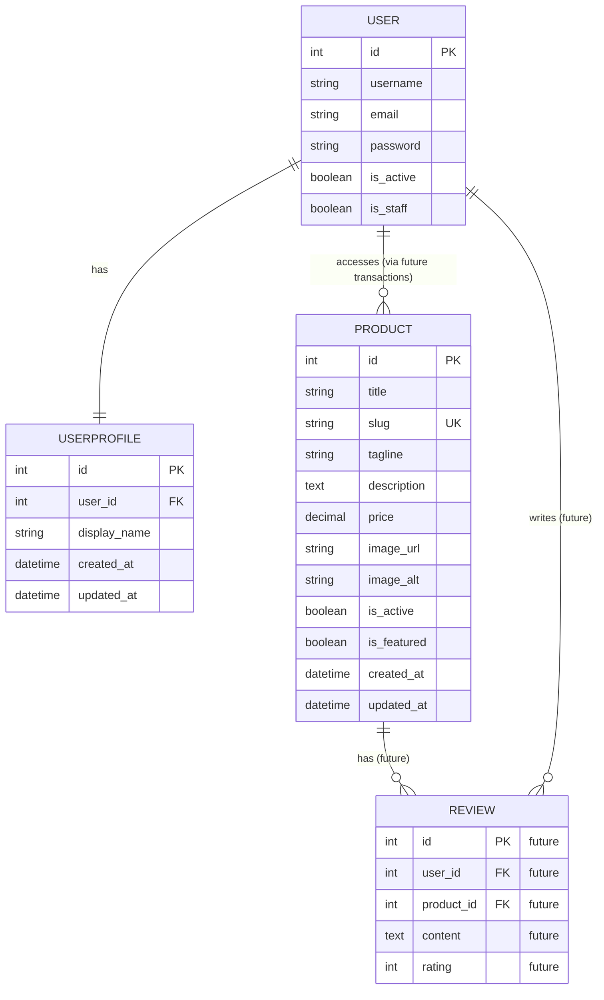

# Milestone Project 4: The Elysium Archive


Live Site: Coming soon

The Elysium Archive is a dark fantasy ecommerce site where each purchase unlocks a private archive page you can only access on the website.  
No downloads. No loose files. Just secrets.

## Contents

- [Project Overview](#project-overview)
- [How The Elysium Archive Works](#how-the-elysium-archive-works)
- [Feature Summary](#feature-summary)
- [User Experience Design](#user-experience-design)
- [Features](#features)
- [Technical Overview](#technical-overview)
- [Frontend Structure and Static Assets](#frontend-structure-and-static-assets)
- [Technologies Used](#technologies-used)
- [Database Design](#database-design)
- [Testing and Bug Fixes](#testing-and-bug-fixes)
- [Running the Project Locally](#running-the-project-locally)
- [Heroku Deployment](#heroku-deployment)
- [Future Improvements](#future-improvements)
- [Credits and Acknowledgements](#credits-and-acknowledgements)

## Project Overview

**The Elysium Archive** is a story-driven, dark fantasy ecommerce project where you do not buy a file, you buy access.

Each product represents an archive entry, a forbidden text stored inside a private, vampire-only archive. After a successful Stripe (test) payment, the entry unlocks a hidden page within the site and becomes part of your personal archive.

The content can be read online at any time, but it is never downloadable, reinforcing the idea of secrecy and exclusivity.

I built this project as my Code Institute Milestone Project 4 using Django and PostgreSQL. Inspired by gothic vampire lore and secret societies, The Elysium Archive is designed to feel like a real place: an ancient library reserved for invited members only.

### The Story Behind The Elysium Archive

The project is inspired by gothic vampire lore and the idea of a hidden society that exists alongside the ordinary world.

Rather than presenting content as a traditional online shop, the platform is designed as a private collection of forbidden texts, accessible only to verified members.

The dark fantasy theme supports the core logic of the platform by providing a narrative reason for:

- User accounts tied to a personal archive
- Access permissions based on verified purchases
- Immediate content unlocking after payment

### What You Get

- A themed product catalog (digital content)
- Secure account system (register, login, logout)
- Stripe checkout in test mode
- Order confirmation and order history
- A private “My Archive” area with unlocked entries
- Protected archive pages
- Verified buyer reviews
- Profile management and full account deletion

### Who It Is For

- Visitors who enjoy dark fantasy themes and want to browse teasers
- Members who want a buy once, access forever experience
- Developers exploring a complete and structured Django project

Refunds are not supported by design. Archive entries unlock immediately after purchase.

## How The Elysium Archive Works

1. Visitors browse the catalog without an account.
2. Users register to purchase content.
3. Checkout is handled via Stripe in test mode.
4. After payment, the product is unlocked for the user.
5. The entry appears in “My Archive”.
6. Only verified buyers can leave reviews.
7. Users can manage or delete their account.

## Feature Summary

### Homepage and User Interface

- Featured archive carousel with a single entry per slide
- Automatic carousel rotation with manual navigation controls
- Fully responsive layout across desktop, tablet, and mobile
- Global reduced-effects toggle available on all pages
- Consistent button styling and iconography across the site
- Optimised image loading and scaling via Cloudinary

### Catalog and Purchases

- Browse products with title, price, and description
- Product detail pages with a clear purchase flow
- Stripe test checkout and confirmation

### Archive Access Control

- Private “My Archive” area
- Individual protected archive pages
- Direct URL access is blocked

### Reviews (Verified Buyers Only)

- Reviews available only after purchase
- Displayed on product pages
- Simple validation for clean feedback

### Profiles

- Edit account details
- View order history
- Delete account permanently

## User Experience Design

To keep this section simple and easy to scan, it is organized in the following order:

1. [User Stories](#user-stories)
2. [Site Structure](#site-structure)
3. [Wireframes](#wireframes)
4. [Color Palette and Typography](#color-palette-and-typography)

### User Stories

User stories are planned and tracked using GitHub Projects.

[GitHub Project board](https://github.com/users/Drake-Designer/projects/5)

### Site Structure

The site structure was designed to support a clear journey from public browsing to protected content access.

#### Public areas

- Homepage
- Product catalog
- Product detail pages
- Registration and login pages

#### Restricted areas

- Shopping cart
- Checkout
- Order confirmation
- My Archive area
- Protected archive pages
- User profile and order history

Restricted areas require authentication and verified purchases.

### Wireframes

Wireframes define layout and user flow before development.  
They focus on structure and usability rather than visual design.

All wireframes were created using Balsamiq.

#### Desktop Wireframes

Designed for a 27 inch QHD display (2560x1440).


#### Mobile Wireframes

Optimized for common mobile and tablet devices.


### Color Palette and Typography

The visual identity supports the dark fantasy theme while remaining readable and accessible.

#### Color Palette

- **Void Black (`#0b0b0f`)**  
  Main background color.

- **Obsidian Grey (`#14141b`)**  
  Secondary background color for sections and cards.

- **Ash White (`#e6e6eb`)**  
  Primary text color.

- **Blood Crimson (`#8b1e2d`)**  
  Accent color for call-to-action elements.

- **Relic Gold (`#c2a14d`)**  
  Premium accent color for archive highlights.

All color combinations were tested for WCAG contrast compliance.


#### Typography

The project uses the following Google Fonts:

- **Playfair Display**  
  Used for headings and section titles.

- **Inter**  
  Used for body text and UI elements.

- **Cinzel**  
  Considered as an alternative decorative heading font.

Typography rules:

- Serif fonts are used only for headings.
- Sans-serif fonts are used for body text and UI.
- No more than two font families are used at the same time.
- Readability is always prioritised.


### Design and UX Decisions

The homepage carousel displays a single archive entry per slide rather than multiple cards. This design choice prioritises readability and allows each featured entry to command attention without visual clutter. The layout maintains a clear visual hierarchy, guiding visitors naturally from the hero section to featured content and membership information.

A global toggle for reduced visual effects is available on all pages. This feature respects user preferences for motion sensitivity and improves accessibility without compromising the dark fantasy atmosphere. The toggle state persists across page navigation using local storage.

Consistency between the homepage and archive views ensures a cohesive experience. Button styles, iconography, and interactive elements follow the same design language throughout the site, reinforcing the premium feel of the platform.

## Features

This section documents implemented features organised by category.

### User Authentication

- **Registration** – Create account with username, email, and password validation
- **Email Verification** – Mandatory email verification via SendGrid
- **Login** – Secure authentication with username or email
- **Password Reset** – Complete password reset flow with email link
- **Password Change** – Users can change password when logged in
- **Email Management** – Add and manage multiple email addresses
- **Account Deletion** – Permanent account deletion with proper cleanup
- **Custom Styling** – All auth pages themed to match dark fantasy design
- **Allauth Integration** – Professional email templates with SendGrid

### Public Pages

- **Homepage**: Hero section, featured entries carousel, membership information
- **Archive Catalog**: Browse all available archive entries
- **Lore Page**: Background story and world-building content

### User Feedback

- **Django Messages**: Clear success and error notifications
- **Form Validation**: Inline error feedback on registration and login forms
- **Accessible Alerts**: Bootstrap-styled alerts with proper ARIA roles

## Pages Overview

| Page | URL | Access | Description |
| ------ | ----- | -------- | ------------- |
| Home | `/` | Public | Landing page with hero, carousel, and membership info |
| Archive | `/archive/` | Public | Browse all archive entries |
| Lore | `/lore/` | Public | World-building and story content |
| Register | `/accounts/register/` | Anonymous only | Create a new account |
| Login | `/accounts/login/` | Anonymous only | Sign in to existing account |
| Logout | `/accounts/logout/` | Authenticated | Sign out (POST only) |
| Admin | `/admin/` | Staff only | Django admin panel |

## Technical Overview

### Architecture Decision: Switching to Django-Allauth

During mid-project development, the authentication system was refactored to use **django-allauth** instead of custom authentication logic.

**Why the switch?**

The initial approach used a custom `accounts` app with basic Django auth views. However, production requirements for professional email management, password resets, and secure authentication workflows made django-allauth the better choice. This is the same approach used successfully in previous projects (PP3).

**What changed:**

- Replaced custom login/register views with allauth's built-in views
- Integrated SendGrid for professional email delivery
- Added email verification, password reset, and account management flows
- Implemented allauth's email templates with custom dark fantasy branding

**How the accounts app evolved:**

Rather than removing the `accounts` app, it was preserved and enhanced to complement allauth with domain-specific functionality:

- **UserProfile model** – Extended user profiles with display names and metadata
- **my_archive view** – Displays user's purchased archive entries
- **profile view** – Allows users to edit display names and manage account settings
- **account_delete view** – Safe account deletion with proper cleanup
- **Custom forms** – ElysiumSignupForm and ElysiumLoginForm styled with Bootstrap

This hybrid approach keeps authentication professional while maintaining custom business logic within the accounts app.

### Django Apps Structure

- `home` – Public-facing pages and layout
- `accounts` – User profiles, archive access, and account management
- `products` – Product catalog and protected archive content
- `cart` – Shopping cart logic
- `checkout` – Stripe checkout handling
- `orders` – Order storage and history
- `reviews` – Verified buyer reviews

## Frontend Structure and Static Assets

This section documents the frontend architecture and static asset management implemented during early development.

### Base Template Architecture

The project uses Django template inheritance to ensure consistency across all pages.

- A global `base.html` template defines:
  - HTML document structure
  - Metadata and SEO blocks
  - Navigation bar
  - Footer
  - Global message handling
- All pages extend `base.html` and override content blocks only where needed
- This approach reduces duplication and simplifies future maintenance

### Navigation and Layout

- The navigation bar is fully responsive using Bootstrap
- Desktop and mobile layouts follow the wireframes exactly
- Accessibility considerations include:
  - Skip to content link
  - Semantic HTML structure
  - Clear focus states for keyboard navigation

### Design System and Styling

A custom design system was implemented using CSS variables.

- All theme colours are defined as root variables
- Typography is controlled centrally
- Spacing, font sizes, and layout scales adapt responsively
- No inline styles are used anywhere in the project

This ensures:

- Consistent visual identity
- Easier future changes
- Clean separation of concerns

### Static Assets Structure

Static assets are organised to support both development and production environments.

- CSS files are stored in `static/css`
- Images are stored in `static/img`
- Video assets are stored in `static/video`
- Favicon assets are stored in `static/img/favicon`

All static files are collected using Django’s `collectstatic` command and are fully compatible with Heroku deployment.### Email Templates and Notifications

All emails sent via SendGrid use custom HTML templates styled to match the dark fantasy theme:

- **Email Verification** – Sent when users register (mandatory verification)
- **Password Reset** – Sent when users request password reset
- **Password Reset Complete** – Confirmation after successful reset
- **Email Change Notification** – Sent when users update their email address

Each template:

- Uses dark theme colors and gothic styling
- Is fully responsive on mobile and desktop
- Has a plaintext fallback for clients that don't support HTML
- Uses SendGrid's infrastructure for reliable delivery
- Maintains consistency with website branding

### Favicon Support

A full favicon set is implemented to support all major platforms.

Included formats:

- Browser favicon (`.ico`)
- PNG icons for multiple resolutions
- Apple touch icon
- Android icons
- Web manifest file

This ensures consistent branding across desktop, mobile, and installed web experiences.

### Media Handling and Image Optimisation

Media assets are stored and delivered using Cloudinary, a cloud-based media management platform. This approach provides several benefits for performance and maintainability.

Images are served responsively based on device size and resolution. Cloudinary automatically generates optimised formats such as WebP and AVIF where supported, reducing file sizes without visible quality loss.

Image scaling is handled server-side to ensure appropriate dimensions for each breakpoint. This prevents unnecessary bandwidth usage on mobile devices while maintaining sharp visuals on larger screens.

The implementation avoids unintended cropping by using intelligent scaling with automatic gravity detection. Featured images retain their intended composition across all device sizes.

## Technologies Used

### Core Framework and Language

- **Django 6.0** – Backend framework
- **Python 3.14** – Programming language
- **PostgreSQL** – Production database
- **SQLite3** – Development database

### Authentication and User Management

- **django-allauth 65.13.1** – Professional authentication system
  - User registration, login, logout
  - Email verification via SendGrid
  - Password reset and change functionality
  - Email address management
  - Social authentication ready

### Frontend and Styling

- **HTML5, CSS3, JavaScript (Vanilla)**
- **Bootstrap 5.3** – Responsive layout and components
- **Font Awesome 6.5** – Icon library
- **Google Fonts** – Playfair Display, Inter, Cinzel

### Backend Services and Integrations

- **Stripe 14.1.0** – Payment processing (test mode)
- **Cloudinary 1.44.1** – Media storage and image optimization
- **SendGrid (via django-allauth)** – Email delivery

### Admin and Development

- **django-jazzmin 3.0.1** – Enhanced Django admin UI
- **whitenoise 6.11.0** – Static file serving
- **gunicorn 23.0.0** – Production WSGI server
- **dj-database-url 3.0.1** – Database URL parsing

### Development and Testing Tools

- **pytest 9.0.2** – Testing framework
- **pytest-django 4.11.1** – Django testing plugin
- **black 25.12.0** – Code formatter
- **flake8 7.3.0** – Linter
- **bandit 1.9.2** – Security linter

### Deployment

- **Heroku** – Cloud hosting platform
- **Heroku PostgreSQL** – Production database
- **Git** – Version control

## Admin Panel Setup

### Django Admin

- The project uses Django’s built-in admin panel.
- The admin interface is available at `/admin`.
- It is used during development to manage users, products, orders, and reviews.

### Jazzmin Admin Theme

- `django-jazzmin` enhances the Django admin UI.
- Jazzmin is configured in `settings.py`.
- It improves layout and usability without changing admin logic.

### Superuser Creation

- Create a superuser locally to access the admin panel.
- Run the command: `python manage.py createsuperuser`.
- The superuser account is required for admin access.

### Environment Variables and Security

- Local development uses an `env.py` file for configuration.
- `env.py` is never committed to version control.
- Production uses Heroku Config Vars.
- Configuration is always read from `os.environ`.

### DEBUG Auto-Switch

- `DEBUG` defaults to `True` locally.
- `DEBUG` is set to `False` on Heroku.
- No manual code changes are required between environments.

## Database Design

This project uses a relational database designed to support secure access control, verified purchases, and protected premium content.

### Business Rules

- Users can register and authenticate.
- Users can purchase products via Stripe checkout.
- A successful payment unlocks access to premium on-site content.
- Content is accessible only within the website and is never downloadable.
- Access is granted per product and linked to the purchasing user.
- Only verified buyers can leave a review for a product.

### Core Entities

- **User**  
  Django built-in authentication user.

- **UserProfile**  
  One-to-one extension of the User model for profile-related data.

- **Product**  
  Represents a premium archive entry available for purchase.

- **Order**  
  Stores checkout and payment-related information.

- **OrderLineItem**  
  Links products to an order and records purchased items.

- **AccessEntitlement**  
  Represents granted access to a product for a specific user after payment.

- **Review**  
  Product review linked to a verified purchase.

Each entity and relationship is designed to be Django-friendly and simple to reason about, avoiding unnecessary complexity while supporting all required functionality.

### Data Model Overview

The database follows a relational structure implemented using Django ORM and PostgreSQL.

Currently, the project uses a minimal, focused data model:

**Core Models:**

- **User** – Django's built-in authentication model (via django-allauth), manages all authentication.
- **UserProfile** – One-to-one extension of User; stores display names and profile metadata.
- **Product** – Represents a purchasable archive entry with title, description, price, and image.

**Future Models (planned):**

- **Order** – Will store purchase records and order history.
- **OrderLineItem** – Will link orders to products.
- **Review** – Will allow verified buyers to leave reviews on products.
- **AccessEntitlement** – Will explicitly grant user access to purchased products after payment.

**Note:** This section will be updated as new models are added to the project.

### Current Relationships

- **User to UserProfile**: One-to-one relationship for extended profile data.
- **Product to User**: Access relationship (currently unimplemented; will use AccessEntitlement when orders are implemented).

This minimal structure keeps the foundation clean and makes it easy to add purchase and review functionality when needed.

### ERD (Entity Relationship Diagram)

The Entity Relationship Diagram (ERD) below illustrates the current database structure.

It shows the main entities, their fields, and relationships. Future models (Order, Review, AccessEntitlement) are listed but not yet implemented.

The ERD was created using **[Mermaid Live](https://mermaid.live/)**, a diagramming tool that allows database relationships to be defined using clear, readable syntax and exported as an image.



The database follows a relational structure implemented using Django ORM and PostgreSQL.

Each model uses Django’s default primary key. Relationships are defined using foreign keys and one-to-one fields where appropriate.

**Key design choices:**

- Users are managed using Django’s built-in authentication system.
- Profile data is stored separately using a one-to-one UserProfile model.
- Products represent premium archive entries.
- Orders and OrderLineItems store purchase history.
- Access to premium content is controlled via an explicit AccessEntitlement model.
- Reviews are restricted to verified buyers only.

### Core Relationships

- **User to UserProfile**: One-to-one relationship for profile data.
- **User to Order**: One-to-many relationship to track purchase history.
- **Order to OrderLineItem**: One-to-many relationship for purchased items.
- **User to Product**: Many-to-many relationship implemented via AccessEntitlement.
- **AccessEntitlement**: Grants access to a specific product for a specific user after payment.
- **Product to Review**: One-to-many relationship for verified buyer reviews.

This structure keeps access control simple, auditable, and aligned with Django best practices.

### ERD (Full Entity Relationship Diagram)

The Entity Relationship Diagram (ERD) below illustrates the structure of the database used in this project.

It shows the main entities, their primary and foreign keys, and how they relate to each other.  
The diagram reflects the relational data model implemented using Django ORM and PostgreSQL.

## Testing and Bug Fixes

For detailed testing, see [TESTING.md](TESTING.md).

## Running the Project Locally

This project uses environment variables for environment specific configuration and to keep secrets out of version control.

Local development uses a file called `env.py` in the project root.  
This file sets environment variables for local development only and is loaded automatically by the Django settings if present.

The `env.py` file must never be committed.

### Local setup

1. Create and activate a virtual environment.
2. Install production dependencies:
   - `pip install -r requirements.txt`
3. Optional: install development dependencies:
   - `pip install -r dev-requirements.txt`
4. Create an `env.py` file in the project root.
5. Run the development server:
   - `python manage.py runserver`

### Example `env.py`

Create a file named `env.py` in the project root (same level as `manage.py`):

```python
import os

os.environ.setdefault("DEBUG", "True")
os.environ.setdefault("SECRET_KEY", "local-dev-secret-key-change-me")
os.environ.setdefault("ALLOWED_HOSTS", "127.0.0.1,localhost")
```

### DEBUG auto-switch

DEBUG is controlled by an environment variable:

- If `DEBUG` is not set, the project defaults to DEBUG True in local development.
- On Heroku, DEBUG is set to False using a config var.

## Heroku Deployment

The project will be deployed on Heroku.

Production configuration uses Heroku Config Vars, which become environment variables at runtime.  
The production environment does not use `env.py`.

### Required config vars

The following values are required on Heroku:

- `DEBUG=False`
- `SECRET_KEY`
- `DATABASE_URL`

More config vars are added as the project grows (Stripe keys, webhook secret, and other settings).

### DEBUG auto-switch in production

Production must always set:

- `DEBUG=False`

This keeps Django debug mode disabled in production while keeping local development convenient.

## Future Improvements

## Credits and Acknowledgements

### Media and Visual Assets

All atmospheric images used throughout the project are sourced from [Stockcake](https://stockcake.com/), a platform providing free AI-generated stock images. All images are used for educational purposes only as part of a Code Institute student project.

Media assets are optimised and delivered using Cloudinary.
