# Testing Guide - The Elysium Archive

[Return back to README](README.md)

This document describes the current automated test suite and manual testing procedures for the repository as it stands.

## Current Test Status

**135 tests passing.** Run `python -m pytest` to execute the full suite.

| What | Command | Expected Result | Evidence |
| --- | --- | --- | --- |
| Full automated suite | `.venv\Scripts\python.exe -m pytest -q` | 135 passed, 0 failed | Local run on 2026-02-13 |
| Verbose run | `.venv\Scripts\python.exe -m pytest -v` | Same pass status with per-test output | Local run on 2026-02-13 |
| Discovery check | `.venv\Scripts\python.exe -m pytest --collect-only` | Confirms current inventory under `TESTS/` | 135 tests collected |

## Evidence Status (Testing and Quality Checklist)

| Evidence Item | Status | Notes/Evidence |
| --- | --- | --- |
| Automated test suite documented | Yes | **135** tests, all passing|
| Manual testing checklist provided | Yes | Critical journeys, edge cases, contact form, Stripe decline flow documented |
| Python style/lint checks completed | Yes | black, isort, flake8, pylint, djlint, bandit |
| Security audit completed | Yes | Bandit scan clean, **0** issues |
| HTML validation results recorded | Yes | All tested pages valid, see HTML Validation section |
| CSS validation results recorded | Yes | Local styles valid; remaining errors are from external CDN libraries |
| JavaScript validation completed | Yes | JSHint, **0** errors |
| Responsiveness testing results recorded | Yes | Mobile, tablet, and smart display tested |
| Accessibility testing results recorded | Yes | Lighthouse + manual keyboard navigation + reduced motion |
| Best practices testing | Yes | Lighthouse Home - Mobile |
| SEO testing | Yes | Lighthouse Home - Mobile |
| Browser compatibility testing | Yes | Chrome and Firefox desktop on Windows |
| Performance testing | Yes | Lighthouse Home - Mobile |

This checklist tracks the current state of testing, validation, and quality evidence in the repository.

## Automated Tests

Automated testing uses `pytest` with `pytest-django`, with a mix of pytest-style functions and Django `TestCase` classes (notably in reviews).

### Tooling

| Tool | Version | Notes |
| --- | --- | --- |
| pytest | 9.0.2 | Primary test runner |
| pytest-django | 4.11.1 | Django integration |
| Test style mix | N/A | Pytest functions + Django `TestCase` classes |

### Automated Coverage Summary (Core Application Features)

| Feature Area | Coverage |
| --- | --- |
| CRUD workflows | Products, reviews, and orders (model + view behavior) |
| Authentication and verification | allauth flows, protected pages, and email-verification gates |
| Payment flow logic | Stripe checkout session creation, webhooks, and entitlement creation |
| Data management and access control | Entitlements and inactive product access rules |
| Review system | Create/edit/delete with character limits and optional fields |
| My Archive | Display of unlocked products with review/edit buttons |
| Dashboard functionality | Profile, archive, orders, reviews tabs, and review delete modal |

### Pytest Configuration

| Setting | Value | Where |
| --- | --- | --- |
| DJANGO_SETTINGS_MODULE | `elysium_archive.settings_test` | `pyproject.toml` (`[tool.pytest.ini_options]`) |
| python_files | `["test_*.py", "*_test.py", "tests.py"]` | `pyproject.toml` (`[tool.pytest.ini_options]`) |
| testpaths | `["TESTS"]` | `pyproject.toml` (`[tool.pytest.ini_options]`) |
| addopts | `"-ra"` | `pyproject.toml` (`[tool.pytest.ini_options]`) |

### Settings Overrides (`elysium_archive/settings_test.py`)

| Setting | Value | File |
| --- | --- | --- |
| STATICFILES_STORAGE | `StaticFilesStorage` | `elysium_archive/settings_test.py` |
| STORAGES | `FileSystemStorage` for media, `StaticFilesStorage` for static | `elysium_archive/settings_test.py` |
| EMAIL_BACKEND | `django.core.mail.backends.locmem.EmailBackend` | `elysium_archive/settings_test.py` |
| ACCOUNT_EMAIL_HTML | `True` | `elysium_archive/settings_test.py` |
| PASSWORD_HASHERS | `MD5PasswordHasher` | `elysium_archive/settings_test.py` |
| STRIPE_WH_SECRET | `whsec_test_dummy` | `elysium_archive/settings_test.py` |

### Running Tests

| Scenario | Command | Notes |
| --- | --- | --- |
| Run all tests | `.venv\Scripts\python.exe -m pytest -q` | Full suite |
| Verbose output | `.venv\Scripts\python.exe -m pytest -v` | Per-test detail |
| Specific test file | `.venv\Scripts\python.exe -m pytest TESTS/accounts/test_profile.py -v` | File-level run |
| Specific test class | `.venv\Scripts\python.exe -m pytest TESTS/products/test_access_control.py::TestProductAccessControl -v` | Class-level run |
| Specific test | `.venv\Scripts\python.exe -m pytest TESTS/orders/test_orders.py::TestWebhookHandling::test_webhook_idempotent_same_event_twice -v` | Single test run |
| Show print output | `.venv\Scripts\python.exe -m pytest -v -s` | Keep stdout/stderr |
| Collect-only discovery | `.venv\Scripts\python.exe -m pytest --collect-only` | Confirms inventory and discovery under `TESTS/` |

### Test Inventory Distribution

| App | Test Count | Coverage Areas |
| --- | --- | --- |
| Accounts | 34 | Authentication, email verification, profile management, account deletion |
| Products | 41 | Access control, archive reading, CRUD operations, product removal, deal banner admin/sync logic |
| Cart | 13 | Cart operations, validation, totals |
| Checkout | 4 | Checkout flow, Stripe integration, order reuse, webhook idempotency |
| Orders | 15 | Webhook handling, order status, entitlements |
| Home | 18 | Admin access, product management, deal banner visibility |
| Reviews | 10 | Review creation, dashboard integration, removed products |
| Total | **135** | Current automated inventory |

### Automated Coverage by App

| App | Test Files | What is Covered (short) |
| --- | --- | --- |
| Accounts | `TESTS/accounts/test_auth_pages.py`; `TESTS/accounts/test_email_gate.py`; `TESTS/accounts/test_profile.py` | Email verification gates for dashboard/profile/my-archive, anonymous redirect to login, verified dashboard tabs (`My Orders`, `My Reviews`), `display_name` updates, account deletion confirmation/logout/redirect/profile cascade removal |
| Products | `TESTS/products/test_access_control.py`; `TESTS/products/test_archive_read.py`; `TESTS/products/test_products.py`; `TESTS/products/test_deal_banners.py` | Active/inactive visibility by role, entitlement required for read page access (403 without), preview vs reading separation, email verification for unpublished products, product model CRUD/navigation links, archive card layout validation, deal banner admin actions, inline activation toggle, destination priority, and deal sync edge cases |
| Cart | `TESTS/cart/test_cart.py` | Add/remove cart with session persistence, verified email required for add-to-cart, validation for missing/inactive products, single/multiple-item totals |
| Checkout | `TESTS/checkout/test_checkout.py`; `TESTS/checkout/test_webhooks.py` | Verified email gate, Stripe session creation and mocked redirect, `Order`/`OrderLineItem` creation from cart, pending order reuse for double-submit safety, success fallback when webhook delayed, cart clearing, wrong-user success page blocked, webhook idempotency safety |
| Orders | `TESTS/orders/test_orders.py` | `checkout.session.completed` (paid/unpaid), `payment_intent.payment_failed`, `checkout.session.expired`, idempotent entitlement creation (`get_or_create`), atomic locking to prevent duplicate orders, signature validation, POST-only enforcement, graceful handling of missing order ID/user |
| Reviews | `TESTS/reviews/test_reviews.py` | Buyer-only form visibility, create with optional title (50 chars) and body (1000 chars), mandatory rating (1-5), duplicate prevention, cascade delete for user/product, edit/delete permission enforcement, delete requires POST and modal confirmation |
| Home | `TESTS/home/test_home.py` | Staff-only admin access (anonymous/regular user 403 or redirect), admin delete/bulk delete, featured flag toggle, staff-only order list/detail access |

## Manual Testing Procedures

Manual testing verifies user-facing behavior, rendering, and third-party flows that complement automated coverage.

### Critical User Journeys

| Test Case | Steps | Expected Result | Result |
| --- | --- | --- | --- |
| Sign Up & Email Verification | Create account -> verify email from console -> login | Verified user can access dashboard | **PASS** |
| Browse Archive | Visit `/archive/` as anon/verified -> click product | Active products listed; inactive hidden from non-staff | **PASS** |
| Cart & Checkout | Add product -> checkout with Stripe test card -> complete | Order marked paid; entitlement created; cart cleared | **PASS** |
| Access Protected Content | Entitled user visits `/archive/<slug>/read/` | Full content accessible; non-entitled users get 403 | **PASS** |
| Create Review | Buyer submits rating + optional title/body on product detail | Review displays with verified badge; non-buyers see no form | **PASS** |
| Edit/Delete Review | Click edit -> update; click delete -> confirm modal | Edit succeeds; delete requires POST + modal confirmation | **PASS** |

### Key Edge Cases

| Test Case | Steps | Expected Result | Result |
| --- | --- | --- | --- |
| Unverified dashboard access | Unverified user visits `/accounts/dashboard/` | Redirected to `/accounts/email/` | **PASS** |
| Unverified checkout attempt | Unverified user tries checkout | Redirected to email verification | **PASS** |
| Non-entitled read attempt | Non-entitled user visits read page | 403 Forbidden | **PASS** |
| Wrong user success page | Wrong user accesses success page | Redirected with error | **PASS** |
| Deal banner admin controls | Staff toggles `is_active` in changelist and runs bulk activate/deactivate actions | Banner states update correctly and products are re-synced without stale `is_deal` flags | **PASS (automated)** |
| Review delete modal | Open delete modal -> Stay | Stay cancels, Delete removes review | **PASS** |
| Rapid double-click checkout | Double-click checkout | Only one pending order created (no duplicate) | **PASS** |

### Contact Form Manual Testing

| Test Case | Steps | Expected Result | Result |
| --- | --- | --- | --- |
| Submit valid contact form | Open Contact page -> Fill name, email, subject, message -> Submit | Success message shown and email received | **PASS** |
| Missing required field | Leave message empty -> Submit | Validation error displayed | **PASS** |
| Invalid email format | Enter invalid email -> Submit | Validation error displayed | **PASS** |

| Email Delivery Verification | Value | Result |
| --- | --- | --- |
| Recipient address | `elysiumarchive@outlook.com` | **PASS** |
| Email content | Sender email, subject, and message body | **PASS** |
| Footer check | Footer confirms origin from contact form | **PASS** |
| Evidence | `documentation/testing/contact-form-email.png` | **PASS** |

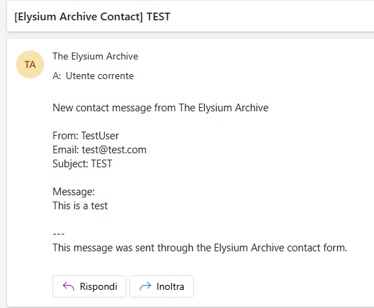

### Stripe Payment Failure Manual Testing

| Test Case | Steps | Expected Result | Result |
| --- | --- | --- | --- |
| Declined card payment | Add product -> Proceed to checkout -> Enter card `4000 0000 0000 9995` -> Confirm payment | Stripe shows decline error, no order marked as paid, no entitlement created, cart remains intact | **PASS** |

| Verification Point | Expected Outcome | Result |
| --- | --- | --- |
| Stripe decline response | Insufficient funds/declined card error shown | **PASS** |
| Success redirect | User is not redirected to success page | **PASS** |
| Product entitlement | No product access unlocked | **PASS** |
| Cart state | Cart contents remain available | **PASS** |
| Evidence | `documentation/testing/stripe-payment-failed.png` | **PASS** |

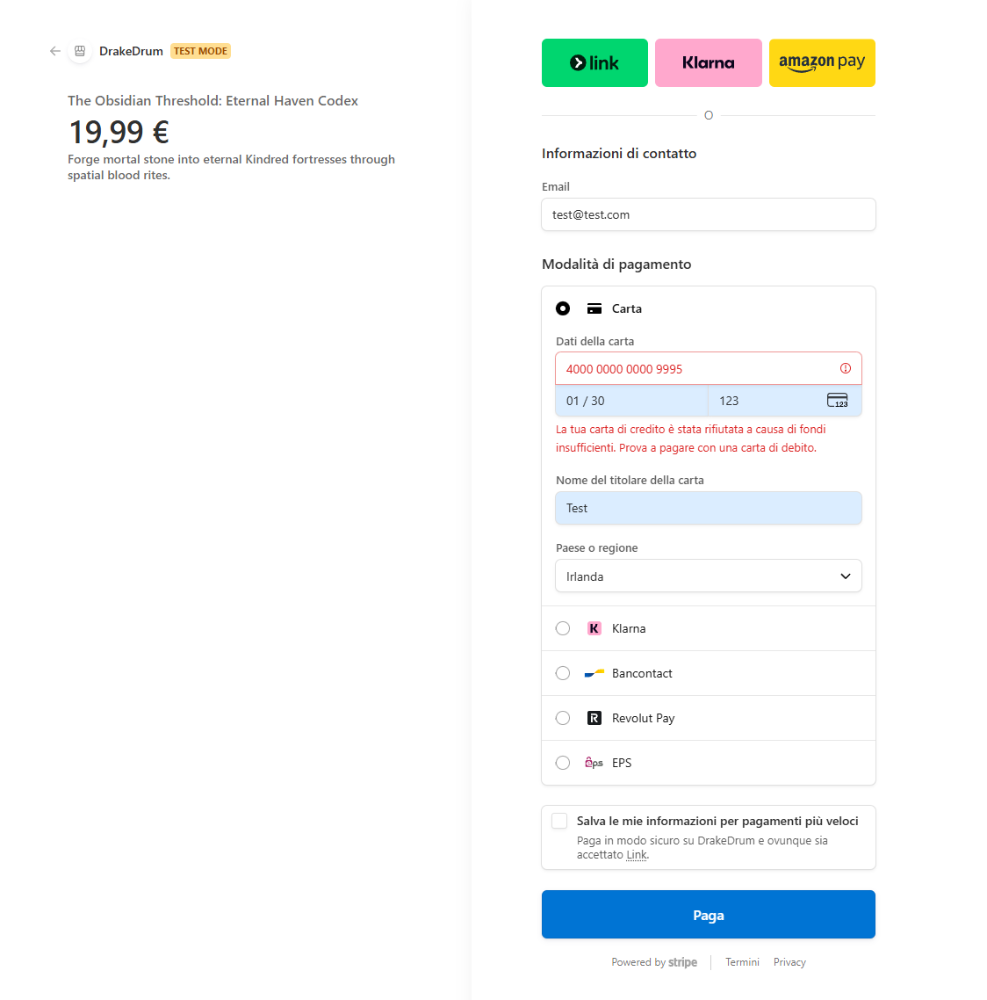

### Test Data Setup

| Task | Command/Steps | Notes |
| --- | --- | --- |
| Create a superuser | `python manage.py createsuperuser` | Required for admin/staff checks |
| Create a test product | `python manage.py shell; >>> from products.models import Category, Product; >>> from decimal import Decimal; >>> cat = Category.objects.create(name="Test", slug="test"); >>> Product.objects.create(title="Test Product", slug="test-product", description="Test description", content="<p>Test premium content.</p>", image_alt="Test image", price=Decimal("9.99"), category=cat, is_active=True)` | Creates active purchasable content for checkout/review/read tests |
| Start local server | `python manage.py runserver` | Run manual flows locally |
| Email verification in DEBUG | Use verification link printed to terminal (console backend) | Email is sent to console backend in DEBUG |

### Stripe Test Mode

| Item | Value/Command | Notes |
| --- | --- | --- |
| Webhook endpoint | `/checkout/webhook/` | Endpoint used for Stripe events |
| Stripe CLI listener | `stripe listen --forward-to http://127.0.0.1:8000/checkout/webhook/` | For local webhook forwarding |
| Test card | `4242 4242 4242 4242` | Use any future expiry and CVC |

## Responsiveness Testing

Responsive behavior was tested across Bootstrap 5 breakpoints and representative mobile, tablet, and smart-display devices.

### Breakpoints Covered

| Breakpoint | Range | Notes |
| --- | --- | --- |
| Mobile portrait | 320px - 575px | Small phone layouts |
| Mobile landscape | 576px - 767px | Wider phone layouts |
| Tablet | 768px - 991px | Tablet layouts |
| Smart display/desktop | 992px+ | Larger screens and desktop-like layouts |

### Device Test Results

| Device | Resolution | Orientation | Browser | Status | Evidence |
| --- | --- | --- | --- | --- | --- |
| iPhone SE | 375x667px | Portrait | Safari (iOS) | ✅ Tested | 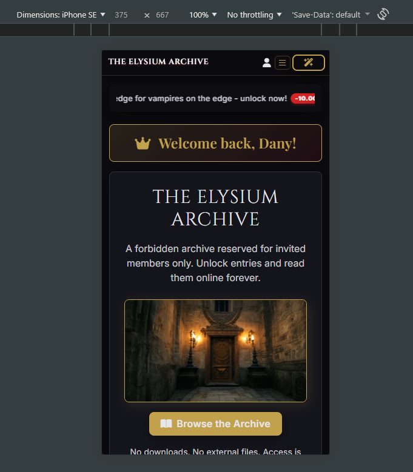 |
| Samsung Galaxy S20 | 360x800px | Portrait | Chrome (Android) | ✅ Tested | 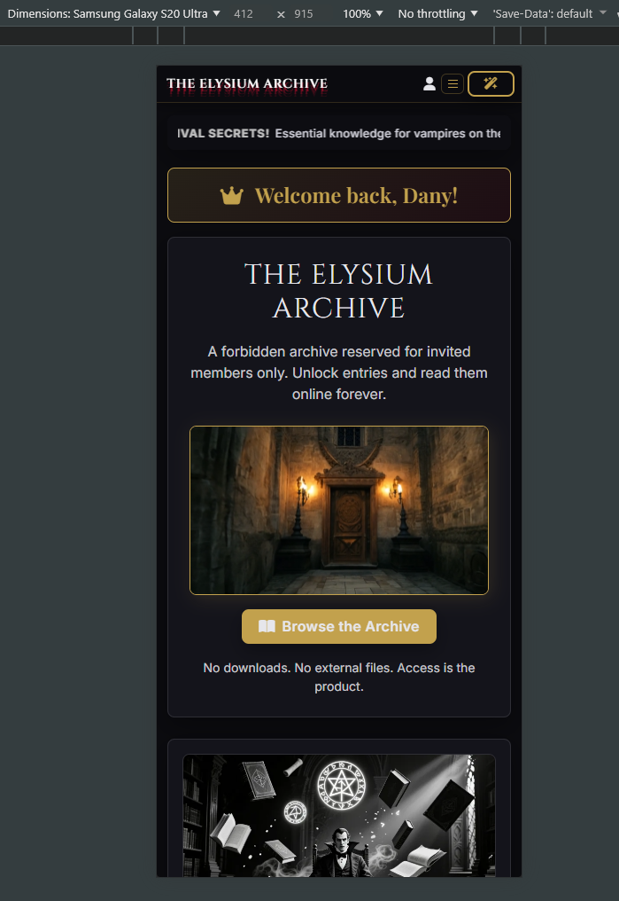 |
| iPhone 14 Pro Max | 430x932px | Portrait | Safari (iOS) | ✅ Tested | 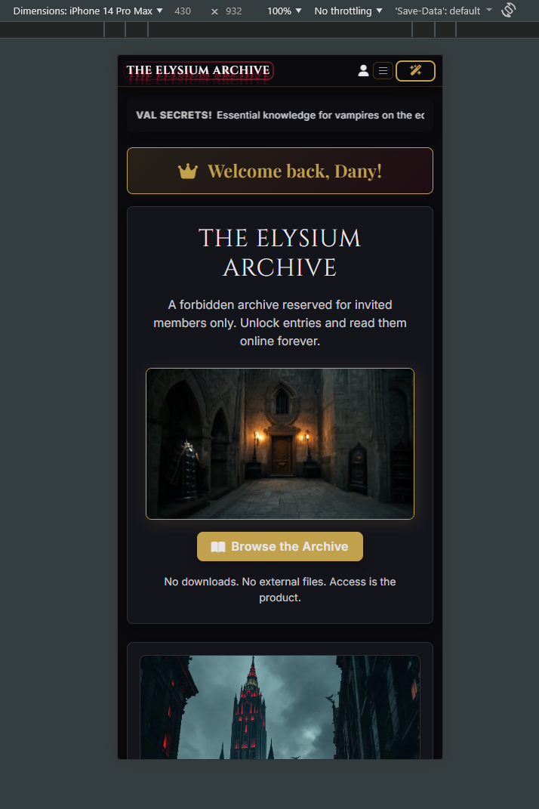 |
| iPad Pro | 1024x1366px | Portrait | Safari (iPadOS) | ✅ Tested | 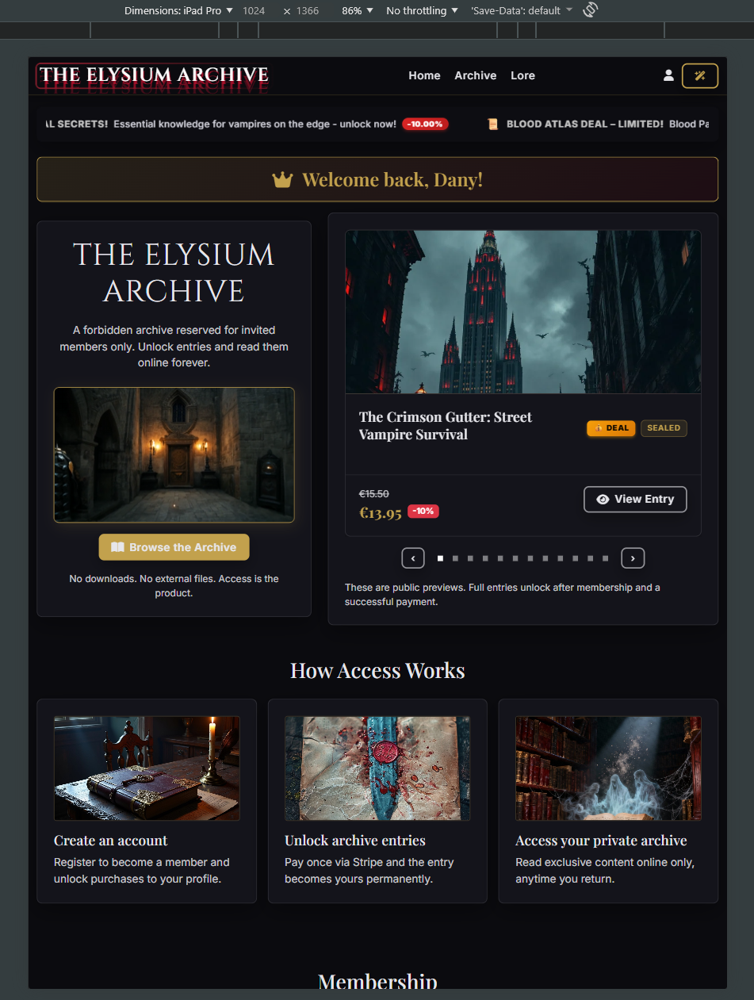 |
| Google Nest Hub Max | 1280x800px | Landscape | Chrome (Cast OS) | ✅ Tested | 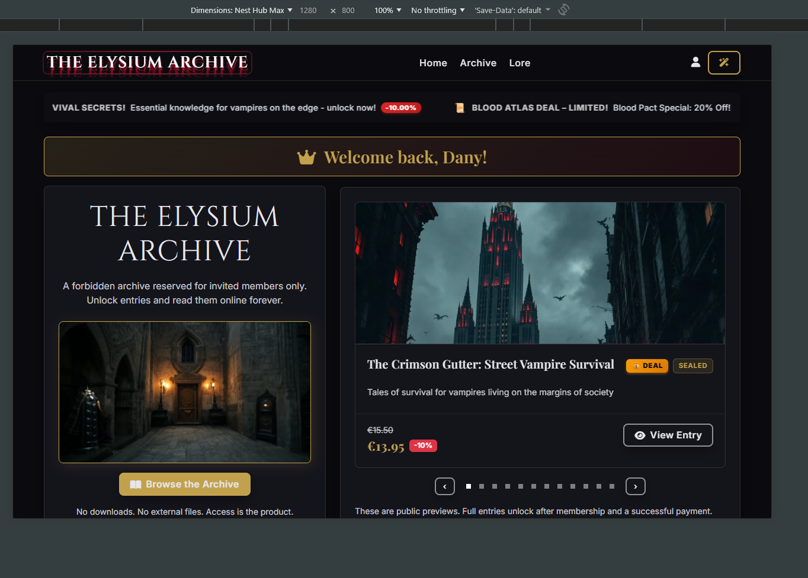 |

### Responsiveness Summary

| Check | Result | Notes |
| --- | --- | --- |
| Mobile-first navigation | **PASS** | Hamburger menu works on mobile |
| Flexible grid layouts | **PASS** | Column spans adapt correctly |
| Typography scaling | **PASS** | Text scales with viewport width |
| Touch-friendly targets | **PASS** | Buttons/links sized for mobile interaction |
| Spacing and padding | **PASS** | Consistent across breakpoints |
| Image behavior | **PASS** | Optimized for different screen densities |
| Form usability | **PASS** | Inputs sized correctly for mobile |
| Device consistency | **PASS** | Mobile and tablet layouts are consistent on tested devices |
| Overall status | **Completed** | Tested mobile (360-430px), tablet (1024px), and smart display (1280px) breakpoints |

## Accessibility Testing

Accessibility testing is completed with Lighthouse and manual keyboard/reduced-motion checks.

### Lighthouse Accessibility Audit Setup

| Item | Value |
| --- | --- |
| Tool | Lighthouse |
| Profile | Mobile emulation (Moto G Power) |
| Network | Slow 4G throttling |

### Lighthouse Accessibility Scores

| Page | Score | Evidence |
| --- | --- | --- |
| Home | **92** |  |
| Archive | **100** | 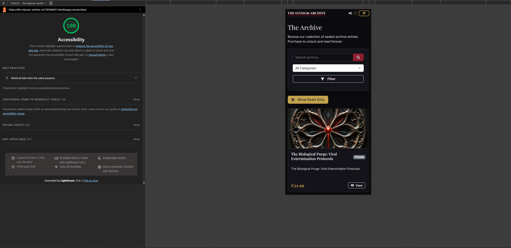 |
| Product Detail | **96** | 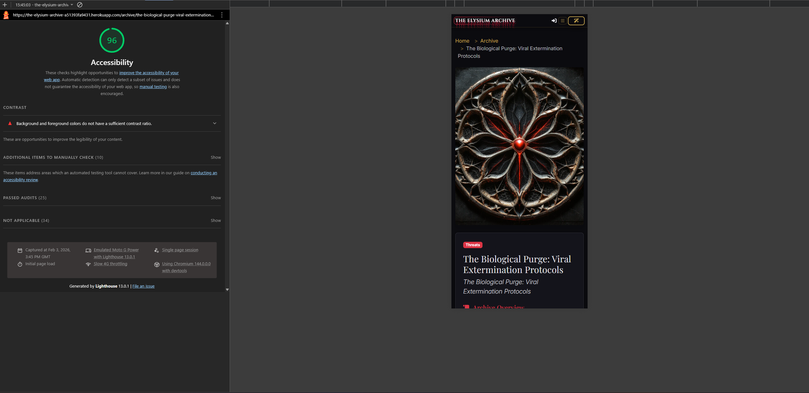 |
| Cart | **96** | 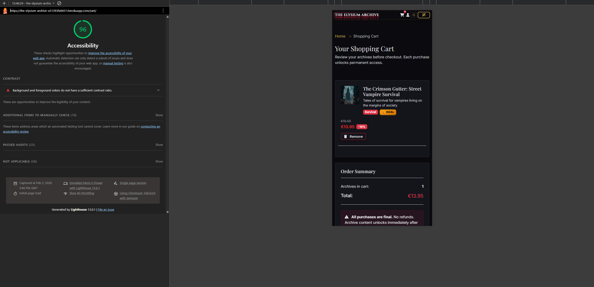 |
| Checkout Success | **94** | 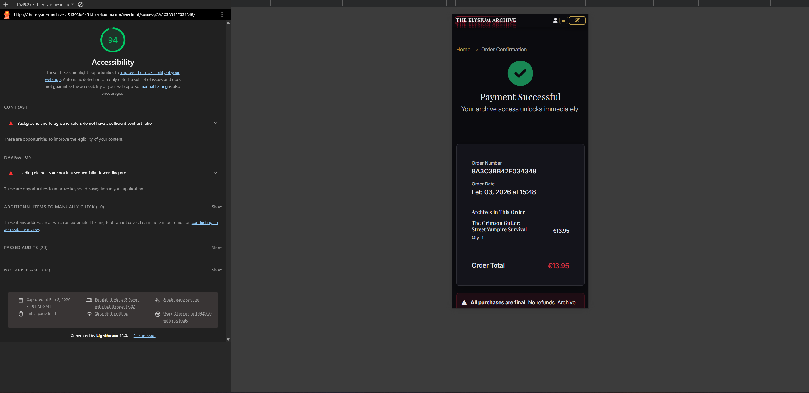 |
| Dashboard | **100** | 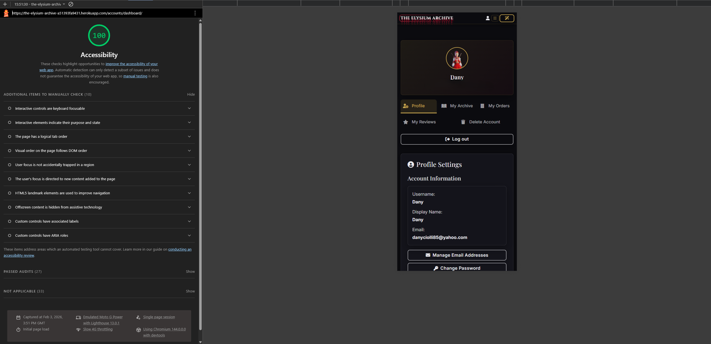 |
| Lore | **100** | 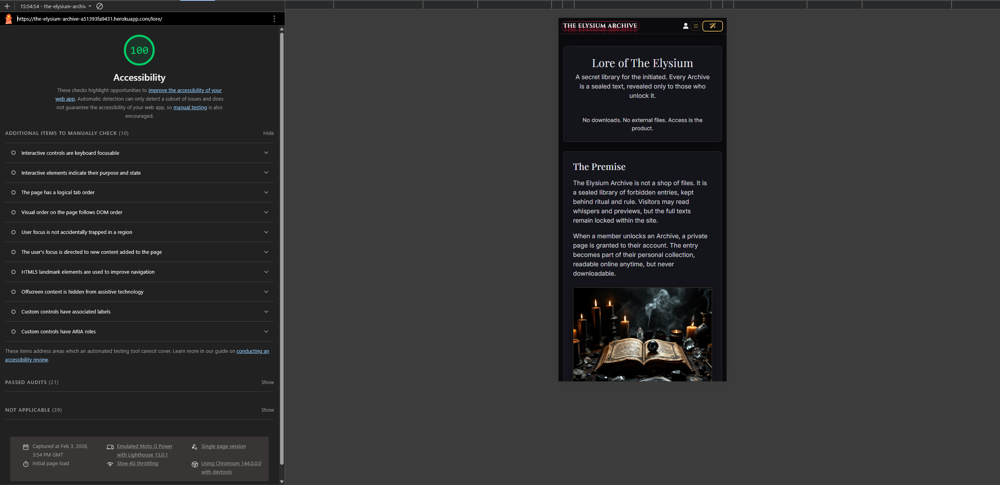 |

### Manual Accessibility Checks

| Check | Steps | Expected Result | Result | Evidence/Notes |
| --- | --- | --- | --- | --- |
| Keyboard navigation | Use Tab/Shift+Tab through primary nav links; verify focus indicator visibility; activate product cards and primary CTAs with Enter; navigate dashboard tabs; operate review delete modal with keyboard (Stay/Delete) | All core interactive elements are reachable and operable by keyboard with visible focus | **PASS** | Manual run completed |
| Reduced motion / effects toggle | Enable reduced effects and verify background video playback is disabled; verify deal banner animations are disabled; verify navbar visual effects/transitions are reduced; refresh page; restart browser | Motion-heavy effects are reduced/disabled and toggle state persists after refresh and restart | **PASS** | Manual run completed |

### Home Page Minor Warnings

| Warning | Impact | Notes |
| --- | --- | --- |
| Primary button contrast warnings | Minor | Tracked; overall accessibility score acceptable |
| Carousel control button sizing | Minor | Touch target sizing can be improved |
| Video captions | Compliance maintained | Captions are already present |

## Lighthouse Testing

Lighthouse 13.0.1 was run in mobile emulation with Slow 4G throttling on initial page load.

### Test Context

| Item | Value |
| --- | --- |
| Tool version | Lighthouse 13.0.1 |
| Mode | Mobile emulation |
| Throttling | Slow 4G |
| Session type | Single page session |
| Load phase | Initial page load |
| URL tested | https://the-elysium-archive-a51393fa9431.herokuapp.com/ |

### Summary Metrics (Latest Home - Mobile)

| Metric | Value |
| --- | --- |
| Performance | **92** |
| First Contentful Paint (FCP) | **2.7s** |
| Largest Contentful Paint (LCP) | **2.8s** |
| Total Blocking Time (TBT) | **0ms** |
| Cumulative Layout Shift (CLS) | **0.013** |
| Speed Index (SI) | **2.7s** |

### Category Scores

| Category | Score | Evidence |
| --- | --- | --- |
| Performance | **92** | 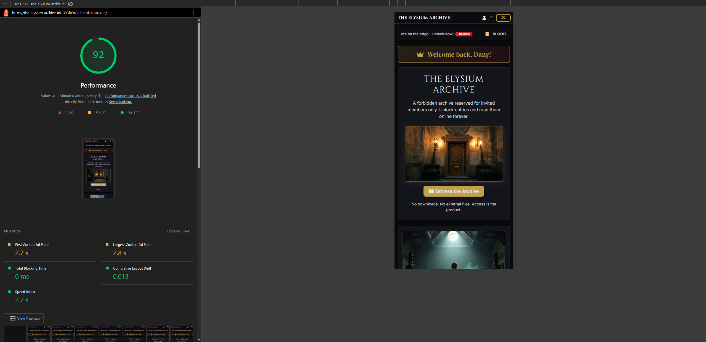 |
| Best Practices | **100** | 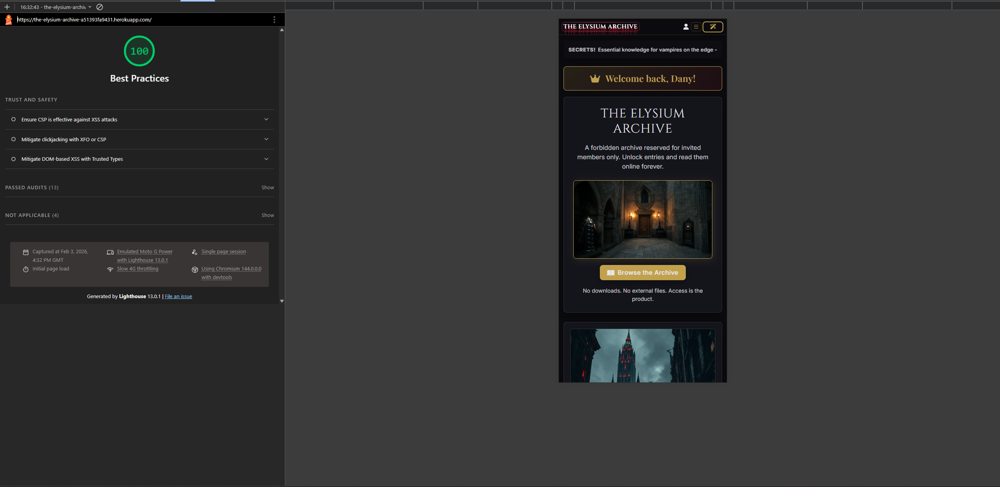 |
| SEO | **100** | 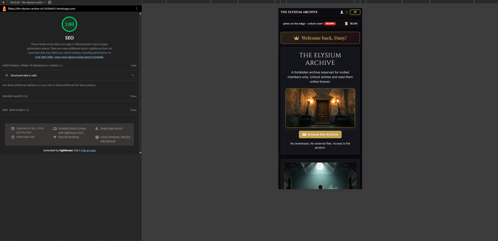 |

Scores can vary slightly between runs due to throttling, server load, caching, and third-party resources.
Results above are from the latest run.

## Validation and Code Quality

Validation and quality checks cover HTML, CSS, JavaScript, Python style/linting, and application security scanning.

### HTML Validation (W3C)

All key public, dashboard, and authentication pages were validated against W3C HTML5.

| Page | W3C URL | Screenshot | Notes |
| --- | --- | --- | --- |
| Home | [W3C](https://validator.w3.org/nu/?doc=https%3A%2F%2Fthe-elysium-archive-a51393fa9431.herokuapp.com%2F) | 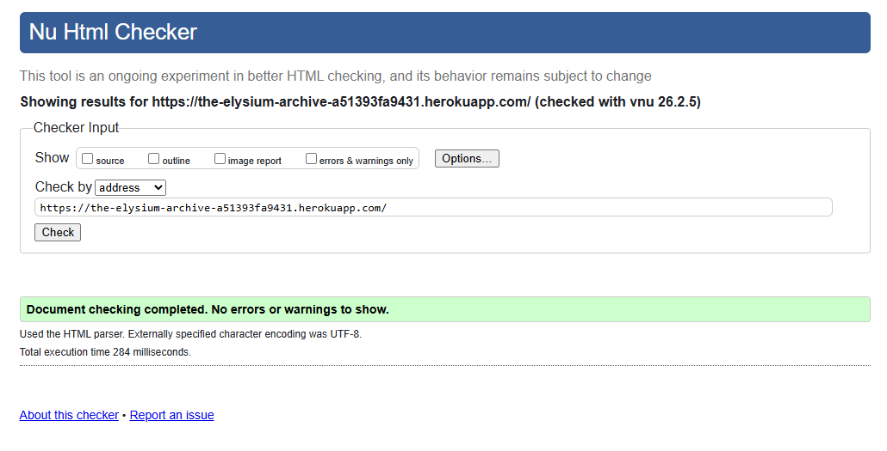 | Pass: No Errors |
| Archive Listing | [W3C](https://validator.w3.org/nu/?doc=https%3A%2F%2Fthe-elysium-archive-a51393fa9431.herokuapp.com%2Farchive%2F) | 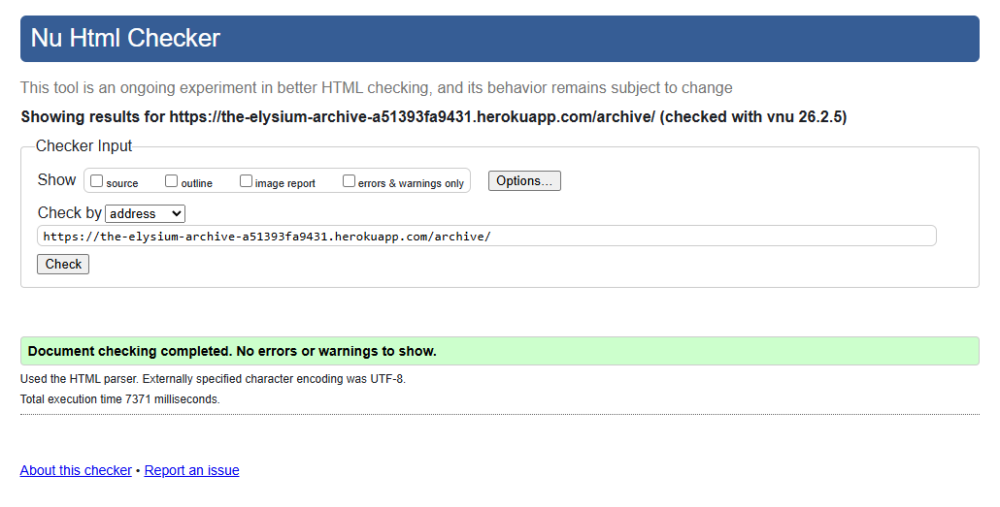 | Pass: No Errors |
| Product Detail (The Biological Purge) | [W3C](https://validator.w3.org/nu/?doc=https%3A%2F%2Fthe-elysium-archive-a51393fa9431.herokuapp.com%2Farchive%2Fthe-biological-purge-viral-extermination-protocols%2F) | 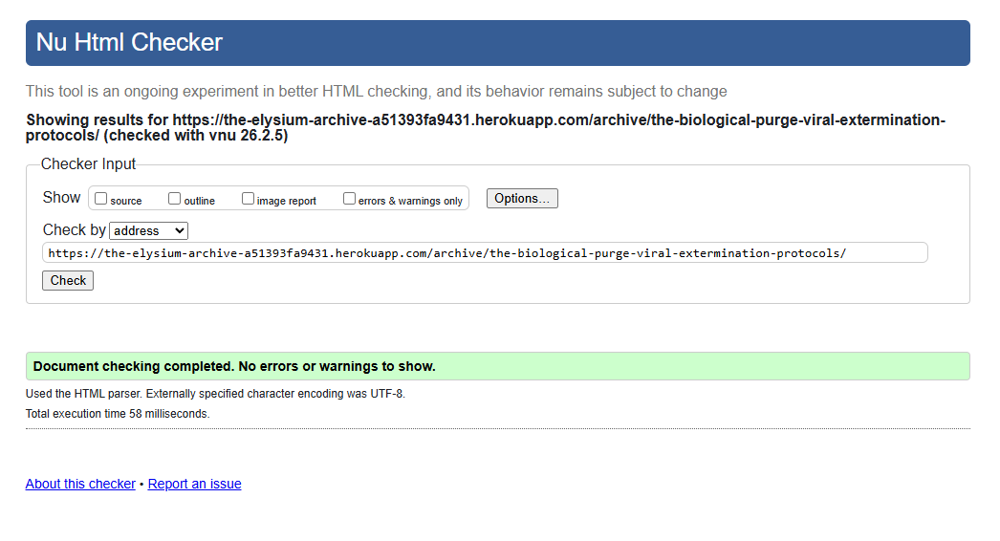 | Pass: No Errors |
| Lore Page | [W3C](https://validator.w3.org/nu/?doc=https%3A%2F%2Fthe-elysium-archive-a51393fa9431.herokuapp.com%2Flore%2F) | 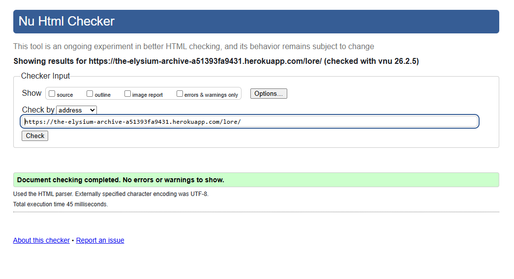 | Pass: No Errors |
| Cart | [W3C](https://validator.w3.org/nu/?doc=https%3A%2F%2Fthe-elysium-archive-a51393fa9431.herokuapp.com%2Fcart%2F) | 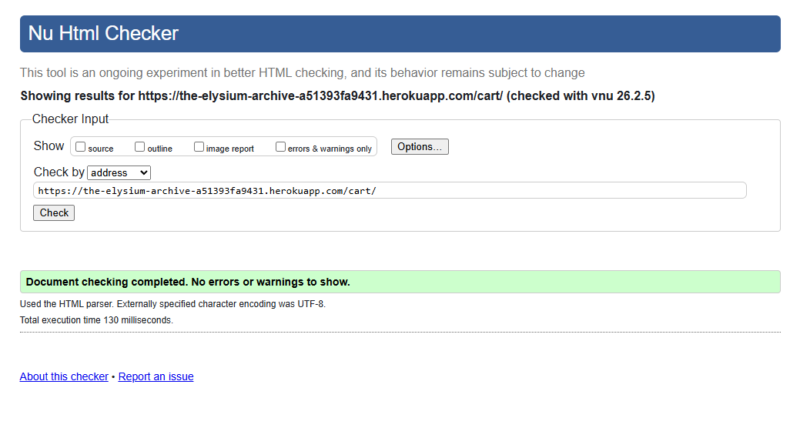 | Pass: No Errors |
| Privacy Policy | [W3C](https://validator.w3.org/nu/?doc=https%3A%2F%2Fthe-elysium-archive-a51393fa9431.herokuapp.com%2Fprivacy-of-the-covenant%2F) | 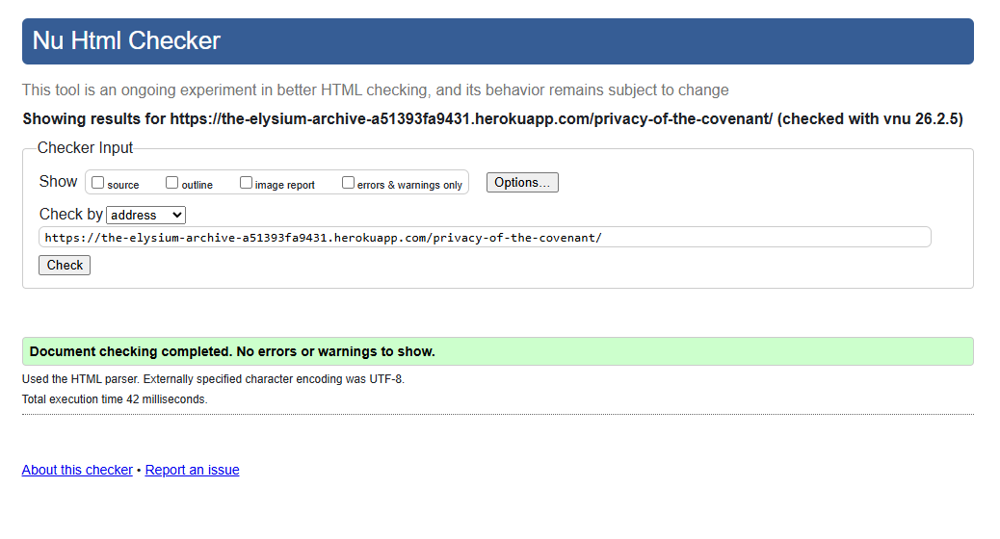 | Pass: No Errors |
| Terms of Service | [W3C](https://validator.w3.org/nu/?doc=https%3A%2F%2Fthe-elysium-archive-a51393fa9431.herokuapp.com%2Fterms-of-the-archiver%2F) | 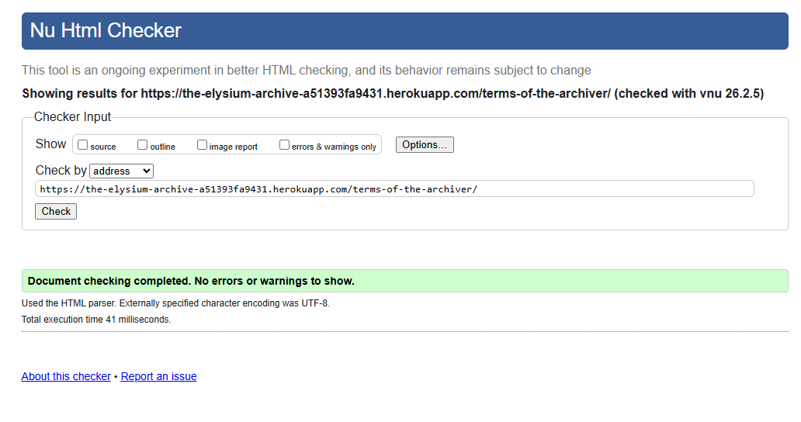 | Pass: No Errors |
| Contact | [W3C](https://validator.w3.org/nu/?doc=https%3A%2F%2Fthe-elysium-archive-a51393fa9431.herokuapp.com%2Fcontact-the-lore%2F) | 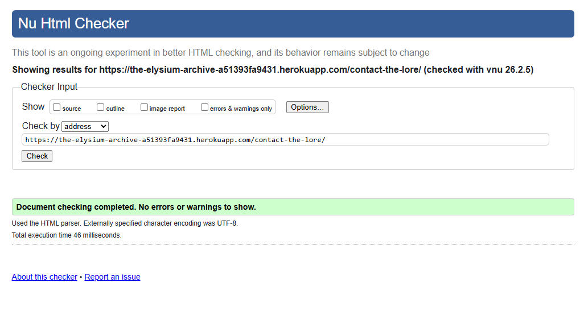 | Pass: No Errors |
| Dashboard - Profile Tab | [W3C](https://validator.w3.org/nu/?doc=https%3A%2F%2Fthe-elysium-archive-a51393fa9431.herokuapp.com%2Faccounts%2Fdashboard%2F) | 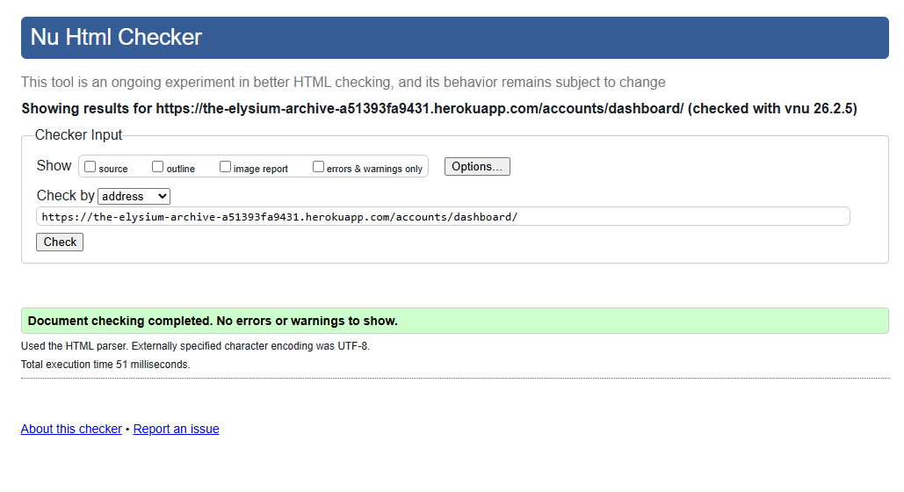 | Pass: No Errors |
| Dashboard - My Archive Tab | [W3C](https://validator.w3.org/nu/?doc=https%3A%2F%2Fthe-elysium-archive-a51393fa9431.herokuapp.com%2Faccounts%2Fdashboard%2F%3Ftab%3Dmy-archive) | 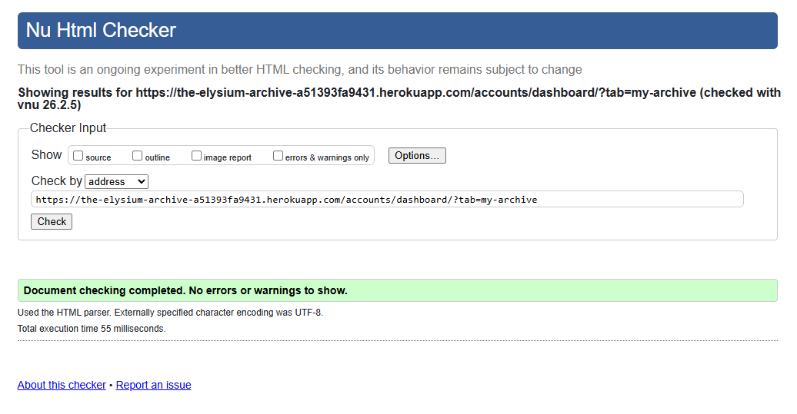 | Pass: No Errors |
| Dashboard - My Orders Tab | [W3C](https://validator.w3.org/nu/?doc=https%3A%2F%2Fthe-elysium-archive-a51393fa9431.herokuapp.com%2Faccounts%2Fdashboard%2F%3Ftab%3Dmy-orders) | 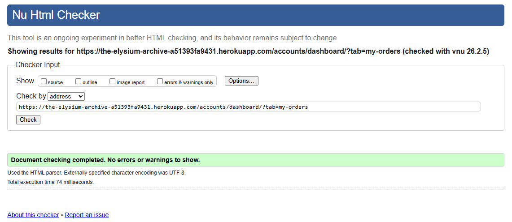 | Pass: No Errors |
| Dashboard - My Reviews Tab | [W3C](https://validator.w3.org/nu/?doc=https%3A%2F%2Fthe-elysium-archive-a51393fa9431.herokuapp.com%2Faccounts%2Fdashboard%2F%3Ftab%3Dmy-reviews) | 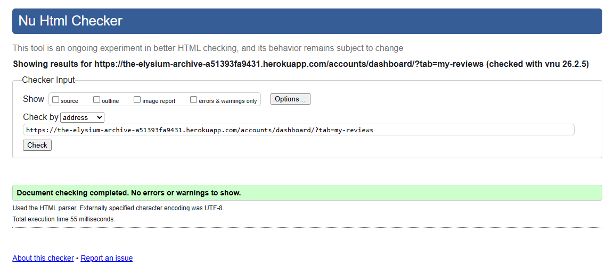 | Pass: No Errors |
| Dashboard - Delete Account Tab | [W3C](https://validator.w3.org/nu/?doc=https%3A%2F%2Fthe-elysium-archive-a51393fa9431.herokuapp.com%2Faccounts%2Fdashboard%2F%3Ftab%3Ddelete) | 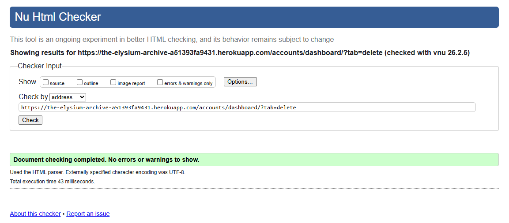 | Pass: No Errors |
| Login | [W3C](https://validator.w3.org/nu/?doc=https%3A%2F%2Fthe-elysium-archive-a51393fa9431.herokuapp.com%2Faccounts%2Flogin%2F) | 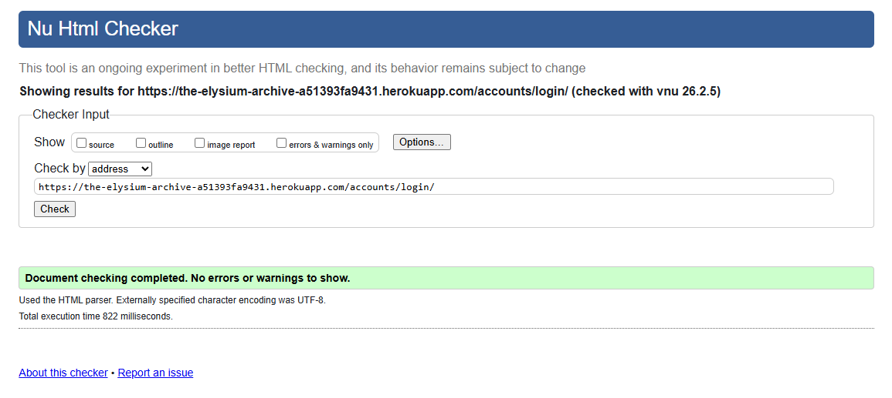 | Pass: No Errors |
| Signup | [W3C](https://validator.w3.org/nu/?doc=https%3A%2F%2Fthe-elysium-archive-a51393fa9431.herokuapp.com%2Faccounts%2Fsignup%2F) | 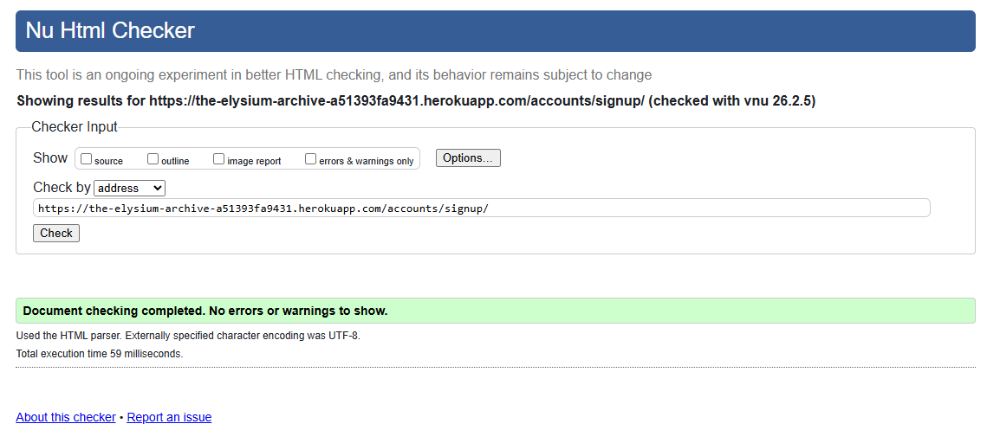 | Pass: No Errors |
| Email Verification | [W3C](https://validator.w3.org/nu/?doc=https%3A%2F%2Fthe-elysium-archive-a51393fa9431.herokuapp.com%2Faccounts%2Femail%2F) | 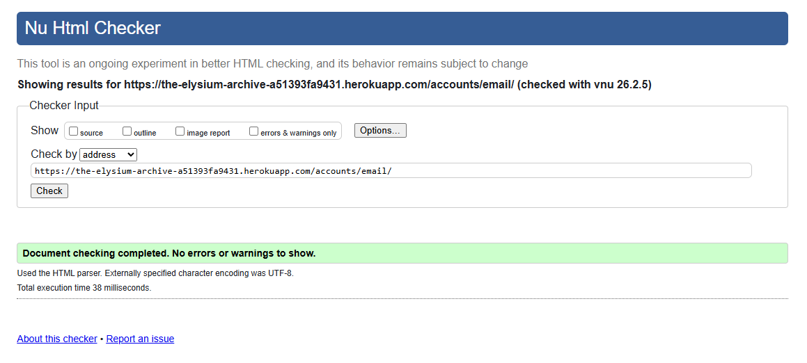 | Pass: No Errors |

All tested pages conform to W3C HTML5 standards with no validation errors or warnings.

### CSS Validation (Jigsaw)

Custom CSS files were validated with W3C CSS Validation Service (Jigsaw); local project CSS passes, and remaining full-page errors come from external CDN libraries (Bootstrap/Font Awesome).

| File | Validator/URL (if available) | Screenshot | Notes |
| --- | --- | --- | --- |
| `static/css/base.css` | [W3C CSS Validation Service (Jigsaw) - direct input](https://jigsaw.w3.org/css-validator/#validate_by_input) | 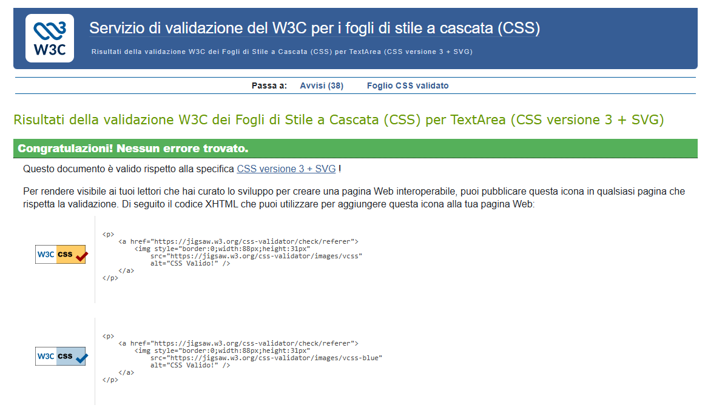 | Pass (project CSS) |
| `static/css/components/dashboard.css` | [W3C CSS Validation Service (Jigsaw) - direct input](https://jigsaw.w3.org/css-validator/#validate_by_input) |  | Pass (project CSS) |
| `static/css/components/deal-banner.css` | [W3C CSS Validation Service (Jigsaw) - direct input](https://jigsaw.w3.org/css-validator/#validate_by_input) |  | Pass (project CSS) |
| `static/css/components/products.css` | [W3C CSS Validation Service (Jigsaw) - direct input](https://jigsaw.w3.org/css-validator/#validate_by_input) |  | Pass (project CSS) |
| `static/css/components/reviews.css` | [W3C CSS Validation Service (Jigsaw) - direct input](https://jigsaw.w3.org/css-validator/#validate_by_input) | 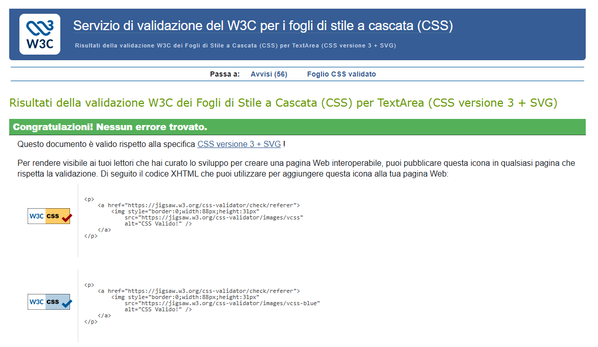 | Pass (project CSS) |
| `static/css/pages/home.css` | [W3C CSS Validation Service (Jigsaw) - direct input](https://jigsaw.w3.org/css-validator/#validate_by_input) | 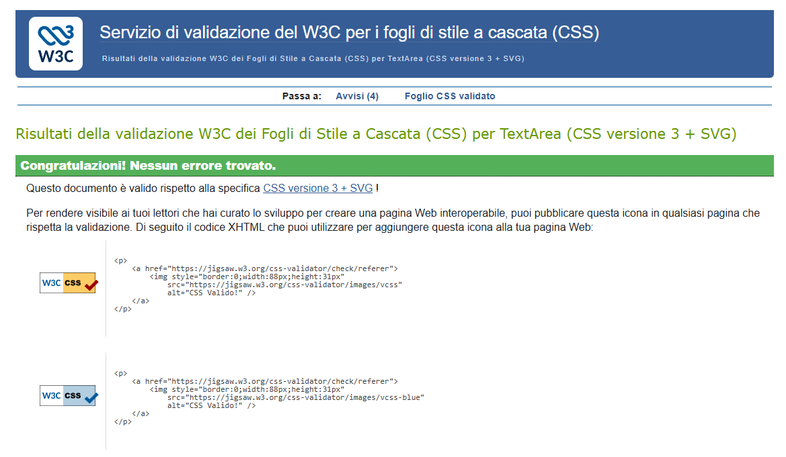 | Pass (project CSS) |
| `static/css/pages/lore.css` | [W3C CSS Validation Service (Jigsaw) - direct input](https://jigsaw.w3.org/css-validator/#validate_by_input) |  | Pass (project CSS) |
| `static/css/pages/footer-pages.css` | [W3C CSS Validation Service (Jigsaw) - direct input](https://jigsaw.w3.org/css-validator/#validate_by_input) | 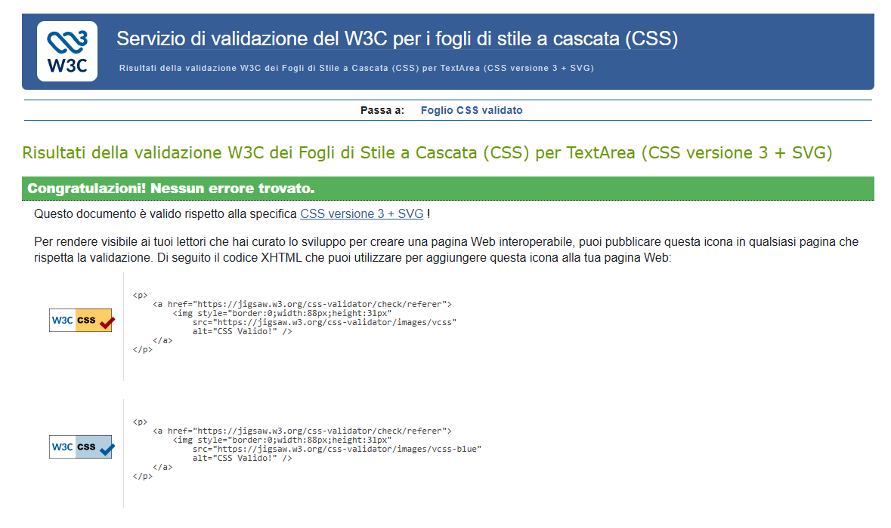 | Pass (project CSS) |
| `static/css/admin/admin.css` | [W3C CSS Validation Service (Jigsaw) - direct input](https://jigsaw.w3.org/css-validator/#validate_by_input) | 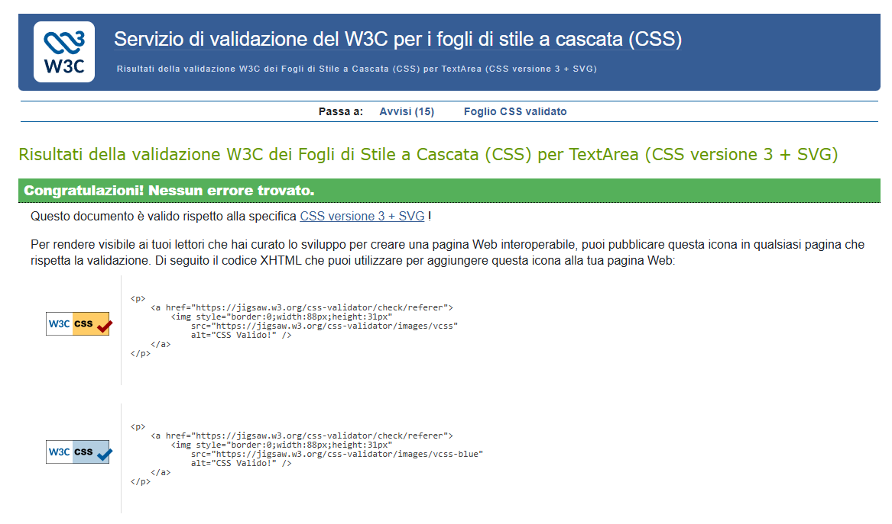 | Pass (project CSS) |
| `static/css/admin/admin-accounts.css` | [W3C CSS Validation Service (Jigsaw) - direct input](https://jigsaw.w3.org/css-validator/#validate_by_input) |  | Pass (project CSS) |
| `static/css/admin/admin-categories.css` | [W3C CSS Validation Service (Jigsaw) - direct input](https://jigsaw.w3.org/css-validator/#validate_by_input) |  | Pass (project CSS) |
| `static/css/admin/admin-components.css` | [W3C CSS Validation Service (Jigsaw) - direct input](https://jigsaw.w3.org/css-validator/#validate_by_input) |  | Pass (project CSS) |
| `static/css/admin/admin-deal-banners.css` | [W3C CSS Validation Service (Jigsaw) - direct input](https://jigsaw.w3.org/css-validator/#validate_by_input) |  | Pass (project CSS) |
| `static/css/admin/admin-jazzmin-overrides.css` | [W3C CSS Validation Service (Jigsaw) - direct input](https://jigsaw.w3.org/css-validator/#validate_by_input) |  | Pass (project CSS) |
| `static/css/admin/admin-orders.css` | [W3C CSS Validation Service (Jigsaw) - direct input](https://jigsaw.w3.org/css-validator/#validate_by_input) |  | Pass (project CSS) |
| `static/css/admin/admin-product-image-alt.css` | [W3C CSS Validation Service (Jigsaw) - direct input](https://jigsaw.w3.org/css-validator/#validate_by_input) |  | Pass (project CSS) |
| `static/css/admin/admin-products.css` | [W3C CSS Validation Service (Jigsaw) - direct input](https://jigsaw.w3.org/css-validator/#validate_by_input) |  | Pass (project CSS) |
| `static/css/admin/admin-reviews.css` | [W3C CSS Validation Service (Jigsaw) - direct input](https://jigsaw.w3.org/css-validator/#validate_by_input) |  | Pass (project CSS) |
| `static/css/admin/admin-variables.css` | [W3C CSS Validation Service (Jigsaw) - direct input](https://jigsaw.w3.org/css-validator/#validate_by_input) |  | Pass (project CSS) |

### JavaScript Validation (JSHint)

All custom JavaScript files were validated with JSHint; reported output contains no errors and only complexity-related metrics warnings.

| File | Tool | Result | Notes |
| --- | --- | --- | --- |
| `static/js/admin/image-alt-counter.js` | [JSHint](https://jshint.com/) | 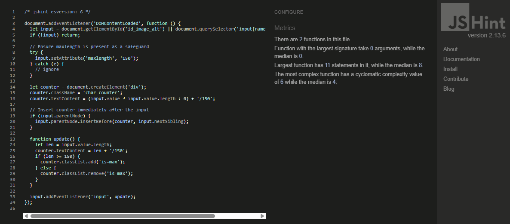 | Pass (metrics warnings only) |
| `static/js/checkout-status.js` | [JSHint](https://jshint.com/) | 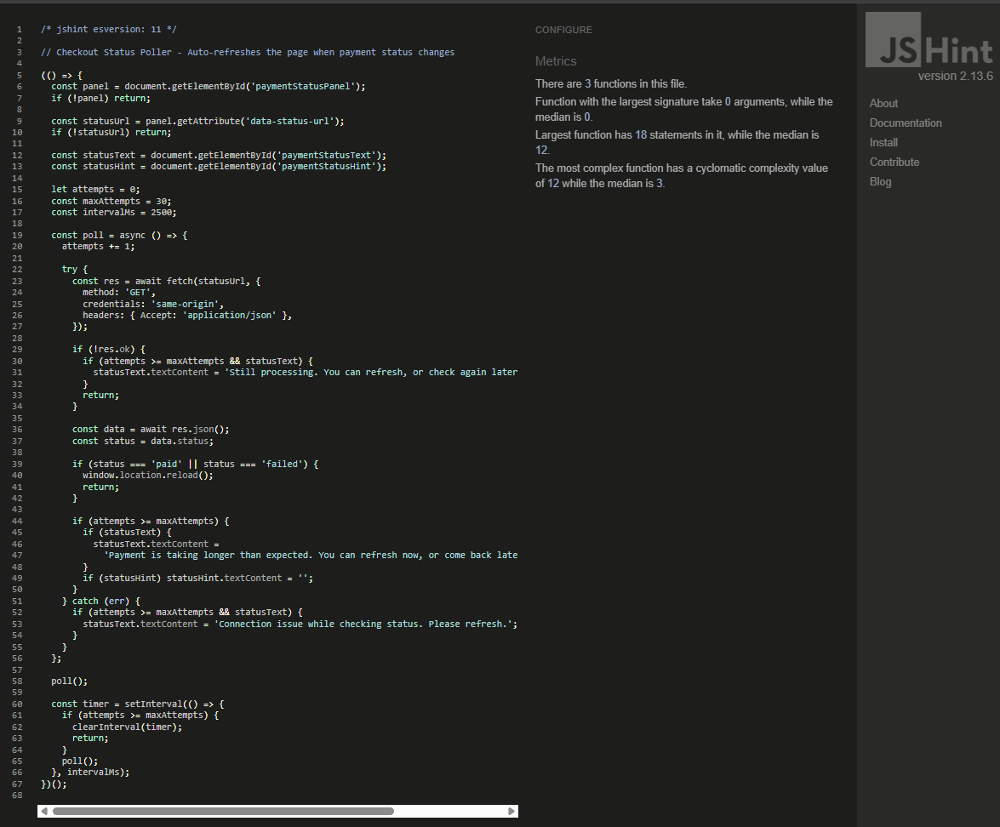 | Pass (metrics warnings only) |
| `static/js/dashboard.js` | [JSHint](https://jshint.com/) |  | Pass (metrics warnings only) |
| `static/js/deal-banner-carousel.js` | [JSHint](https://jshint.com/) | 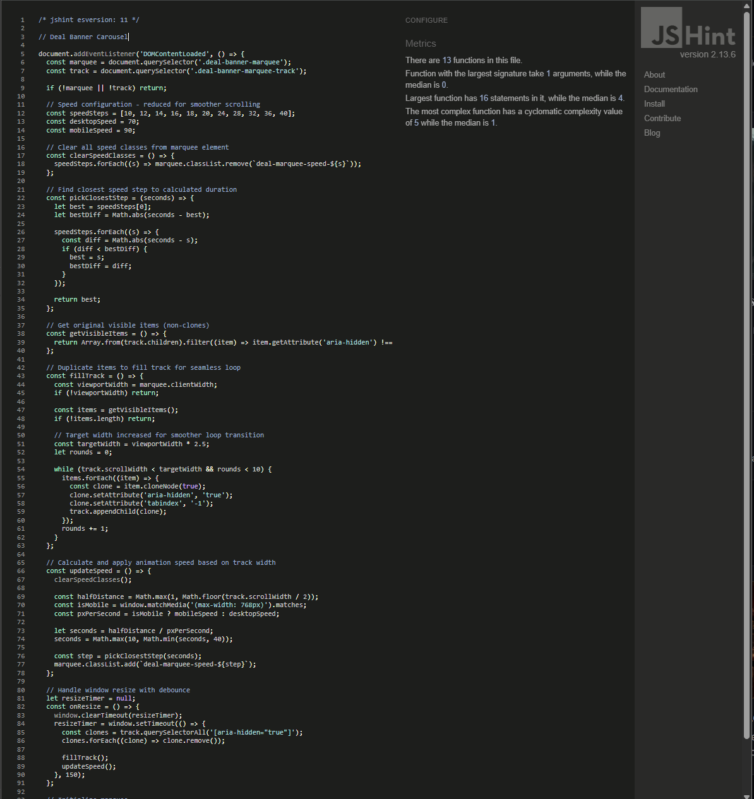 | Pass (metrics warnings only) |
| `static/js/effects-toggle.js` | [JSHint](https://jshint.com/) | 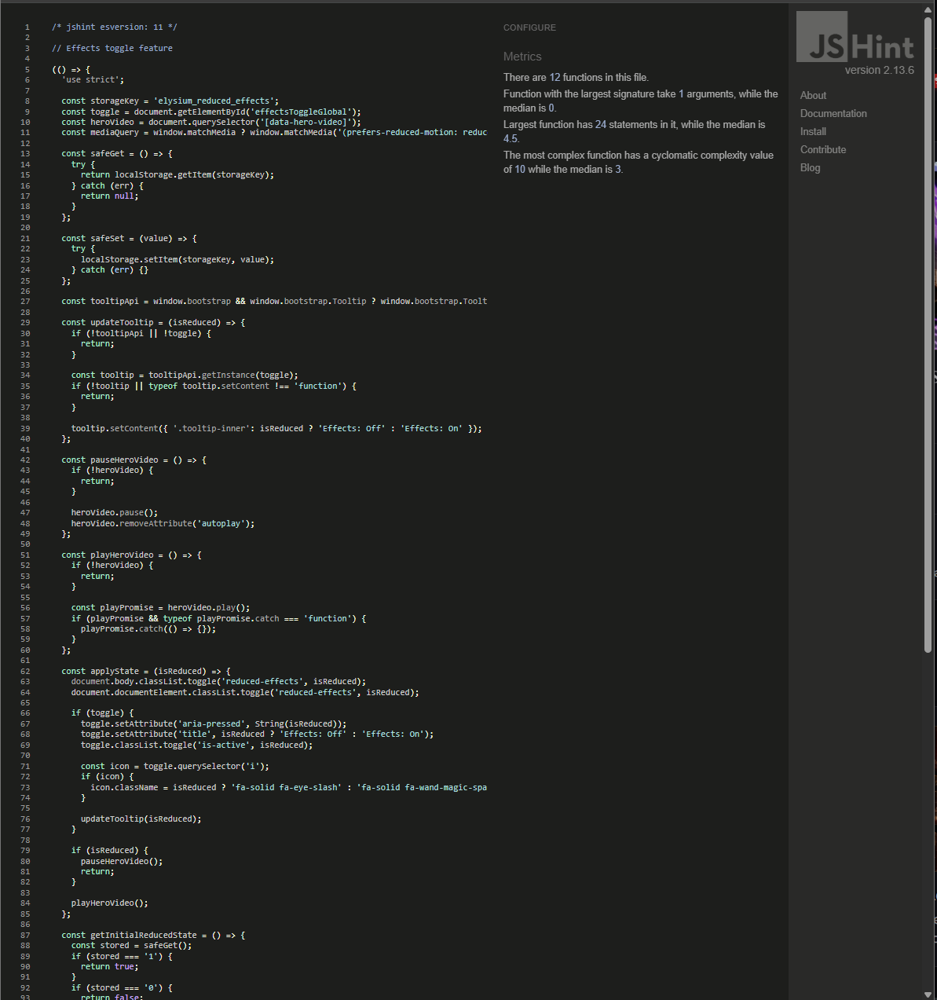 | Pass (metrics warnings only) |
| `static/js/messages.js` | [JSHint](https://jshint.com/) | 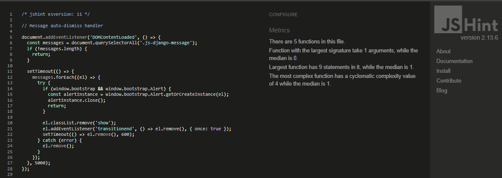 | Pass (metrics warnings only) |
| `static/js/review-form.js` | [JSHint](https://jshint.com/) | 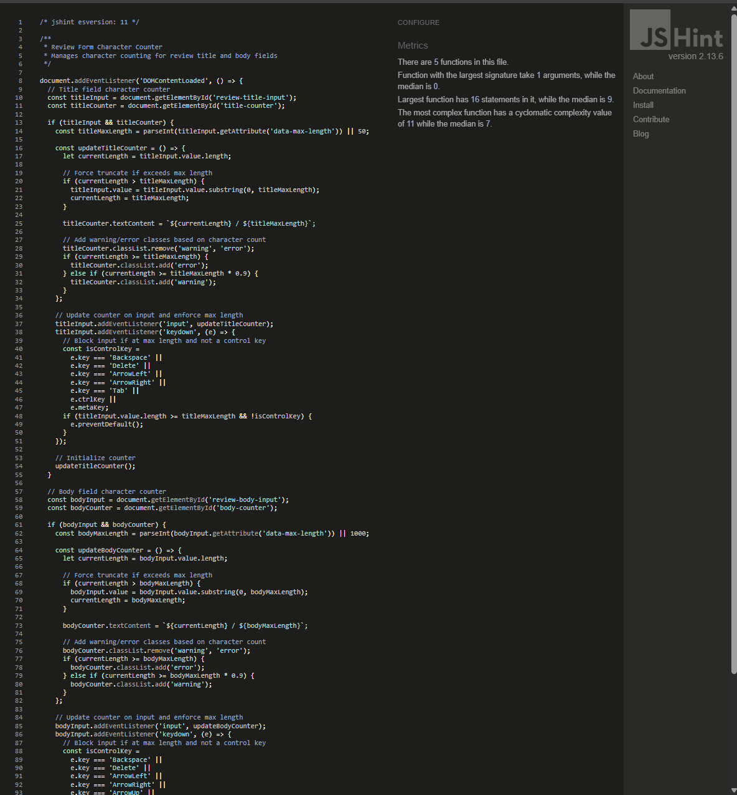 | Pass (metrics warnings only) |

### Python Style/Lint Checks

Checks are available via `dev-requirements.txt` and were run with passing results.

| Tool | Command | Result | Notes |
| --- | --- | --- | --- |
| black | `.venv\Scripts\python.exe -m black --check .` | **PASS** | `82` files would be left unchanged |
| isort | `.venv\Scripts\python.exe -m isort --check-only .` | **PASS** | Skipped `42` files via configured excludes |
| flake8 | `.venv\Scripts\python.exe -m flake8 .` | **PASS** | No lint output |
| pylint | `.venv\Scripts\python.exe -m pylint accounts cart checkout home orders products reviews elysium_archive manage.py` | **PASS** | `10.00/10`, no warnings/errors |
| bandit | `.venv\Scripts\python.exe -m bandit -c bandit.yaml -r accounts cart checkout home orders products reviews elysium_archive manage.py` | **PASS** | No issues identified (`Low: 0`, `Medium: 0`, `High: 0`) |
| djlint | `.venv\Scripts\python.exe -m djlint --check .` | **PASS** | `0` files would be updated (`39` files checked) |

### Bandit Security Audit Details

Bandit is configured to focus on application code and avoid known false positives.

Configuration (bandit.yaml):

```yaml
# Bandit configuration
# Exclude test folders and generated assets.
exclude:
  - .venv
  - node_modules
  - staticfiles
  - migrations
  - TESTS
  - tests
skips:
  - B101  # assert_used - acceptable in test code
  - B308  # mark_safe - reviewed, only static HTML without user input
```

| Area | Selection | Reason |
| --- | --- | --- |
| Excluded directories | `.venv`, `node_modules`, `staticfiles` | Third-party code and generated assets |
| Excluded directories | `migrations`, `TESTS`, `tests` | Auto-generated code and test files |
| Skipped checks | `B101 (assert_used)` | Acceptable in test code; tests are already excluded |
| Skipped checks | `B308 (mark_safe)` | Uses reviewed and confirmed safe for static HTML only |

| Area | Change | Reason |
| --- | --- | --- |
| XSS Prevention | Replaced `mark_safe()` with `format_html()` in admin display methods where variables are interpolated; retained `mark_safe()` only for static reviewed HTML | Prevent unsafe HTML interpolation while preserving intended rendering |
| Password Security | Removed hardcoded passwords from test fixtures; added runtime password generation with `django.utils.crypto.get_random_string()` | Avoid static credential reuse in codebase |
| Secret Key Management | Removed hardcoded development secret key; added `get_random_secret_key()` fallback for local development; production validation requires `SECRET_KEY` from environment | Improve secret handling and production safety |
| Exception Handling | Added logging to `try/except` blocks that previously used `pass`; exceptions now logged with `logger.warning()` and `exc_info=True` | Preserve observability for recoverable failures |

| Lines Scanned | Issues Found | Status | Evidence/Notes |
| --- | --- | --- | --- |
| **5,369** | **0** (Low: **0**, Medium: **0**, High: **0**) | **Completed** (clean) | Application code only; 1 reviewed `# nosec B105` in test settings |

## Security Headers

Headers were verified in `DEBUG=False` mode.

| Header | Expected Value | When Verified | Notes |
| --- | --- | --- | --- |
| `X-Frame-Options` | `DENY` | `2026-02-12` (`DEBUG=False`, secure request) | Required anti-clickjacking header present |
| `X-Content-Type-Options` | `nosniff` | `2026-02-12` (`DEBUG=False`, secure request) | MIME sniffing disabled |
| `Strict-Transport-Security` | `max-age=31536000; includeSubDomains; preload` | `2026-02-12` (`DEBUG=False`, secure request) | HSTS policy present |

## Browser Compatibility Testing

Core user journeys and ecommerce flows were verified on Chrome and Firefox desktop (Windows 11) with no layout, JavaScript, or navigation issues. Behavior verified on both Chrome and Firefox. Visual evidence is shown once because the UI and behavior are identical across tested browsers.

| Browser(s) | OS | Version(s) | Test Case | Result | Evidence |
| --- | --- | --- | --- | --- | --- |
| Chrome + Firefox | Windows 11 | Chrome 144.0.7559.133 + Firefox 147.0.2 (64-bit) | Home page loads and renders correctly | **PASS** | Manual browser test |
| Chrome + Firefox | Windows 11 | Chrome 144.0.7559.133 + Firefox 147.0.2 (64-bit) | Archive listing and product detail pages | **PASS** | Manual browser test |
| Chrome + Firefox | Windows 11 | Chrome 144.0.7559.133 + Firefox 147.0.2 (64-bit) | Login and dashboard access (verified user) | **PASS** | Manual browser test |
| Chrome + Firefox | Windows 11 | Chrome 144.0.7559.133 + Firefox 147.0.2 (64-bit) | Add to cart and cart display | **PASS** | Manual browser test |
| Chrome + Firefox | Windows 11 | Chrome 144.0.7559.133 + Firefox 147.0.2 (64-bit) | Stripe checkout cancel flow | **PASS** | See visual evidence below |
| Chrome + Firefox | Windows 11 | Chrome 144.0.7559.133 + Firefox 147.0.2 (64-bit) | Cart persistence after cancel | **PASS** | See visual evidence below |
| Chrome + Firefox | Windows 11 | Chrome 144.0.7559.133 + Firefox 147.0.2 (64-bit) | Archive reading page (entitled user) | **PASS** | Manual browser test |
| Chrome + Firefox | Windows 11 | Chrome 144.0.7559.133 + Firefox 147.0.2 (64-bit) | JavaScript console errors | **PASS** | No errors reported |

### Visual Evidence – Stripe Checkout Cancel Flow

The checkout cancellation page renders correctly with the "Checkout Cancelled" message and "Return to Cart" button. Behavior and UI are identical on both Chrome and Firefox.

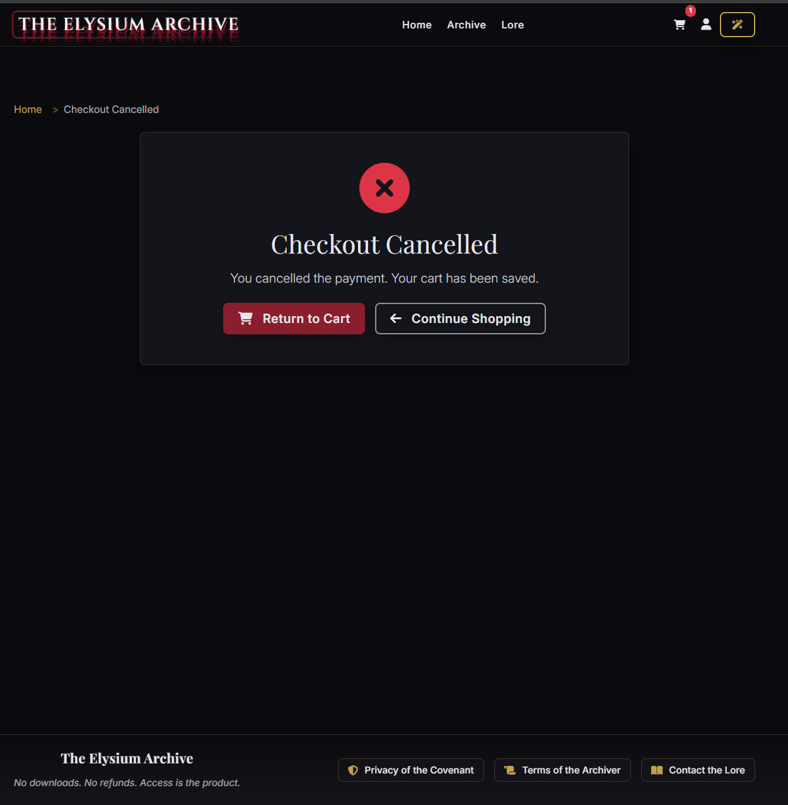

### Visual Evidence – Cart Persistence After Cancel

After cancelling the Stripe checkout session, the user is redirected to the cart page and all items remain in the cart. Behavior and UI are identical on both Chrome and Firefox.

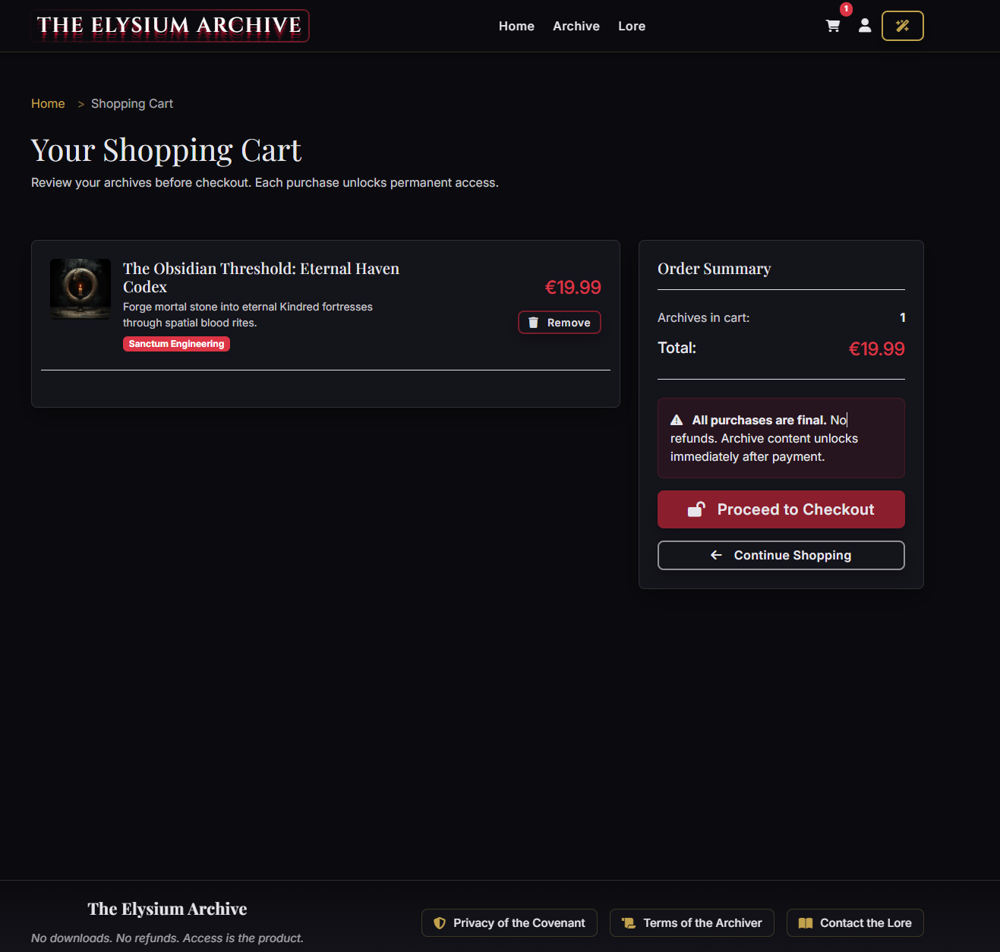
