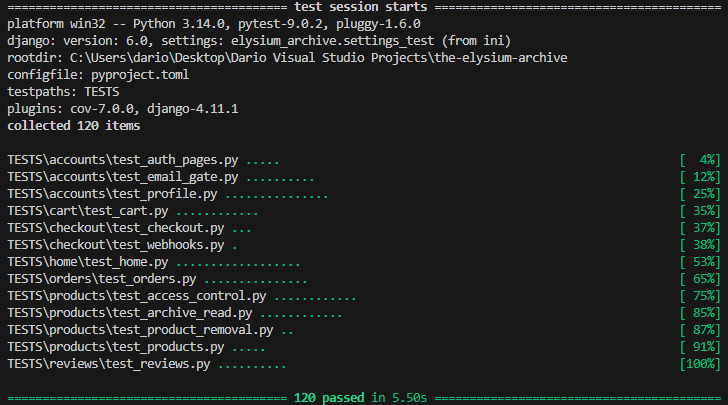

# Testing Guide - The Elysium Archive

This document describes the current automated test suite and manual testing procedures for the repository as it stands.

## Current Test Status

**120 tests passing** (as of 02/02/2026)

All automated tests run successfully with pytest. See the [Automated Tests](#automated-tests) section for details.



---

## Evidence Status (Testing and Quality Checklist)

- Automated test suite documented: **Yes** (120 tests, all passing)
- Manual testing checklist provided: **Yes**
- Python style/lint checks completed: **Yes** (black, isort, flake8, pylint, djlint, bandit)
- Security audit completed: **Yes** (Bandit scan clean, 0 issues)
- HTML validation results recorded: **Partial** (see HTML Validation section)
- CSS validation results recorded: **Partial** (see CSS Validation section)
- JavaScript validation completed: **Yes** (JSHint, 0 errors)
- Responsiveness testing results recorded: **To be completed**
- Accessibility testing results recorded: **To be completed**

This checklist is used to track the current state of testing, validation, and quality evidence within the repository.

---

## Automated Tests

### Tooling

- pytest 9.0.2
- pytest-django 4.11.1
- Tests are a mix of pytest-style functions and Django TestCase classes (notably in reviews).

### Automated Coverage Summary (Core Application Features)

The automated suite covers:

- CRUD workflows for products, reviews, and orders (model + view behavior)
- Authentication and email‑verification gates (allauth flows and protected pages)
- Payment flow logic (Stripe checkout session creation, webhooks, and entitlement creation)
- Data management and access control (entitlements, inactive product access rules)
- **Review system** (create, edit, delete with character limits and optional fields)
- **My Archive** (display of unlocked products with review/edit buttons)
- **Dashboard functionality** (profile, archive, orders, reviews tabs with review delete modale)

### Test Configuration

Pytest configuration lives in `pyproject.toml` under `[tool.pytest.ini_options]`:

- `DJANGO_SETTINGS_MODULE = "elysium_archive.settings_test"`
- `python_files = ["test_*.py", "*_test.py", "tests.py"]`
- `testpaths = ["TESTS"]`
- `addopts = "-ra"`

`elysium_archive/settings_test.py` overrides:

- `STATICFILES_STORAGE` uses `StaticFilesStorage`
- `STORAGES` uses `FileSystemStorage` for media and `StaticFilesStorage` for static
- `EMAIL_BACKEND` uses `django.core.mail.backends.locmem.EmailBackend`
- `ACCOUNT_EMAIL_HTML = True`
- `PASSWORD_HASHERS` uses `MD5PasswordHasher`

### Running Tests

Run all tests:

```bash
pytest
```

Verbose output:

```bash
pytest -v
```

Run a specific test file:

```bash
pytest TESTS/accounts/test_profile.py -v
```

Run a specific test class:

```bash
pytest TESTS/products/test_access_control.py::TestProductAccessControl -v
```

Run a specific test:

```bash
pytest TESTS/orders/test_orders.py::TestWebhookHandling::test_webhook_idempotent_same_event_twice -v
```

Show print output:

```bash
pytest -v -s
```

### Test Inventory Summary

**Total Tests:** 120 (all passing as of 02/02/2026)

**Test Distribution by App:**

- Accounts: 20 tests (authentication, email verification, profile management, account deletion)
- Products: 29 tests (access control, archive reading, CRUD operations, product removal)
- Cart: 12 tests (cart operations, validation, totals)
- Checkout: 3 tests (checkout flow, Stripe integration, order reuse)
- Orders: 15 tests (webhook handling, order status, entitlements)
- Home: 18 tests (admin access, product management, deal banner visibility)
- Reviews: 10 tests (review creation, dashboard integration, removed products)
- Webhooks: 13 tests (idempotency, payment status, error handling)

Test discovery (under `TESTS/`) is controlled by `pyproject.toml`. Run `pytest --collect-only` to confirm the current test count.

---

## Automated Test Coverage by App

### Accounts

Files:

- `TESTS/accounts/test_auth_pages.py`
- `TESTS/accounts/test_email_gate.py`
- `TESTS/accounts/test_profile.py`

Coverage:

- Login, signup, and logout page behaviour (200/302)
- Email verification gate for dashboard, profile, and my-archive redirects
- Dashboard "My Orders" tab rendering/availability for verified users
- Dashboard "My Reviews" tab rendering/availability for verified users
- Redirect helpers `/accounts/my-orders/` and `/accounts/my-reviews/` target the correct dashboard tabs
- Anonymous users redirected to login for account pages
- My Archive display for verified users, including deleted-product handling
- Dashboard form POST updates display_name
- Profile view shows username/email and display_name form (profile POST does not update display_name)
- Account deletion flow (confirmation, delete, logout, redirect, message, profile removal)

Key assertions:

- Status codes and redirect targets (`/accounts/login/`, `/accounts/email/`)
- Template rendering and message presence
- User/Profile database updates after delete

### Products

Files:

- `TESTS/products/test_access_control.py`
- `TESTS/products/test_archive_read.py`
- `TESTS/products/test_products.py`

Coverage:

- Active vs inactive product visibility for anonymous, verified, staff, and entitled users
- Product list includes only active items; featured items appear; inactive featured items do not
- Product detail shows title/description/price for active items
- Archive reading page access (login required, entitlement required, email verified)
- Preview page content separation and CTA differences
- My Archive links to reading page
- Reading page navigation links
- Product model CRUD
- Archive card layout class checks

Key assertions:

- Status codes (200/302/403/404)
- Content presence or absence on preview vs reading pages
- Correct links for reading and detail pages
- Model persistence and deletion

### Cart

File:

- `TESTS/cart/test_cart.py`

Coverage:

- Add to cart redirects and session storage
- Cart view renders with items or empty state
- Remove from cart updates session
- Cart persistence across pages
- Validation for missing/nonexistent products and inactive products
- Verified email required for add-to-cart
- Totals for single and multiple items

Key assertions:

- Session cart contents
- Redirects and status codes
- Expected product titles in rendered cart

### Checkout

File:

- `TESTS/checkout/test_checkout.py`

Coverage:

- Verified email gate for checkout and anonymous login redirect
- Stripe session creation mocked and redirects to Stripe, including redirect handling
- Order and OrderLineItem creation from cart
- Order total calculation
- Stripe error cleanup (Order and OrderLineItem removal)
- Empty cart redirects to cart
- Success page template rendering and wrong-user access
- Double POST to `/checkout/` in quick succession (reuse of a recent pending order)
- Reuse of a recent pending order to prevent duplicate pending orders
- Success fallback confirms Stripe session `payment_status == "paid"` can mark the order paid and create entitlements when webhook delivery is delayed
- Cart clearing after success
- Cancel page template rendering and message presence

Key assertions:

- Status codes and redirect targets
- Order database state
- Stripe session URL handling

### Orders and Webhooks

File:

- `TESTS/orders/test_orders.py`

Coverage:

- Webhook handling for `checkout.session.completed` (paid and unpaid)
- Webhook handling for `payment_intent.payment_failed`
- Webhook handling for `checkout.session.expired`
- Idempotent entitlement creation (unique constraint + `get_or_create` on replay)
- Paid orders can be made consistent when Stripe IDs are missing (fill Stripe session/payment intent IDs, ensure entitlements)
- Atomic operations and locking (`select_for_update`) used in critical flows
- Missing/invalid signature handling and POST-only enforcement
- Missing order ID and order without user
- Stripe session/payment intent ID storage
- Order model order_number generation, uniqueness, and timestamps
- AccessEntitlement uniqueness and cascade delete
- Order default status test exists (no explicit assertion)

Key assertions:

- Response codes for webhook endpoints
- Order status transitions and stripe ID fields
- Entitlement counts and uniqueness

### Reviews

File:

- `TESTS/reviews/test_reviews.py`

Coverage:

- Review form visibility for buyers vs non-buyers
- Review creation for buyers (with character limits: title 50 chars, body 1000 chars)
- Anonymous redirect to login on review POST
- Duplicate review prevention
- Review display (single and multiple with star ratings and verified badges)
- Rating range validation (1-5 stars)
- **Optional review title** (no character limit enforcement required)
- **Optional review body** (can submit rating-only reviews)
- **Mandatory rating field** (only required field in review form)
- Review model **str**
- Cascade deletes for user and product
- Review edit and delete permissions
- Delete requires POST and modale confirmation in UI
- Character counter real-time updates (JavaScript)
- Edit review inherits same styling and validations as create

Key assertions:

- Status codes and redirects
- Review database state and uniqueness
- Content displayed on product detail page
- Optional fields properly accepted as blank/empty

---

File:

- `TESTS/home/test_home.py`

Coverage:

- Admin access for anonymous, regular, and staff users
- Admin delete actions for products (single delete and bulk delete exercised)
- Featured flag toggled via admin change form
- Admin product edits and deactivation
- Admin order list/detail access for staff only
- A placeholder test exists for delete without entitlements (no assertions)

Key assertions:

- Status codes for admin access
- Product database changes after admin POSTs
- Staff-only access to orders in admin

## Manual Testing Procedures

Manual tests validate user-facing behaviour, page rendering, and third-party flows that are not fully covered by automated tests.

Key user journeys covered below:

- Sign up, email verification, login/logout
- Access to protected content (dashboard, archive reading, reviews)
- Cart operations (add/remove, totals)
- Checkout success/cancel and entitlement creation
- Review create/edit/delete (verified buyers)

### Test Environment Setup

1. Create a superuser:

```bash
python manage.py createsuperuser
```

1. Create a test category and product:

```bash
python manage.py shell
>>> from products.models import Category, Product
>>> from decimal import Decimal
>>> cat = Category.objects.create(name="Test", slug="test")
>>> Product.objects.create(
...     title="Test Product",
...     slug="test-product",
...     tagline="Test tagline",
...     description="Test description",
...     content="<p>Test premium content.</p>",
...     image_alt="Test image",
...     price=Decimal("9.99"),
...     category=cat,
...     is_active=True,
... )
```

1. Start the dev server:

```bash
python manage.py runserver
```

Note: In DEBUG, email is sent to the console backend. Use the verification link printed in the terminal.

### Manual Test Checklist

#### Authentication and Email Verification

- [ ] Anonymous user visits `/accounts/login/` -> page loads
- [ ] Anonymous user visits `/accounts/signup/` -> page loads
- [ ] New user signs up -> verification email appears in console
- [ ] Sign up with an email already used is rejected (case-insensitive, e.g., `Test@Test.com` vs `test@test.com`)
- [ ] User confirms email -> verification succeeds
- [ ] Unverified user visits `/accounts/dashboard/` -> redirected to `/accounts/email/`
- [ ] Verified user visits `/accounts/dashboard/` -> dashboard loads

#### Dashboard, Profile, and Account Deletion

- [ ] Verified user visits `/accounts/profile/` -> redirected to dashboard profile tab
- [ ] Verified user updates display name in dashboard form -> success message shown
- [ ] Verified user visits `/accounts/my-archive/` -> redirected to dashboard archive tab
- [ ] Verified user visits `/accounts/delete/` -> confirmation page loads
- [ ] User submits delete -> account removed, redirected to home, message shown
- [ ] Superuser delete attempt -> blocked with message

#### Dashboard Tabs

- [ ] Verified user opens My Orders tab -> sees order list or empty state
- [ ] Verified user opens My Reviews tab -> sees review list or empty state
- [ ] Review edit link from dashboard works (ownership rules still apply)
- [ ] Review delete from dashboard requires POST and removes the review

#### Product Catalog and Preview

- [ ] Anonymous user visits `/archive/` -> active products listed
- [ ] Product detail page shows title, description, price, and CTA
- [ ] Inactive products do not appear in the list for non-staff users
- [ ] Unpublished products are not listed publicly, but entitled buyers can access preview/read pages; non-entitled users cannot
- [ ] Staff user can edit product in admin and save changes

#### Cart (Manual)

- [ ] Verified user adds product to cart from preview page -> success message
- [ ] Visit `/cart/` -> items listed and totals shown
- [ ] Remove item via cart -> item removed
- [ ] Empty cart shows empty state
- [ ] Unverified user visits `/cart/` or `/cart/add/` -> redirected to `/accounts/email/`

#### Checkout (Stripe Test Mode)

- [ ] Verified user clicks checkout -> POST to `/checkout/` and redirect to Stripe
- [ ] Use test card `4242 4242 4242 4242` with any future expiry and CVC
- [ ] Stripe success -> redirected to `/checkout/success/<order_number>/`
- [ ] Stripe cancel -> redirected to `/checkout/cancel/`
- [ ] Order visible in admin (`/admin/orders/order/`)
- [ ] Simulate a server crash after Stripe session creation -> no broken state; retry yields consistent pending order handling and no duplicate entitlements
- [ ] Rapid double click / double submit checkout: only one pending order is created/reused
- [ ] Refresh success page multiple times: no duplicate entitlements; cart remains cleared
- [ ] Simulated delayed webhook: fallback confirmation still finalises paid order and unlocks access

Webhook endpoint for Stripe CLI testing:

- `/checkout/webhook/`

Stripe CLI listener:

```bash
stripe listen --forward-to http://127.0.0.1:8000/checkout/webhook/
```

Post-payment verification checklist:

- latest Order is marked "paid"
- Stripe payment intent ID stored on the order
- AccessEntitlement exists for the order/product
- no duplicate entitlements for the same user/product
- cart cleared after payment
- `/archive/<slug>/read/` accessible for the entitled user

### Data Integrity and Idempotency

- No duplicate entitlements (unique constraint + `get_or_create`)
- Double-submit checkout safety (reuse/locking prevents duplicate pending orders)
- Success-page refresh safety (idempotent entitlement creation and cart clearing)
- Webhook replay safety

#### Reviews (Manual)

- [ ] Buyer sees review form on product detail page
- [ ] Non-buyer does not see review form
- [ ] **Rating field is mandatory** - cannot submit without selecting a rating
- [ ] **Title field is optional** - can submit review without a title
- [ ] **Review/Body field is optional** - can submit review with only a rating
- [ ] Buyer enters title -> character counter updates (0-50 limit)
- [ ] Buyer enters review body -> character counter updates (0-1000 limit)
- [ ] Cursor blocked at 50 chars in title field (cannot type beyond limit)
- [ ] Cursor blocked at 1000 chars in review field (cannot type beyond limit)
- [ ] Buyer submits review -> appears on product detail page with correct rating/title/body
- [ ] Review displays with star rating and verified badge
- [ ] Buyer edits review via `/archive/<slug>/review/<id>/edit/` -> same form styling and character limits
- [ ] Buyer deletes review -> **modale confirmation appears** ("Are you sure you want to delete your review?")
- [ ] Modale "Stay" button -> closes modale, review not deleted
- [ ] Modale "Delete" button -> removes review, redirects back
- [ ] Buyer views My Archive tab -> **"Leave Review" button below "Read"** (if no review exists)
- [ ] Buyer clicks "Leave Review" -> jumps to product detail review section
- [ ] Buyer with existing review sees **"Edit Review" button** instead of "Leave Review"
- [ ] Buyer clicks "Edit Review" from My Archive -> opens edit review page
- [ ] Buyer views My Reviews tab in Dashboard -> review listed with edit/delete buttons
- [ ] Buyer clicks delete from My Reviews -> **same modale confirmation appears**
- [ ] Non-owner edit/delete -> redirected with error message
- [ ] Delete via GET returns 405

#### Archive Reading Experience

- [ ] Owner clicks "Read Full Archive" -> `/archive/<slug>/read/` opens
- [ ] Preview page does not show full content
- [ ] Anonymous user visits `/archive/<slug>/read/` -> redirected to login
- [ ] Verified user without entitlement -> 403
- [ ] Unverified user with entitlement -> redirected to `/accounts/email/`
- [ ] Reading page contains navigation back to My Archive and to preview page

#### Admin Interface

- [ ] Staff user accesses `/admin/` -> admin loads
- [ ] Regular user accesses `/admin/` -> 403 or redirect to login
- [ ] Staff user edits products and toggles `is_featured`
- [ ] Staff user can view order list and order detail pages
- [ ] Test delete and bulk delete in admin and confirm observed behaviour

## Responsiveness Testing

The application has been tested across multiple device sizes to ensure responsive design and proper layout at all breakpoints.

### Device Coverage

#### iPhone SE


- Screen size: 375x667px
- Browser: Safari (iOS)
- Status: ✅ Tested and verified

#### Samsung Galaxy S20


- Screen size: 360x800px
- Browser: Chrome (Android)
- Status: ✅ Tested and verified

#### iPhone 14 Pro Max


- Screen size: 430x932px
- Browser: Safari (iOS)
- Status: ✅ Tested and verified

#### iPad Pro


- Screen size: 1024x1366px
- Browser: Safari (iPadOS)
- Status: ✅ Tested and verified

#### Google Nest Hub Max


- Screen size: 1280x800px
- Browser: Chrome (Cast OS)
- Status: ✅ Tested and verified

### Testing Summary

All major breakpoints have been tested across mobile (portrait/landscape), tablet, and desktop devices. The application maintains consistent layout, readability, and usability across all tested screen sizes.

Key responsive features verified:

- Mobile-first navigation (hamburger menu on mobile)
- Flexible grid layouts with appropriate column spans
- Typography scaling with viewport width
- Touch-friendly button/link sizing on mobile devices
- Proper spacing and padding at all breakpoints
- Image optimization for different screen densities
- Form inputs properly sized for mobile interaction

---

## Accessibility Testing (To be completed)

No accessibility audit results are stored in the repository yet. Use one of the methods below and record outcomes.

### Lighthouse (recommended)

- [ ] Run Lighthouse Accessibility audits on key pages (Home, Archive, Product Detail, Cart, Dashboard)
- [ ] Record scores and key findings here

### WAVE (alternative)

- [ ] Run WAVE checks on key pages
- [ ] Record issues and fixes here

### Error Page Testing

Steps:

1. Log in as a staff user.
2. Visit `/_test/errors/` and use the dashboard to trigger each error.
3. With `DEBUG=True`, Django will show debug pages; set `DEBUG=False` locally for production-parity template checks.

Staff-only test URLs exist for error pages:

- `/_test/errors/` (dashboard)
- `/_test/errors/400/`
- `/_test/errors/403/`
- `/_test/errors/404/`
- `/_test/errors/500/`

Verify each renders the intended themed error page. These should be tested with `DEBUG=False` for production parity.

## Validation and Code Quality

### HTML Validation (W3C)

All key pages have been validated using the W3C HTML Validator and conform to HTML5 standards.

#### CSS Validation Results

**Public Pages:**

- [Home](https://validator.w3.org/nu/?doc=https%3A%2F%2Fthe-elysium-archive-a51393fa9431.herokuapp.com%2F) - ✅ Valid
- [Archive Listing](https://validator.w3.org/nu/?doc=https%3A%2F%2Fthe-elysium-archive-a51393fa9431.herokuapp.com%2Farchive%2F) - ✅ Valid
- [Product Detail (The Biological Purge)](https://validator.w3.org/nu/?doc=https%3A%2F%2Fthe-elysium-archive-a51393fa9431.herokuapp.com%2Farchive%2Fthe-biological-purge-viral-extermination-protocols%2F) - ✅ Valid
- [Lore Page](https://validator.w3.org/nu/?doc=https%3A%2F%2Fthe-elysium-archive-a51393fa9431.herokuapp.com%2Flore%2F) - ✅ Valid
- [Cart](https://validator.w3.org/nu/?doc=https%3A%2F%2Fthe-elysium-archive-a51393fa9431.herokuapp.com%2Fcart%2F) - ✅ Valid
- [Privacy Policy](https://validator.w3.org/nu/?doc=https%3A%2F%2Fthe-elysium-archive-a51393fa9431.herokuapp.com%2Fprivacy-of-the-covenant%2F) - ✅ Valid
- [Terms of Service](https://validator.w3.org/nu/?doc=https%3A%2F%2Fthe-elysium-archive-a51393fa9431.herokuapp.com%2Fterms-of-the-archiver%2F) - ✅ Valid
- [Contact](https://validator.w3.org/nu/?doc=https%3A%2F%2Fthe-elysium-archive-a51393fa9431.herokuapp.com%2Fcontact-the-lore%2F) - ✅ Valid

**Dashboard Pages (Authenticated):**

- [Dashboard - Profile Tab](https://validator.w3.org/nu/?doc=https%3A%2F%2Fthe-elysium-archive-a51393fa9431.herokuapp.com%2Faccounts%2Fdashboard%2F) - ✅ Valid
- [Dashboard - My Archive Tab](https://validator.w3.org/nu/?doc=https%3A%2F%2Fthe-elysium-archive-a51393fa9431.herokuapp.com%2Faccounts%2Fdashboard%2F%3Ftab%3Dmy-archive) - ✅ Valid
- [Dashboard - My Orders Tab](https://validator.w3.org/nu/?doc=https%3A%2F%2Fthe-elysium-archive-a51393fa9431.herokuapp.com%2Faccounts%2Fdashboard%2F%3Ftab%3Dmy-orders) - ✅ Valid
- [Dashboard - My Reviews Tab](https://validator.w3.org/nu/?doc=https%3A%2F%2Fthe-elysium-archive-a51393fa9431.herokuapp.com%2Faccounts%2Fdashboard%2F%3Ftab%3Dmy-reviews) - ✅ Valid
- [Dashboard - Delete Account Tab](https://validator.w3.org/nu/?doc=https%3A%2F%2Fthe-elysium-archive-a51393fa9431.herokuapp.com%2Faccounts%2Fdashboard%2F%3Ftab%3Ddelete) - ✅ Valid

**Authentication Pages:**

- [Login](https://validator.w3.org/nu/?doc=https%3A%2F%2Fthe-elysium-archive-a51393fa9431.herokuapp.com%2Faccounts%2Flogin%2F) - ✅ Valid
- [Signup](https://validator.w3.org/nu/?doc=https%3A%2F%2Fthe-elysium-archive-a51393fa9431.herokuapp.com%2Faccounts%2Fsignup%2F) - ✅ Valid
- [Email Verification](https://validator.w3.org/nu/?doc=https%3A%2F%2Fthe-elysium-archive-a51393fa9431.herokuapp.com%2Faccounts%2Femail%2F) - ✅ Valid

#### Summary

All tested pages conform to W3C HTML5 standards with no validation errors or warnings.

---

### CSS Validation (Jigsaw)

Suggested files:

- `static/css/base.css`
- `static/css/components/*`
- `static/css/pages/*`

How to validate:

- Use [Jigsaw CSS Validator](https://jigsaw.w3.org/css-validator/)
- Record results and fixes here once completed

#### Validation Results

- Local styles updated to remove nonstandard `line-clamp` and invalid mask shorthand.
- Remaining CSS errors in the validator report come from external CDN libraries (Font Awesome) and cannot be fixed in this repository.
- Warnings are primarily vendor extensions (Bootstrap/Font Awesome) and CSS variables.

### JavaScript Validation (JSHint)

All custom JavaScript files were validated with JSHint and returned no errors. Metrics warnings relate to complexity only.

Validated files:

- `static/js/admin/image-alt-counter.js`
- `static/js/checkout-status.js`
- `static/js/dashboard.js`
- `static/js/effects-toggle.js`
- `static/js/messages.js`
- `static/js/review-form.js`

### Python Style/Lint Checks (optional)

Available via `dev-requirements.txt`:

- `python -m black --check .`
- `python -m isort --check-only .`
- `flake8`
- `pylint`
- `bandit -c bandit.yaml -r accounts cart checkout home orders products reviews elysium_archive manage.py`
- `djlint --check .`

Results (02/02/2026):

- `black --check .`: ✅ Passed after formatting.
- `isort --check-only .`: ✅ Passed after formatting.
- `flake8 .`: ✅ Passed with exclusions for `.venv` and migrations via `.flake8`.
- `pylint accounts cart checkout home orders products reviews elysium_archive manage.py`: ✅ No output reported.
- `bandit -c bandit.yaml -r accounts cart checkout home orders products reviews elysium_archive manage.py`: ✅ No issues reported.
- `djlint --check .`: ✅ Passed (0 files would be updated).

#### Bandit Security Audit Details

Bandit is a security linter that scans Python code for common security issues. The project uses a custom configuration file (`bandit.yaml`) to focus scans on application code and skip false positives.

**Configuration (`bandit.yaml`):**

```yaml
# Bandit configuration
# Exclude test folders and generated assets.
exclude:
  - .venv
  - node_modules
  - staticfiles
  - migrations
  - TESTS
  - tests
skips:
  - B101  # assert_used - acceptable in test code
  - B308  # mark_safe - reviewed, only static HTML without user input
```

**Excluded Directories:**

- `.venv`, `node_modules`, `staticfiles`: third-party code and generated assets
- `migrations`, `TESTS`, `tests`: auto-generated code and test files

**Skipped Checks:**

- **B101** (assert_used): Acceptable in test code; excluded globally since tests are already excluded
- **B308** (mark_safe): All uses reviewed and confirmed safe (static HTML only, no user input)

**Security Improvements Implemented:**

1. **XSS Prevention:**
   - Replaced `mark_safe()` with `format_html()` in admin display methods where variables are interpolated
   - Retained `mark_safe()` only for completely static HTML (reviewed and documented)

2. **Password Security:**
   - Removed all hardcoded passwords from test fixtures
   - Implemented runtime password generation using `django.utils.crypto.get_random_string()`

3. **Secret Key Management:**
   - Removed hardcoded development secret key
   - Added `get_random_secret_key()` fallback for local development
   - Production validation ensures `SECRET_KEY` comes from environment

4. **Exception Handling:**
   - Added logging to all try/except blocks that previously used `pass`
   - Exceptions are now logged with `logger.warning()` and `exc_info=True`

**Scan Results:**

- **Date:** 02/02/2026
- **Lines Scanned:** 5,146 (application code only)
- **Issues Found:** 0 (Low: 0, Medium: 0, High: 0)
- **Status:** ✅ Clean

### Security Headers

With `DEBUG=False`, confirm response headers include:

- `X-Frame-Options: DENY`
- `X-Content-Type-Options: nosniff`
- `Strict-Transport-Security: max-age=31536000; includeSubDomains; preload`

## Known Issues

None recorded in this document yet. Update this section if issues are discovered during testing.

## CI/CD and Continuous Integration (Recommended)

No CI workflow is included in the repository. If you add one, keep it aligned with the repo's Python version.

Example GitHub Actions workflow:

```yaml
name: Run Tests

on: [push, pull_request]

jobs:
  test:
    runs-on: ubuntu-latest
    steps:
      - uses: actions/checkout@v4
      - uses: actions/setup-python@v5
        with:
          python-version: '3.14'
      - run: pip install -r dev-requirements.txt
      - run: pytest --tb=short
```

## Debugging Failed Tests

1. Verbose traceback:

```bash
pytest <test_name> -vv --tb=long
```

1. Show print/debug output:

```bash
pytest <test_name> -vv -s
```

1. Stop on first failure:

```bash
pytest -x
```

1. Run in debugger (pdb):

```bash
pytest <test_name> --pdb
```

Notes:

- pytest-django uses Django's test database based on `elysium_archive.settings_test`.
- Use `response.context` to inspect template context in tests.
- Print queries with:
  `from django.db import connection; print(connection.queries)`

## Adding New Tests

Tests live under `TESTS/` and are discovered by `testpaths = ["TESTS"]`.

Example layout:

```text
TESTS/
  accounts/
    test_auth_pages.py
    test_new_feature.py
```

Example test using existing fixtures:

```python
import pytest
from django.urls import reverse

@pytest.mark.django_db
class TestNewFeature:
    def test_something(self, client, verified_user, product_active):
        client.force_login(verified_user)
        response = client.get(reverse("archive"))
        assert response.status_code == 200
```

Run a new file:

```bash
pytest TESTS/accounts/test_new_feature.py -v
```

## Test Fixtures (conftest.py)

Available fixtures defined in `conftest.py`:

- `category`
- `product_active`
- `product_inactive`
- `verified_user`
- `unverified_user`
- `staff_user`
- `client_with_cart`
- `entitlement`
- `order_pending`
- `order_paid`

pytest-django built-ins such as `client` and `db` are also available.
